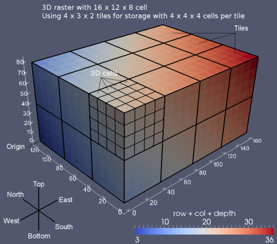

**
3D 
**

GRASS umožňuje pracovat jak 2D tak 3D rastrovými a vektorovými daty.

* :grasscmd:`3D rastrová data <raster3dintro>` - moduly s
  :grasscmd:`prefixem r3.* <raster3d>`
* 3D vektorová data - pouze :grasscmd:`několik modulů <keywords.html#3D>`
  umožňuje práci s 3D vektorovými daty

.. note:: Topologie vektorovývh dat je pouze 2D, pro 3D vektorová
   data je sestavena topologie průmětu do roviny XY.

Vizualizace ve 3D
=================

Vizualizovat 2D, 2.5D a 3D lze přímo v *mapovém okně*, kde je dostupný
tzv. :grasscmd:`3D viewer <wxGUI.nviz>` (aka NVIZ).

.. important:: 3D viewer respektuje při načítání rastrových dat
   aktuální výpočetní region, proto lze doporučit před
   spuštění 3D pohledu :skoleni:`nastavit region
   <grass-gis-zacatecnik/intro/region.html#nastaveni-vypocetniho-regionu>`
   podle vybrané rastrové mapy.

.. note:: Vzhledem k poměrně velkému prostorovému rozlišení rastrové
   mapy :map:`dmt` v lokaci pro školení (25m) nastavíme před načtením
   prostorové rozlišení na rozlišení menší, např. 100m.

   .. code-block:: bash

      g.region raster=dmt res=100

   
   Ukázka vizualizace ve 3D - digitální model terénu a pořární stanice

.. tip:: Vizualizovat data ve 3D umožňuje z příkazové řádky modul
   :grasscmd:`m.nviz.image`.

3D rastrová data
================

3D rastrová data (tzv. *volumes*) podporuje systém GRASS již od verze
6, více informací v :grasscmd:`dokumentaci <raster3dintro>`.

* :grasscmd:`Seznam modulů <raster3d>` pro práci s 3D rastrovými daty
  

   3D rastrová data v systému GRASS (zdroj: :grasscmd:`GRASS manuál
   <raster3dintro>`)

Příklad
-------

Nejprve vstupní data převzorkujeme na prostorové rozlišení 100m. Z DMT
vytvoříme mapu sklonu svahu, viz školení :skoleni:`GRASS GIS pro
začátečníky <grass-gis-zacatecnik/raster/analyzy-povrchu>`.

.. code-block:: bash

   g.region raster=dmt res=500
   r.resamp.interp in=dmt out=dmt500 method=bilinear
   r.slope.aspect elev=dmt500 slope=slope500

Před vytvoření 3D rastrové mapy z DMT a hodnot míry svahu nastavíme
hodnoty a rozlišení ve směru osy `Z` výpočetního regionu.

.. code-block:: bash
                
   g.region b=0 t=50 res3=500 tbres=1

.. tip:: Nastavení 3D regionu můžeme vypsat pomocí přepínače
         :option:`-3` modulu :grasscmd:`g.region`.

Pro vytvoření 3D rastrové mapy na základně DMT a hodnot míry svahu
použijeme modul :grasscmd:`r.to.rast3elev`.

.. code-block:: bash
                
   r.to.rast3elev input=slope500 elevation=dmt500 output=dmt_slope_3d --o
