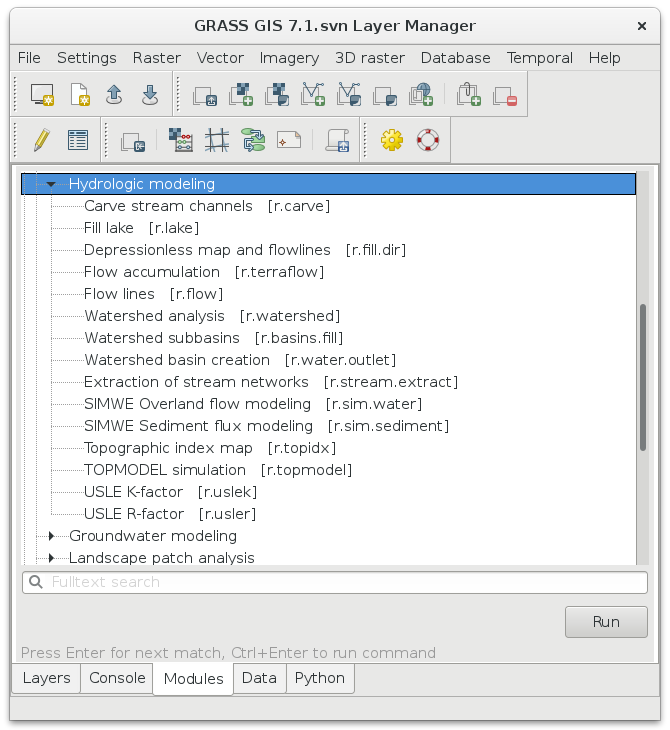
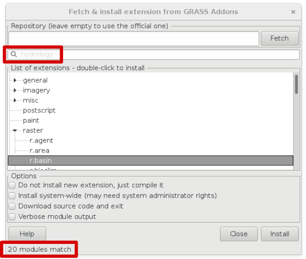

**********
Hydrologie
**********

GRASS nabízí celou řadu nástrojů pro hydrologické modelování, výpočet
eroze a pod, viz sekce :grasscmd:`hydrology <topic_hydrology>` a
:grasscmd2:`erosion <keywords#erosion>`.

   Nástroje v sekci Hydrologic modeling

Další nástroje jsou dostupné jako rozšíření Addons
(:menuselection:`Settings --> Addons extensions --> Install extension
from addons`).

.. rubric:: Témata
   :class: secnotoc           
      
.. toctree::
   :maxdepth: 2

   scs-cn

Užitečné odkazy
===============

* http://grasswiki.osgeo.org/wiki/Hydrological_Sciences
