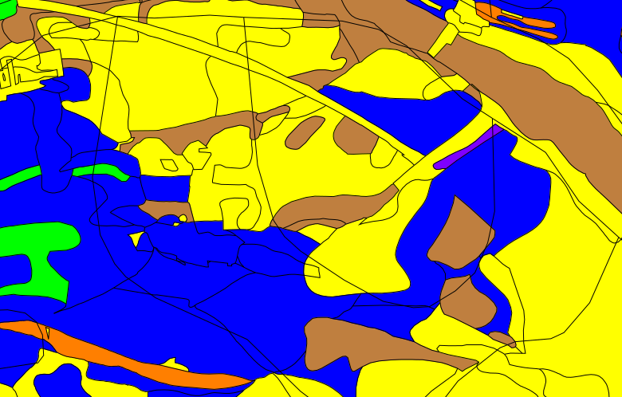
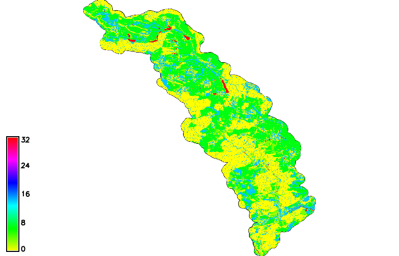
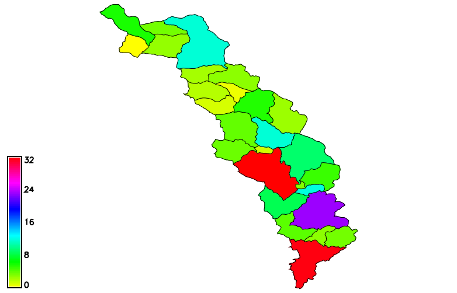

Metoda SCS CN
=============

Výpočet přímého objemu odtoku z povodí pomocí metody
:wikipedia:`SCS CN <Metoda CN křivek>`.

Vstupní data
------------

 * vrstva povodí IV. řádu
 * návrhové srážky (s dobou opakování 5, 10, 20, 50 a 100 let pro
   každé dílčí podpovodí IV. řádu)
 * využití území - landuse
 * HPJ - hlavní půdní jednotky z kódu BPEJ
 * KPP - komplexní průzkum půd

Postup
------

.. _hydrsk:

Odvození hydrologických skupin půd
^^^^^^^^^^^^^^^^^^^^^^^^^^^^^^^^^^

Nejprve určíme hydrologické skupiny půd na celé ploše povodí.

Spojíme (union) vektorové mapy :map:`hpj` a :map:`kpp` tak, aby došlo
k rozdělení řešeného území na menší elementární plochy. K tomu
použíjeme modul :grasscmd:`v.overlay`.

.. _hpj_kpp:

.. code-block:: bash
   
   v.overlay ainput=hpj binput=kpp operator=or output=hpj_kpp        

Naimportujeme pomocné číselníky s hydrologickými skupinami půd
(:grasscmd:`db.in.ogr` dostupný z menu :menuselection:`File --> Import
database table --> Common import format`).
                
.. code-block:: bash

   db.in.ogr input=hpj_hydrsk.dbf output=hpj_hydrsk
   db.in.ogr input=sum_kpp2hydrsk.dbf output=kpp_hydrsk

Poté přípojíme k atributové tabulce informace z
:dbtable:`hpj_hydrsk`. Předtím ale musíme sloupec :dbcolumn:`HPJ`
překonverovat na celočíselný typ (po importu tabulky má sloupeček
datový typ ``double``, který ale modul :grasscmd:`v.db.join` nepodporuje
jako klíč pro spojení tabulek).

Přidáme nový sloupec s datovým typem ``integer`` a do toho sloupce
poté uložíme pomocí :grasscmd:`db.execute` přetypované hodnoty.

.. code-block:: bash
   
   db.execute sql="alter table hpj_hydrsk add column HPJ_key int"
   db.execute sql="update hpj_hydrsk set HPJ_key = cast(HPJ as int)"

Po upravě tabulky :dbtable:`hpj_hydrsk` již můžeme tuto tabulku
připojit k atributům vektorové mapy :map:`hpj_kpp`.

.. code-block:: bash
                
   v.db.join map=hpj_kpp column=a_HPJ other_table=hpj_hydrsk other_column=HPJ_key

Pro prvky, které nemají informaci o HPJ odvodíme hydrologickou skupinu
z tabulky :dbtable:`kpp_hydrosk`, k tomu požijeme SQL příkaz
aplikovaný module :grasscmd:`db.execute`.
   
.. code-block:: sql

   UPDATE hpj_kpp_1 SET HydrSk = (
   SELECT b.First_hydr FROM hpj_kpp_1 AS a JOIN kpp_hydrsk as b ON a.b_KPP = b.KPP
   ) WHERE HydrSk IS NULL

Výsledek může vypadat následovně.

.. figure:: images/scs-cn-db-join.png

   Atributový dotaz s výsledkem hydrologické skupiny půd

Pomocí modulu :grasscmd:`v.colors` můžeme na základě hydrologických
skupin půd nastavit :skoleni:`tabulku barev
<grass-gis-zacatecnik/raster/tabulka-barev.html>`. V současnosti ale
modul podporuje pouze sloupce s číselnými hodnotami. Budeme si muset
pomoci trikem, do nového sloupce :dbcolumn:`HydrSk_key` vložíme
unikátní číselné kódy. Tento sloupce poté můžeme použít pro nastavení
tabulky barev.

Nový sloupec přidáme pomocí :skoleni:`správce atributových dat
<grass-gis-zacatecnik/vector/atributy.html>` anebo pomocí modulu
:grasscmd:`v.db.addcolumn`.

.. code-block:: bash
                           
   v.db.addcolumn map=hpj_kpp columns=HydrSk_key int                        

Číselné kódy do sloupce :dbcolumn:`HydrSk_key` vložíme jako níže
uvedené SQL příkazy pomocí modulu :grasscmd:`db.execute`.
   
.. code-block:: sql
                   
   update hpj_kpp_1 set HydrSk_key = 1 where HydrSk = 'A';
   update hpj_kpp_1 set HydrSk_key = 2 where HydrSk = 'AB';
   update hpj_kpp_1 set HydrSk_key = 3 where HydrSk = 'B';
   update hpj_kpp_1 set HydrSk_key = 4 where HydrSk = 'BC';
   update hpj_kpp_1 set HydrSk_key = 5 where HydrSk = 'C';
   update hpj_kpp_1 set HydrSk_key = 6 where HydrSk = 'CD';
   update hpj_kpp_1 set HydrSk_key = 7 where HydrSk = 'D';

Nyní již můžeme nastavit vlastní tabulku barev:

.. code-block:: bash
                
   v.colors map=hpj_kpp use=attr column=HydrSk_key rules=colors.txt

Obsah souboru :file:`colors.txt`:

::

   1 red
   2 green
   3 yellow
   4 blue
   5 brown
   6 orange
   7 purple

   Výsledná vizualizace

Do atributové tabulky vrstvy přidáme data o využití území jednotlivých
ploch, to vyřešíme průnikem (`intersection`) s vrstvou
:map:`land_use`. Tuto operaci provedeme modulem
:grasscmd:`v.overlay`. Zájmové území tak bylo rozděleno na více
elemenrárních ploch.

.. _hpj_kpp_lu:

.. code-block:: bash
                
   v.overlay ainput=hpj_kpp binput=land_use operator=and output=hpj_kpp_land

V dalším kroku přidáme sloupec obsahující údaje o využití území a o
hydrologické skupině půdy dané elementární plochy ve tvaru ``využití
území_hydrologická skupina`` ve zkratce :dbcolumn:`LU_HyrdSk`.

Tuto operaci lze provést pomocí :skoleni:`správce atributových dat
<grass-gis-zacatecnik/vector/atributy.html>` (`Field Calculator`) anebo
pomocí modulu :grasscmd:`v.db.addcolumn` v kombinaci s
:grasscmd:`db.execute` (SQL příkaz).

.. code-block:: bash
                
   v.db.addcolumn map=hpj_kpp_land columns="LU_HydrSk text"

.. code-block:: bash

   db.execute sql="update hpj_kpp_land_1 set LU_HydrSk = b_LandUse || '_' || a_HydrSk"

Pomocí jednoduchého SQL dotazu (modul :grasscmd:`db.select` anebo
:skoleni:`správce atributových dat
<grass-gis-zacatecnik/vector/atributy.html>`) byly zjištěny vzniklé
kombinace :dbcolumn:`LU_HydrSk`.

.. code-block:: bash

   db.select sql="select LU_HydrSk from hpj_kpp_land_1 group by LU_HydrSk"

Pro každou hodnotu určíme odpovídající hodnota CN, nejprve tabulku CN
hodnot naimportujeme (:grasscmd:`db.in.ogr`) a poté připojíme k naší
atributové tabulce (:grasscmd:`v.db.join`).

.. code-block:: bash
              
   db.in.ogr input=LU_CN.xls output=lu_cn               
   v.db.join map=hpj_kpp_land column=LU_HydrSk other_table=lu_cn other_column=LU_HydrSk

.. todo:: Hodnoty návrhových sráţek s různou dobou opakování byly do
          vrstvy přidány pomocí nástroje UNION, čímţ opět došlo k
          rozdělení území povodí na menší elementární plochy.

Výpočet výšky a objemu přímého odtoku
^^^^^^^^^^^^^^^^^^^^^^^^^^^^^^^^^^^^^

Pro každou elementární plochu vypočteme její výměru buď pomocí
:skoleni:`správce atributových dat
<grass-gis-zacatecnik/vector/atributy.html>` anebo modulu
:grasscmd:`v.to.db`.

.. code-block:: bash
      
   v.db.addcolumn map=hpj_kpp_land columns="vymera double"                  
   v.to.db map=hpj_kpp_land option=area columns=vymera                  

V dalším kroku vypočteme z hodnot CN potenciální retenci :dbcolumn:`A`

.. math::
      
   A = 25.4 \times (\frac{1000}{CN} - 10)

.. code-block:: bash

   v.db.addcolumn map=hpj_kpp_land columns="A double"
   v.db.update map=hpj_kpp_land column=A value="24.5 * (1000 / CN - 10)"

Následně vypočteme počáteční ztráta :dbcolumn:`I_a`:
   
.. math::
                   
   I_a = 0.2 \times A

.. code-block:: bash

   v.db.addcolumn map=hpj_kpp_land columns="I_a double"
   v.db.update map=hpj_kpp_land column=I_a value="0.2 * A"

.. todo:: Poté došlo k ověření, zda je návrhová srážka větší než
          počáteční ztráta, pokud tomu tak není, znamená to, že
          výsledný objem přímého odtoku bude nulový.

V následujícím kroku vypočteme *výšku přímého odtoku* :dbcolumn:`H_O` v mm:

.. math::
   
   H_O = \frac{(H_S − 0.2 \times A)^2}{H_S + 0.8 \times A}

kde :math:`H_S` je úhrn návrhové srážky (mm).

.. note:: V našem případě použijeme konstantní úhrn návrhové srážky
          :math:`H_S` pro celé území 32 mm.
  
*Objem přímého odtoku* vypočteme dle následujícího vztahu:

.. math::
   
   O_P = P_P \times \frac{H_O}{1000}

kde :math:`P_P` je výměra pozemku v metrech čtverečních.

Do atributové tabulky přidáme nové sloupce pomocí
:grasscmd:`v.db.addcolumn`, hodnoty vypočteme pomocí
:grasscmd:`v.db.update`.

.. code-block:: bash

   v.db.addcolumn map=hpj_kpp_land columns="HO double, OP double"
   v.db.update map=hpj_kpp_land column=HO value="((32 - 0.2 * A) * (32 - 0.2 * A)) / (32 + 0.8 * A)"
   v.db.update map=hpj_kpp_land column=OP value="vymera * (HO / 1000)"

Průměrná hodnota objemu přímého odtoku pro povodí
^^^^^^^^^^^^^^^^^^^^^^^^^^^^^^^^^^^^^^^^^^^^^^^^^   

Pro tuto operaci použijeme modul :grasscmd:`v.rast.stats`, pomocí
kterého vypočteme průměrné hodnoty a sumu objemu přímého odtoku pro
každé dílčí povodí. Před touto operací musí informaci o objemu přímého
odtoku převést do rastrové reprezentace pomocí modulu
:grasscmd:`v.rast.stats`. Před rasterizací nastavíme
:skoleni:`výpočetní region <grass-gis-zacatecnik/intro/region.html>` s
rozlišením 10 m (:grasscmd:`g.region`).

.. code-block:: bash
             
   g.region vector=kpp res=10
   v.to.rast input=hpj_kpp_land output=ho use=attr attribute_column=HO
   v.rast.stats map=povodi_4 raster=ho column_prefix=ho

   Objem přímého odtoku pro elementární plochy

Pro účely vizualizace nastavíme vhodnou :skoleni:`tabulku barev
<grass-gis-zacatecnik/raster/tabulka-barev.html>`:

.. code-block:: bash
                
   v.colors map=povodi_4 use=attr column=ho_average color=blues

   Objem přímého odtoku pro povodí čtvrtého řádu

   
