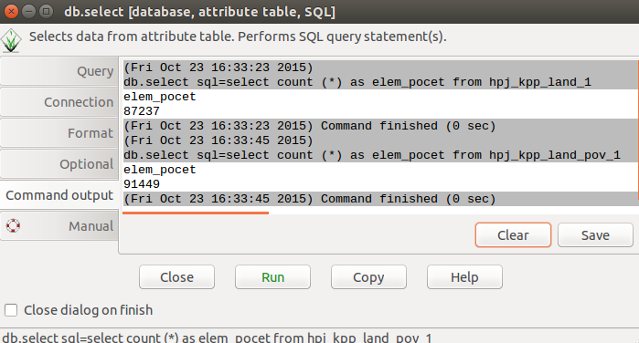

1. Metóda SCS CN
================

Teoretické východiská
---------------------

Ide o výpočet odtokovej straty z povodia. Metóda bola vypracovaná službou na ochranu pôd *Soil Conservation Service* (:wikipedia:`SCS CN <Metoda CN křivek>`) v USA. Objem zrážok je na objem odtoku prevedený podľa čísel odtokových kriviek *CN*, ktoré sú tabelizované na základe hydrologických vlastností pôd *HydrSk*. Metóda zohľadňuje závislosť retencie (zadržiavanie vody) od hydrologických vlastností pôd, počiatočné nasýtenie a spôsob využívania pôdy. Číslo *CN* krivky reprezentuje teda vlastnosť povodia. Obvykle nadobúda hodnoty :item:`30`, t.j. veľké straty až :item:`100`, t.j. malé straty.

Základné symboly:
-----------------

 * :math:`CN` ... číslo odtokovej krivky
 * :math:`A`  ... maximálna potenciálna strata z povodia
 * :math:`I_a` ... počiatočná strata z povodia, keď ešte nedochádza k odtoku
 * :math:`H_s` ... návrhová výška zrážky v mm
 * :math:`H_o` ... výška priameho odtoku
 * :math:`P_p` ... výmera elementárnej plochy v :math:`m^2`
 * :math:`O_p` ... objem priameho odtoku

Platí, že pomer medzi skutočnou a maximálnou stratou z povodia je rovnaký ako pomer odtoku a zrážky, ktorá je redukovaná o počiatočné straty

.. math::
   
   \frac{O_p}{A}=\frac{H_o}{H_s-I_a}.

Vstupné dáta
------------

 * :map:`hpj` - vektorová vrstva hlavných pôdnych jednotiek,
 * :map:`kpp` - vektorová vrstva komplexného prieskumu pôd,
 * :dbtable:`hpj_hydrsk.dbf`, :dbtable:`sum_kpp2hydrsk.dbf` - pomocné číselníky s hydrologickými skupinami pôd,
 * :map:`Land_Use` - vektorová vrstva využitia územia,
 * :map:`A07_Povodi_IV` - vektorová vrstva povodí IV. rádu s návrhovými zrážkami :math:`H_s` (doba opakovania 5, 10, 20, 50 a 100 rokov).

Navrhovaný postup:
------------------

 1. príprava potrebných dát pre výpočet v prostredí GIS (rastrová vrstva s kódmi CN, raster s hodnotami :math:`H_s` a raster s výmerou :math:`P_p` pre elementárne plochy v :math:`m^2`),
 2. výpočet parametra :math:`A`, ktorý je funkciou CN,
 3. výpočet parametra :math:`I_a`, ktorý je funkciou :math:`A`,
 4. výpočet parametra :math:`H_o`, ktorý je funkciou :math:`H_s` a :math:`A`,
 5. výpočet parametra :math:`O_p`, ktorý je funkciou :math:`P_p` a :math:`H_o`.

    .. _schema:

    .. figure:: images/schema_a.PNG

        Grafická schéma postupu 

.. note:: Ako vyplýva z :num:`#schema`, príprave rastrovej vrstvy s kódmi CN predchádza odvodenie hydrologických skupín pôd *HydrSk* a jej priestorové prekrytie s vrstvou využitia krajinnej pokrývky *land*, čím sa získa jedinečná kombinácia *HydrSk_land*.

Postup spracovania v GRASS GIS
------------------------------

Krok 1
^^^^^^

V prvom kroku zjednotíme vrstvu hlavných pôdnych jednotiek a komplexného prieskumu pôd. Použijeme modul :grasscmd:`v.overlay` a operáciu prekrývania *union*.

.. code-block:: bash
   
   v.overlay ainput=hpj binput=kpp operator=or output=hpj_kpp   

Importujeme čiselníky.
                
.. code-block:: bash

   db.in.ogr input=hpj_hydrsk.dbf output=hpj_hydrsk
   db.in.ogr input=sum_kpp2hydrsk.dbf output=kpp_hydrsk

Pre kontrolu prezrieme obsah importovaných číselníkov (tabuliek) v prostredí GRASS GIS, prípadne aspoň ich stĺpcov. Použijeme moduly :grasscmd:`db.select` a :grasscmd:`db.columns`.

.. code-block:: bash
   
   db.select table=hpj_hydrsk
   db.select table=kpp_hydrsk

   db.columns table=hpj_hydrsk 
   db.columns table=kpp_hydrsk
   
.. note:: 
   
   V atribútovej tabuľke hlavných pôdnych jednotiek :map:`hpj_hydrsk` je po importe dátový typ atribútu :dbcolumn:`HPJ` ako *type: DOUBLE PRECISION* (príkaz :code:`db.describe table=hpj_hydrsk`); je potrebné prekonvertovať ho na celočíselný typ, t.j. *type: INTEGER* (kvôli spájaniu tabuliek a číselníkov pomocou :grasscmd:`v.db.join`). Použijeme **ALTER** na vytvorenie atribútu :dbcolumn:`HPJ_key` a **UPDATE** na naplnenie hodnôt atribútu.

.. code-block:: bash

   db.execute sql="alter table hpj_hydrsk add column HPJ_key int"
   db.execute sql="update hpj_hydrsk set HPJ_key = cast(HPJ as int)"
   
Po úprave tabuľky :dbtable:`hpj_hydrsk` môžeme túto tabuľku pripojiť k atribútom vektorovej mapy :map:`hpj_kpp` pomocou kľúča, konkrétne atribútu :dbcolumn:`HPJ_key`.

.. code-block:: bash

   v.db.join map=hpj_kpp column=a_HPJ other_table=hpj_hydrsk other_column=HPJ_key

Atribúty v tabuľke :dbtable:`hpj_kpp` po spojení skontrolujeme či obsahujú stĺpce z číselníka a následne doplníme chýbajúce informácie o hydrologickej skupine :dbcolumn:`HydrSk` pomocou :map:`kpp_hydrsk`. Doplníme ich zo stĺpca :dbcolumn:`First_Hydr` vrstvy komplexného prieskumu pôd. Využijeme modul :grasscmd:`db.execute` a SQL príkaz **JOIN**.

.. code-block:: bash

    db.execute sql="UPDATE hpj_kpp_1 SET HydrSk = (
    SELECT b.First_hydr FROM hpj_kpp_1 AS a JOIN kpp_hydrsk as b 
    ON a.b_KPP = b.KPP) WHERE HydrSk IS NULL"

Výsledok môže vyzerať nasledovne.

.. figure:: images/scs-cn-db-join.png

   Atribútový dotaz s výsledkom hydrologickej skupiny pôd

Prezrieme všetky informácie v atribútovej tabuľke :map:`hpj_kpp` cez *SQL Query BUILDER* a overíme či všetky hodnoty o hydrologickej skupine sú vyplnené. 

.. code-block:: bash

    SELECT cat,HydrSk FROM hpj_kpp_1 WHERE hydrSk = "NULL" 

Nastavíme :skoleni:`tabuľku farieb <grass-gis-zacatecnik/raster/tabulka-barev.html>` pre jednotlivé skupiny pomocou modulu :grasscmd:`v.colors`. Kódy nemôžu byť použité, lebo tento modul podporuje iba celočíselné hodnoty, preto je potrebné vytvoriť nový atribút s jedinečnými hodnotami pre kódy. Nazveme ho :dbcolumn:`HydrSk_key`) a bude obsahovať čísla 1 až 7 prislúchajúce kódom A až D. Použijeme moduly :grasscmd:`v.db.addcolumn` a :grasscmd:`db.execute` a príkaz **UPDATE** jazyka SQL.

.. code-block:: bash

    v.db.addcolumn map=hpj_kpp columns=HydrSk_key int

    db.execute sql="update hpj_kpp_1 set HydrSk_key = 1 where HydrSk = 'A';
    update hpj_kpp_1 set HydrSk_key = 2 where HydrSk = 'AB';
    update hpj_kpp_1 set HydrSk_key = 3 where HydrSk = 'B';
    update hpj_kpp_1 set HydrSk_key = 4 where HydrSk = 'BC';
    update hpj_kpp_1 set HydrSk_key = 5 where HydrSk = 'C';
    update hpj_kpp_1 set HydrSk_key = 6 where HydrSk = 'CD';
    update hpj_kpp_1 set HydrSk_key = 7 where HydrSk = 'D'"

.. note:: Nový stĺpec možno pridať aj pomocou :skoleni:`správcu atribútových dát <grass-gis-zacatecnik/vector/atributy.html>`.

Do textového súboru :file:`colors.txt` vložíme pravidlá pre vlastnú farebnú stupnicu pre jednotlivé kategórie.

.. code-block:: bash

   1 red
   2 green 
   3 yellow
   4 blue
   5 brown
   6 orange
   7 purple

MOdulom :grasscmd:`g.region` nastavíme výpočtový región (napr. :map:`hpj_kpp`), konvertujeme vektorovú vrstvu na rastrovú, priradíme farebnú škálu a doplníme mimorámové údaje: legendu a mierku.

.. note:: Vektorovú vrstvu konvertujeme kvôli tomu, lebo zobraziť legendu je možné len pre rastrové dáta.

.. code-block:: bash

   g.region vector=hpj_kpp
   v.to.rast input=hpj_kpp output=hpj_kpp_rst use=attr attribute_column=HydrSk_key

.. figure:: images/1a.png
   :class: middle

   Výsledná vizualizácia hydrologických skupín pôd (1: A, 2: AB, 3: B, 4: BC, 5: C, 6: CD a 7: D)

Pridáme informácie o využití územia pre každú plochu pomocou operácie priniku *intersection* s dátovou vrstvou o krajinnej pokrývke :map:`Land_Use`. 

.. code-block:: bash

   v.overlay ainput=hpj_kpp binput=Land_Use operator=and output=hpj_kpp_land

Pridáme stĺpec :dbcolumn:`LU_HydrSk` s informáciami o využití územia a hydrologickej skupine pre každú elementárnu plochu. Hodnoty budú v tvare *VyužitieÚzemia_KodHydrologickejSkupiny*, t.j. *LU_HydrSk*.

.. code-block::bash

   v.db.addcolumn map=hpj_kpp_land columns="LU_HydrSk text"
   db.execute sql="update hpj_kpp_land_1 set LU_HydrSk = b_LandUse || '_' || a_HydrSk"

.. note: Túto operáciu je možné vykonať aj pomocou :skoleni:`správcu atribútových dát <grass-gis-zacatecnik/vector/atributy.html>` (`Field Calculator`)

Pomocou modulu :grasscmd:`db.select` alebo pomocou :skoleni:`správcu atribútových dát <grass-gis-zacatecnik/vector/atributy.html>` vypíšeme počet všetkých kombinácií v stĺpci :dbcolumn:`LU_HydrSk`.

.. code-block::bash

   db.select sql="select count(*) as comb_count from (select LU_HydrSk from hpj_kpp_land_1 group by LU_HydrSk)"`

.. figure:: images/2a.png
   :class: middle

   Zobrazenie časti atribútovej tabuľky a výpis počtu kombinácií krajinnej pokrývky a hydrologickej skupiny
 
Určíme odpovedajúce hodnoty CN. Importujeme ich zo súboru :dbtable:`LU_CN.xls` a následne pripojíme pomocou :grasscmd:`v.db.join`.
 
.. code-block::bash

   db.in.ogr input=LU_CN.xls output=lu_cn
   v.db.join map=hpj_kpp_land column=LU_HydrSk other_table=lu_cn other_column=LU_HydrSk

Výsledné informácie ako kód hydrologickej skupiny, kód krajinnej pokrývky a kód CN zobrazíme v atribútovej tabuľke SQL dotazom :code:`SELECT cat,a_HydrSk,b_LandUse,CN FROM hpj_kpp_land_1`.

Následne vytvoríme rastrovú vrstvu s kódmi CN.

.. cole-block::bash

   g.region vector=hpj_kpp_land
   v.to.rast input=hpj_kpp_land output=hpj_kpp_land_rst use=attr attribute_column=CN
   r.colors -e map=hpj_kpp_land_rst color=aspectcolr

.. figure:: images/3a.png
   :class: middle

   Kódy CN pre každú elementárnu plochu krajinnej pokrývky v záujmovom území 

Atribútová tabuľka vrstvy povodí obsahuje údaje o návrhových zrážkach s dobou opakovania 5, 10, 20, 50 a 100 rokov. Je potrebné pridať tieto informácie ku každej elementárnej ploche.

.. figure:: images/5a.png
   :class: middle

   Atribúty súvisiace s návrhovými zrážkami s rôznou dobou opakovania

Vrstvu :map:`hpj_kpp_land` zjednotíme s vrstvou povodí :map:`A07_Povodi_IV`, na čo využijeme modul :grasscmd:`v.overlay`. 

.. code-block::bash

   v.overlay ainput=hpj_kpp_land binput=A07_Povodi_IV operator=or output=hpj_kpp_land_pov`

Po zjednotení vidíme, že došlo k rozdeleniu územia na menšie plochy (87 237, 91 449). Presný počet možno zistiť použitím :grasscmd:`db.select`.
 
.. code-block::bash

   db.select sql="select count (*) as elem_pocet from hpj_kpp_land_1"
   db.select sql="select count (*) as elem_pocet from hpj_kpp_land_pov_1"

   Počet elementárnych plôch pred a po zjednotení s vrstvou povodí

Kroky 2 a 3
^^^^^^^^^^^

Pre každú elementárnu plochu vypočítame jej výmeru, parameter :math:`A` (maximálna strata) a parameter :math:`I_{a}` (počiatočná strata, čo je 5 % z :math:`A`)

.. math::
      
   A = 25.4 \times (\frac{1000}{CN} - 10)

.. math::
                   
   I_a = 0.2 \times A

Do atribútovej tabuľky `hpj_kpp_land_pov` pridáme nové stĺpce :dbcolumn:`vymera`, :dbcolumn:`A`, :dbcolumn:`I_a` výpočítame výmeru, parameter :math:`A` a parameter :math:`I_{a}`.

.. code-block::bash
   
   v.db.addcolumn map=hpj_kpp_land_pov columns="vymera double,A double,I_a double"
   v.to.db map=hpj_kpp_land_pov option=area columns=vymera
   v.db.update map=hpj_kpp_land_pov column=A value="24.5 * (1000 / a_CN - 10)"
   v.db.update map=hpj_kpp_land_pov column=I_a value="0.2 * A"

Kroky 4 a 5
^^^^^^^^^^^

.. note:: V ďalších krokoch budeme uvažovať priemerný úhrn návrhovej zrážky :math:`H_{s}` = 32 mm. Pri úhrne s dobou opakovania 2 roky (atribút :dbcolumn:`H_002_120`) či dobou 5, 10, 20, 50 alebo 100 rokov by bol postup obdobný.  

.. code-block::bash

   db.select sql="select count(*) as pocet from hpj_kpp_land_pov_1 where ((32 < I_a) or (b_H_002_120 < I_a))" 

Pridáme ďalšie nové stĺpce do atribútovej tabuľky pre parametre :math:`H_{o}` a :math:`O_{p}` a vypočítame ich hodnoty pomocou :grasscmd:`v.db.update`.

.. math::
   
   H_O = \frac{(H_S − 0.2 \times A)^2}{H_S + 0.8 \times A}

.. math::
   
   O_P = P_P \times \frac{H_O}{1000}

.. code-block::bash

   v.db.addcolumn map=hpj_kpp_land_pov columns="HO double, OP double"

   v.db.update map=hpj_kpp_land_pov column=HO value="((32 - 0.2 * A) * (32 - 0.2 * A)) / (32 + 0.8 * A)"
   v.db.update map=hpj_kpp_land_pov column=OP value="vymera * (HO / 1000)"

Výsledky zobrazíme v rastrovej podobe.

.. code-block::bash

   v.to.rast input=hpj_kpp_land_pov output=HO use=attr attribute_column=HO
   v.to.rast input=hpj_kpp_land_pov output=OP use=attr attribute_column=OP

.. figure:: images/7a.png
   :class: middle

   Výška v mm vľavo a objem v :math:`m^{3}` vpravo priameho odtoku pre elementárne plochy

Vypočítame a zobrazíme priemerné hodnoty priameho odtoku pre jednotlivé povodia. Pritom je potrebné nastaviť rozlíšenie výpočtového regiónu, prekopírovať mapu povodí do aktuálneho mapsetu a nastaviť vhodnú :skoleni:`farebnosť výsledku <grass-gis-zacatecnik/raster/tabulka-barev.html>`.

.. code-block::bash

   g.region vector=kpp@PERMANENT res=10
   g.copy vector=A07_Povodi_IV,A07_Povodi_IV
   v.rast.stats map=A07_Povodi_IV raster=HO column_prefix=ho
   v.to.rast input=A07_Povodi_IV output=HO_pov use=attr attribute_column=ho_average
   r.colors map=HO_pov color=bcyr

   v.rast.stats map=A07_Povodi_IV raster=OP column_prefix=op
   v.to.rast input=A07_Povodi_IV output=OP_pov use=attr attribute_column=op_average
   r.colors map=OP_pov color=bcyr

.. figure:: images/8a.png

   Výpočet štatistických údajov pre každé povodie

.. figure:: images/9a.png
   :class: middle

   Priemerná výška odtoku v mm a priemerný objem odtoku v :math:`m^{3}` povodí v záujmovom území

Výstupné dáta:
--------------

* :map:`hpj_kpp` - zjednotenie :map:`hpj` a :map:`kpp` (atribúty aj z číselníka :map:`hpj`),
* :map:`hpj_kpp_land` - prienik :map:`hpj_kpp` a :map:`LandUse`,
* :map:`hpj_kpp_rst` - raster s kódmi *HydrSk*,
* :map:`hpj_kpp_land_rast` - raster s kódmi *CN*,
* :map:`HO`, resp. :map:`HO_pov` - raster s výškou odtoku pre elementárne plochy, resp. pre povodia v mm,
* :map:`OP`, resp. :map:`OP_pov` - raster s hodnotami objemu odtoku v :math:`m^{3}` pre elementárne plochy, resp. povodia.

Použité zdroje:
---------------

[1] `Školení GRASS GIS pro pokročilé <http://training.gismentors.eu/grass-gis-pokrocily/hydrologie/scs-cn.html>`_

[2] `Index of /~landa/gis-zp-skoleni <http://geo102.fsv.cvut.cz/~landa/gis-zp-skoleni>`_

[3] Wikipédia : `Metóda CN kriviek <https://cs.wikipedia.org/wiki/Metoda_CN_k%C5%99ivek>`_

[4] `HYDRO.upol.cz <http://hydro.upol.cz/?page_id=15>`_

