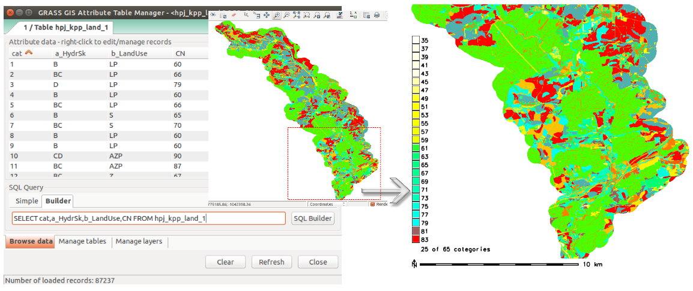
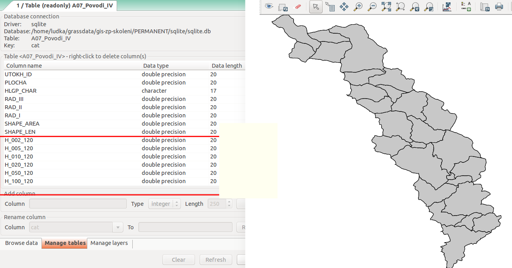
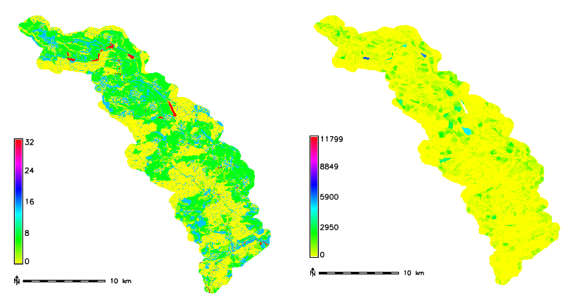

Metoda SCS CN
=============

Teoretický základ
-----------------

Jde o výpočet přímého odtoku z povodí, který je tvořen tzv. povrchovým
odtokem a hypodermeckým (podpovrchovým) odtokem. Metoda byla
vypracovaná službou na ochranu půd *Soil Conservation Service*
(:wikipedia:`SCS CN <Metoda CN křivek>`) v USA. Objem srážek je na
objem odtoku převedený na základě hodnot odtokových křivek `CN`, které
jsou tabelizovány na základě hydrologických vlastností půd. Metoda
zohledňuje závislost retence (zadržování vody) hydrologických
vlastností půd, počáteční nasycení a způsob využívaní půdy. Hodnota
`CN` křivek reprezentuje vlastnost povodí a platí, že čím je
hodnota `CN` vyšší, tím je vyšší pravděpodobnost, že při srážkové
události dojde k přímému odtoku.

Hodnota `CN` závisí na kombinaci hydrologické skupiny půd a způsobu
využití území v daném místě. Kód hydrologické skupiny půd je získaný
z dat hlavních půdních jednotek (přesnější způsob) anebo dat
komplexního průzkumu půd (tam, kde informace o hlavních půdních
jednotkách nejsou k dispozici).

Základní symboly
----------------

 * :math:`CN` - hodnota odtokové křivky
 * :math:`A` - maximalní potenciální ztráta z povodí, výška vody
   zadržané v povodí; ostatní je odtok (:math:`mm`)
 * :math:`I_a` - počítaná ztráta z povodí, když ještě nedochází k odtoku
   (:math:`mm`)
 * :math:`H_s` - návrhová výška srážky, zátěžový stav (:math:`mm`)
 * :math:`H_o` - výška přímého odtoku (:math:`mm`)
 * :math:`O_p` - objem přímého odtoku (:math:`m^3`)

Platí, že poměr mezi skutečnou a maximální ztrátou z povodí je stejný
jako poměr odtoku a srážky, která je redukovaná o počáteční ztraty.

.. math::

   \frac{O_p}{A}=\frac{H_o}{H_s-I_a}

.. _scs-cn-vstupni-data:

Vstupní data
------------

 * :map:`hpj.shp` - vektorová vrstva hlavních půdních jednotek z
   kodů BPEJ, :num:`#hpj-kpp` vlevo
 * :map:`kpp.shp` - vektorová vrstva komplexního průzkumu půd, :num:`#hpj-kpp` vpravo
 * :map:`landuse.shp` - vektorová vrstva využití území, :num:`#lu-pov` vlevo
 * :map:`povodi.shp` - vektorová vrstva povodí IV. řádu s návrhovými
   srážkami :math:`H_s` (doba opakovaní 2, 5, 10, 20, 50 a 100 rokov), :num:`#lu-pov` vpravo
 * :dbtable:`hpj_hydrsk` - číselník s hydrologickými skupinami půd pro hlavní 
   půdní jednotky, :num:`#ciselniky1` vlevo
 * :dbtable:`kpp_hydrsk` - číselník s hydrologickými skupinami půd pro vrstvu 
   komplexního průzkumu půd, :num:`#ciselniky1` uprostřed
 * :dbtable:`lu_hydrsk_cn` - číselník s hodnotami CN pro kombinaci využití 
   území a hydrologické skupiny, :num:`#ciselniky1` vpravo

.. note:: Vrstvu povodí je možno získat z volně dostupné databáze
          `DIBAVOD <http://www.dibavod.cz>`_. Bonitované půdní
          ekologické jednotky - dvě číslice pětimístného kódu
          udávající hlavní půdní jednotku, informace o využití území
          *Land Parcel Identification System* a data komplexního
          průzkumu půd poskytuje většinou krajský úřad příslušného
          území. Návrhové srážky je možno získat z hydrometeorologického
          ústavu.

Navrhovaný postup
------------------
:ref:`1.<kr1>` 
sjednocení hlavních půdních jednotek a komplexního průzkumu půd

:ref:`2.<kr2>` 
připojení informací o hydrologické skupině

:ref:`3.<kr3>` 
průnik vrstvy s hydrologickými skupinami s vrstvou využití území

:ref:`4.<kr4>` 
připojení hodnot odtokové křivky :math:`CN`

:ref:`5.<kr5>` 
sjednocení průniku vrstvy s hydrologickými skupinami a využitím území 
s vrstvou povodí 

:ref:`6.<kr6>` 
výpočet výměry elementárních ploch, parametru :math:`A` a parametru :math:`I_a`

:ref:`7.<kr7>` 
výpočet parametru :math:`H_o` a parametru :math:`O_p` pre každou elementární plochu

:ref:`8.<kr8>` 
vytvoření rastrových vrstev výšky a objemu přímého odtoku

:ref:`9.<kr9>` 
výpočet průměrných hodnot výšky a objemu přímého odtoku pro povodí 

.. _schema:

.. figure:: images/schema_scs-cn.png
   :class: middle

   Grafické schéma postupu.

Znázornění vstupních dat spolu s atributovými tabulkami je uvedeno na
:num:`#hpj-kpp` a :num:`#lu-pov`. Tabulky s informacemi o hydrologické
skupině půdy a o hodnotách CN pro kombinaci využití území a
hydrologické skupiny, resp.  číselníky jsou na :num:`#ciselniky1`.

.. _hpj-kpp:

.. figure:: images/hpjkpp.png
   :class: large

   Hlavní půdní jednotky a podrobný průzkum půd spolu s jejich atributovými tabulkami.

.. _lu-pov:

   Využití území a vrstva povodí IV. řádu spolu s jejich atributovými tabulkami.

.. _ciselniky1:

.. figure:: images/ciselniky.png
   :class: middle

   Číselníky s informacemi o hydrologické skupině a hodnotami CN.

Postup zpracování v GRASS GIS
-----------------------------

Krok 1
^^^^^^

V prvním kroku sjednotíme vrstvu hlavních půdních jednotek a
komplexního průzkumu půd. Použijeme modul :grasscmd:`v.overlay` a
operaci překrytí *union*.

.. code-block:: bash

   v.overlay ainput=hpj binput=kpp operator=or output=hpj_kpp

Dále importujeme číselníky (:grasscmd:`db.in.ogr`):

.. code-block:: bash

   db.in.ogr input=hpj_hydrsk.dbf output=hpj_hydrsk
   db.in.ogr input=sum_kpp2hydrsk.dbf output=kpp_hydrsk

Zkontrolujeme obsah importovaných číselníků (tabulek) v prostředí
GRASS GIS, případně aspoň jejich sloupů. Použijeme moduly
:grasscmd:`db.select` a :grasscmd:`db.columns`.

.. code-block:: bash

   db.select table=hpj_hydrsk
   db.select table=kpp_hydrsk

   db.columns table=hpj_hydrsk
   db.columns table=kpp_hydrsk

.. note::

   V atributové tabulce hlavních půdních jednotek :dbtable:`hpj_hydrsk` je
   po importu datový typ atributu :dbcolumn:`HPJ` jako typ *DOUBLE
   PRECISION* (příkaz :code:`db.describe table=hpj_hydrsk`); je
   potřebné jej překonvertovat na celočíselný typ, t.j. *INTEGER*
   (kvůli spojení tabulek a číselníků pomocí
   :grasscmd:`v.db.join`). Použijeme :sqlcmd:`ALTER` pro vytvorení
   atributu :dbcolumn:`HPJ_key` a :sqlcmd:`UPDATE` pro naplnění hodnot
   atributu.

.. code-block:: bash

   db.execute sql="alter table hpj_hydrsk add column HPJ_key int"
   db.execute sql="update hpj_hydrsk set HPJ_key = cast(HPJ as int)"

Po úpravě tabulky :dbtable:`hpj_hydrsk` můžeme tuto tabulku připojit
k atributům vektorové mapy :map:`hpj_kpp` pomocí klíče, konkrétně
atributu :dbcolumn:`HPJ_key`.

.. code-block:: bash

   v.db.join map=hpj_kpp column=a_HPJ other_table=hpj_hydrsk other_column=HPJ_key

Atributy v tabulce :dbtable:`hpj_kpp` po spojení zkontrolujeme či
obsahují sloupce z číselníku a následně doplníme chybějící informace o
hydrologické skupině :dbcolumn:`HydrSk` pomocí
:map:`kpp_hydrsk`. Doplníme je ze sloupce :dbcolumn:`First_Hydr`
vrstvy komplexního průzkumu půd. Využijeme modul
:grasscmd:`db.execute` a SQL příkaz :sqlcmd:`JOIN`.

.. code-block:: bash

    db.execute sql="UPDATE hpj_kpp_1 SET HydrSk = (SELECT b.First_hydr FROM hpj_kpp_1 AS a JOIN kpp_hydrsk as b ON a.b_KPP = b.KPP) WHERE HydrSk IS NULL"

Obsah atributové tabulky :map:`hpj_kpp` zkontrolujeme pomocí *SQL
Query Builder* a ověříme, zda všechny hodnoty hydrologické skupiny jsou
vyplněné.

.. code-block:: bash

    SELECT cat,HydrSk FROM hpj_kpp_1 WHERE hydrSk is "NULL"

.. figure:: images/scs-cn-db-join.png

   Atributový dotaz s výsledkem hydrologické skupiny půd.

Nastavíme :skoleni:`tabulku barev
<grass-gis-zacatecnik/raster/tabulka-barev.html>` pro jednotlivé
skupiny pomocí modulu :grasscmd:`v.colors`. Kódy nelze použít, neboť
tento modul podporuje pouze celočíselné hodnoty, proto je potřebné
vytvořit nový atribut s jedinečnými hodnotami pro kódy. Nazveme ho
:dbcolumn:`HydrSk_key` a bude obsahovat čísla 1 až 7 odpovídající
kódům A až D. Použijeme moduly :grasscmd:`v.db.addcolumn` a
:grasscmd:`db.execute` a příkaz :sqlcmd:`UPDATE` jazyka
:wikipedia:`SQL`.

.. code-block:: bash

    v.db.addcolumn map=hpj_kpp columns="HydrSk_key int"

    db.execute sql="update hpj_kpp_1 set HydrSk_key = 1 where HydrSk = 'A';
    update hpj_kpp_1 set HydrSk_key = 2 where HydrSk = 'AB';
    update hpj_kpp_1 set HydrSk_key = 3 where HydrSk = 'B';
    update hpj_kpp_1 set HydrSk_key = 4 where HydrSk = 'BC';
    update hpj_kpp_1 set HydrSk_key = 5 where HydrSk = 'C';
    update hpj_kpp_1 set HydrSk_key = 6 where HydrSk = 'CD';
    update hpj_kpp_1 set HydrSk_key = 7 where HydrSk = 'D'"

.. note:: Nový sloupec je možné přidat i pomocí :skoleni:`správce
          atributových dat <grass-gis-zacatecnik/vektorova_data/atributy.html>`.

Do textového souboru :file:`colors.txt` vložíme pravidla vlastní
barevné stupnice pro jednotlivé kategorie.

.. code-block:: bash

   1 red
   2 green
   3 yellow
   4 blue
   5 brown
   6 orange
   7 purple

Modulem :grasscmd:`g.region` nastavíme výpočetní region na vektorovou
mapu :map:`hpj_kpp` a konvertujeme vektorovou vrstvu na rastrovou,
přiřadíme barevnou škálu a doplníme mimorámové údaje jako legendu a
měřítko. Pro rasterizaci použijeme vhodné prostorové rozlišení, v
našem případě 10m.

.. note:: Vektorovou vrstvu konvertujeme kvůli tomu, neboť zobrazit legendu je 
	  možné pouze pro rastrové data.

.. code-block:: bash

   g.region vector=hpj_kpp res=10
   v.to.rast input=hpj_kpp output=hpj_kpp_rst use=attr attribute_column=HydrSk_key

   Výsledná vizualizace hydrologických skupin půd (1: A, 2: AB, 3:
   B, 4: BC, 5: C, 6: CD a 7: D).

Přidáme informace o využití území pro každou plochu pomocí operace
průniku *intersection* s datovou vrstvou využití území
:map:`landuse`.

.. code-block:: bash

   v.overlay ainput=hpj_kpp binput=landuse operator=and output=hpj_kpp_land

Přidáme sloupec :dbcolumn:`LU_HydrSk` s informacemi o využití území a
hydrologické skupině pro každou elementární plochu. Hodnoty budou ve
tvaru *VyužitíÚzemí_KodHydrologickéSkupiny*, t.j. *LU_HydrSk*.

.. code-block:: bash

   v.db.addcolumn map=hpj_kpp_land columns="LU_HydrSk text"
   db.execute sql="update hpj_kpp_land_1 set LU_HydrSk = b_LandUse || '_' || a_HydrSk"

.. note:: Tuto operaci je možné provést i pomocí :skoleni:`správce
          atributových dat
          <grass-gis-zacatecnik/vektorova_data/atributy.html>` (`Field
          Calculator`)

Pomocí modulu :grasscmd:`db.select` anebo pomocí *správce atributových
dat* vypíšeme počet všech kombinácí v sloupci :dbcolumn:`LU_HydrSk`.

.. code-block:: bash

   db.select sql="select count(*) as comb_count from (select LU_HydrSk from hpj_kpp_land_1 group by LU_HydrSk)"`

.. figure:: images/2a.png
   :class: middle

   Zobrazení části atributové tabulky a výpis počtu kombinací
   využití území a hydrologické skupiny.

Určíme odpovídající hodnoty :math:`CN`. Importujeme je do souboru
:dbtable:`LU_CN.xls` a následně připojíme pomocí :grasscmd:`v.db.join`.

.. code-block:: bash

   db.in.ogr input=LU_CN.xls output=lu_cn
   v.db.join map=hpj_kpp_land column=LU_HydrSk other_table=lu_cn other_column=LU_HydrSk

Výsledné informace jako kód hydrologické skupiny, kód využití území
a kód :math:`CN` zobrazíme v atributové tabulce SQL dotazem 
:code:`SELECT cat,a_HydrSk,b_LandUse,CN FROM hpj_kpp_land_1`.

Následně vytvoříme rastrovou vrstvu s hodnotami :math:`CN`.

.. code-block:: bash

   g.region vector=hpj_kpp_land res=10
   v.to.rast input=hpj_kpp_land output=hpj_kpp_land_rst use=attr attribute_column=CN
   r.colors -e map=hpj_kpp_land_rst color=aspectcolr

   Kódy :math:`CN` pro každou elementární plochu využití půdy v
   zájmovém území.

Atributová tabulka vrstvy :map:`povodi` obsahuje údaje o návrhových
srážkách s dobou opakovaní 5, 10, 20, 50 a 100 let. Je potřebné přidat
tuto informaci ke každé elementární ploše.

   Atributy související s návrhovými srážkami s různou dobou opakovaní.

Vrstvu :map:`hpj_kpp_land` sjednotíme s vrstvou :map:`povodi`,
na což využijeme modul :grasscmd:`v.overlay`.

.. code-block:: bash

   v.overlay ainput=hpj_kpp_land binput=povodi operator=or output=hpj_kpp_land_pov`

Po sjednotení vidíme, že došlo k rozdělení území na menší plochy (87
237, 91 449). Přesný počet je možné zjistit použitím :grasscmd:`db.select`.

.. code-block:: bash

   db.select sql="select count (*) as elem_pocet from hpj_kpp_land_1"
   db.select sql="select count (*) as elem_pocet from hpj_kpp_land_pov_1"

.. figure:: images/6a.png
   :class: small

   Počet elementárních ploch před a po sjednocení s vrstvou povodí.

Kroky 2 a 3
^^^^^^^^^^^

Pro každou elementární plochu vypočítame její výměru, parametr :math:`A`
(maximální ztráta) a parametr :math:`I_{a}` (počáteční ztráta, což je
5 % z :math:`A`)

.. math::

   A = 25.4 \times (\frac{1000}{CN} - 10)

.. math::

   I_a = 0.2 \times A

Do atributové tabulky `hpj_kpp_land_pov` přidáme nové sloupce
:dbcolumn:`vymera`, :dbcolumn:`A`, :dbcolumn:`I_a` vypočítame výměru,
parametr :math:`A` a parametr :math:`I_{a}`.

.. code-block:: bash

   v.db.addcolumn map=hpj_kpp_land_pov columns="vymera double,A double,I_a double"
   v.to.db map=hpj_kpp_land_pov option=area columns=vymera
   v.db.update map=hpj_kpp_land_pov column=A value="24.5 * (1000 / a_CN - 10)"
   v.db.update map=hpj_kpp_land_pov column=I_a value="0.2 * A"

Kroky 4 a 5
^^^^^^^^^^^

Přidáme další nové sloupce do atributové tabulky o parametry :math:`H_{o}`
a :math:`O_{p}` a vypočítame jejich hodnoty pomocí :grasscmd:`v.db.update`.

.. math::

   H_O = \frac{(H_S − 0.2 \times A)^2}{H_S + 0.8 \times A}

.. note:: V dalších krocích budeme uvažovat průměrný úhrn návrhové srážky 
	  :math:`H_{s}` = 32 mm. Při úhrnu s dobou opakovaní 2 roky (atribut
	  :dbcolumn:`H_002_120`) či dobou 5, 10, 20, 50 anebo 100 let by byl 
	  postup obdobný.

.. note:: Hodnota v čitateli musí být kladná, resp. nesmíme umocňovat záporné 
	  číslo. V připadě, že čitatel je záporný, výška přímého odtoku je
	  rovná nule. Pro vyřešení této situace si pomůžeme novým sloupcem
	  v atributové tabulce, který nazveme :dbcolumn:`HOklad`. 

.. code-block:: bash

   v.db.addcolumn map=hpj_kpp_land_pov columns="HOklad double, HO double, OP double" 
   v.db.update map=hpj_kpp_land_pov column=HOklad value="(32 - 0.2 * A)"
   db.execute sql="update hpj_kpp_land_pov_1 set HOklad = 0 where HOklad < 0"
   v.db.update map=hpj_kpp_land_pov column=HO value="(HOklad * HOklad) / (32 + 0.8 * A)" 
   
Nakonec vypočítáme objem :math:`O_{p}` a výsledky zobrazíme v rastrové podobě. 

.. math::

   O_P = P_P \times \frac{H_O}{1000}

.. code-block:: bash

   v.db.update map=hpj_kpp_land_pov column=OP value="vymera * (HO / 1000)"
   v.to.rast input=hpj_kpp_land_pov output=HO use=attr attribute_column=HO
   v.to.rast input=hpj_kpp_land_pov output=OP use=attr attribute_column=OP

   Výška v mm vlevo a objem v :math:`m^{3}` vpravo přímého odtoku pro
   elementární plochy.

Vypočítame a zobrazíme průměrné hodnoty přímého odtoku pro jednotlivé
povodí.  Přitom je potrebné nastavit rozlišení výpočetního regionu,
překopírovat mapu povodí do aktuálneho mapsetu a nastaviť vhodnou
:skoleni:`barevnost výsledku
<grass-gis-zacatecnik/raster/tabulka-barev.html>`.

.. code-block:: bash

   g.region vector=kpp@PERMANENT res=10
   g.copy vector=A07_Povodi_IV,A07_Povodi_IV
   v.rast.stats map=A07_Povodi_IV raster=HO column_prefix=ho
   v.to.rast input=A07_Povodi_IV output=HO_pov use=attr attribute_column=ho_average
   r.colors map=HO_pov color=bcyr

   v.rast.stats map=A07_Povodi_IV raster=OP column_prefix=op
   v.to.rast input=A07_Povodi_IV output=OP_pov use=attr attribute_column=op_average
   r.colors map=OP_pov color=bcyr

.. figure:: images/8a.png
   :class: middle

   Výpočet statistických údajů pro každé povodí.

.. figure:: images/9a.png
   :class: middle

   Průměrná výška odtoku v :math:`mm` a průměrný objem odtoku v :math:`m^{3}`
   povodí v zájmovém území.

Výstupní data
-------------

* :map:`hpj_kpp` - sjednocení :map:`hpj` a :map:`kpp` (atributy aj z číselníku
  :map:`hpj`),
* :map:`hpj_kpp_land` - průnik :map:`hpj_kpp` a :map:`landuse`,
* :map:`hpj_kpp_land_pov` - průnik :map:`hpj_kpp_land` a :map:`povodi`,
* :map:`hpj_kpp_rst` - rastr s hodnotami *HydrSk*,
* :map:`hpj_kpp_land_rst` - rastr s hodnotami *CN*,
* :map:`HO`, resp. :map:`HO_pov` - rastr s výškou odtoku :math:`mm` 
  pro elementární plochy, resp. pre povodí,
* :map:`OP`, resp. :map:`OP_pov` - rastr s hodnotami objemu odtoku v
  :math:`m^{3}` pro elementární plochy, resp. povodí.

Použité zdroje
--------------

.. _o1:

[1] `HYDRO.upol.cz <http://hydro.upol.cz/?page_id=15>`_
