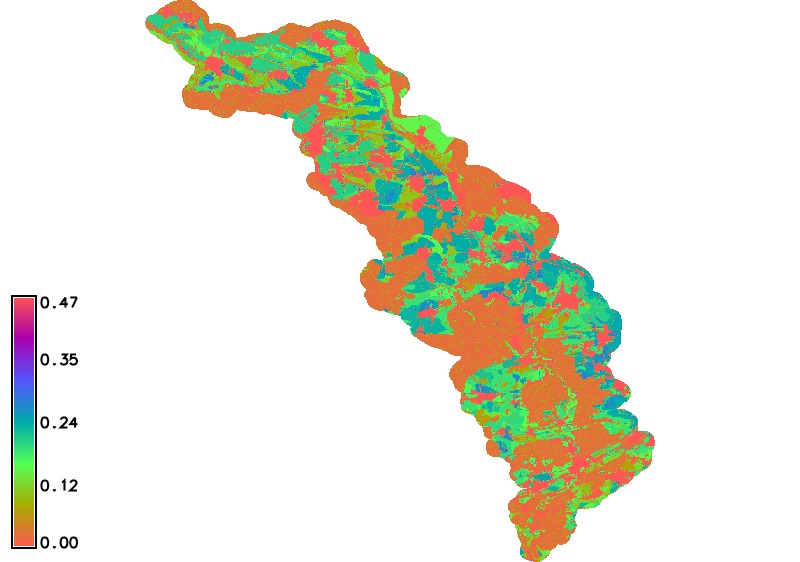
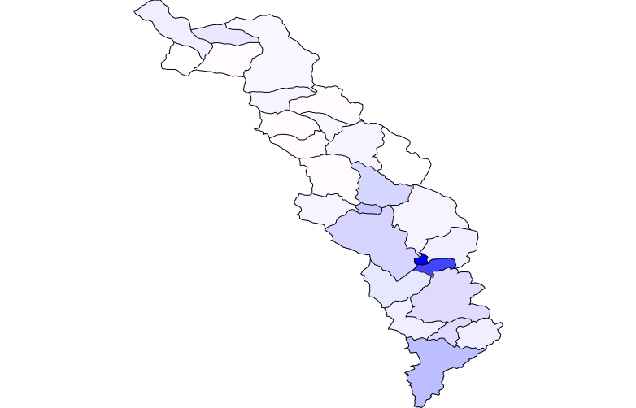

2. Priemerná dlhodobá strata pôdy
=================================

Teoretické východiská
---------------------

Pri výpočtoch priemernej dlhodobej straty pôdy sa proces vodnej erózie popisuje pomocou matematického modelu USLE, tzv. univerzálnej rovnice straty pôdy:

.. math::
   
   G = R \times K \times L \times S \times C \times P
   
.. math::
   
   (t.ha^{-1} . rok^{-1})=(MJ.ha^{-1} .cm.h^{-1}) \times (t.h.MJ^{-1} .cm^{-1} .rok^{-1}) \times ( ) \times ( ) \times ( ) \times ( )

Základné symboly:

 * G ... priemerná dlhodobá strata pôdy
 * R ... faktor eróznej účinnosti dažďa
 * K ... faktor erodovateľnosti pôdy 
 * L ... faktor dĺžky svahu 
 * S ... faktor sklonu svahu 
 * C ... faktor ochranného vplyvu vegetačného krytu 
 * P ... faktor účinnosti protieróznych opatrení 

Vstupné dáta
------------

 * :map:`DMT` v rozlišení 10 x 10 m
 * :map:`HPJ` - hlavné pôdne jednotky (atribút :dbcolumn:`K_value`)
 * :map:`KPP` - komplexný prieskum pôd (atribút :dbcolumn:`K_faktor`)
 * :dbtable:`HPJ_K.xls`, :dbtable:`KPP_K.xls`, :dbtable:`LU_C.xls` - tabuľky s kódmi K a C

* :map:`hpj_kpp_land` - zjednotenie HPJ a KPP a ich prienik s LU (atribút :dbcolumn:`a_b_K_faktor`)
* :map:`A07_Povodi_IV` - povodia IV. rádu
* základná báza geografických dát - ZABAGED
* ortofotomapa
   
Postup
------

Z digitálneho modelu terénu (DMT) vytvoríme rastrovú mapu znázorňujúcu sklonové pomery v stupňoch (*slope*). Tá bude potrebná neskôr na výpočet :ref:`topografického faktora LS <ls-faktor>`. V prvom kroku nastavíme :skoleni:`výpočtový región
<grass-gis-zacatecnik/intro/region.html>` na základe vstupného DMT a následne použijeme modul :grasscmd:`r.slope.aspect`, viď.
:skoleni:`topografické analýzy
<grass-gis-zacatecnik/raster/analyzy-povrchu.html>`. 

.. code-block:: bash
                
   g.region raster=dmt
   r.slope.aspect elevation=dmt slope=svah                           

.. figure:: images/1b.png
   :class: middle

   Hypsografické stupne (DMT) v metroch a sklonové pomery v stupňoch

Ďalej vytvoríme vyhladený DMT (:option:`filled`), rastrovú mapu smeru odtoku do susednej bunky s najväčším sklonom (:option:`direction`) a rastrovú mapu znázorňujúcu akumuláciu toku v každej bunke (:option:`accumulation`). 

.. note:: Na vytvorenie vyhladeného DMT možno alternatívne použiť aj Addons modul :grasscmdaddons:`r.hydrodem`, pre výpočet smeru odtoku modul :grasscmd:`r.fill.dir` a pre akumuláciu odtoku :grasscmd:`r.watershed`.
          
Pred výpočtom si nastavíme masku podľa záujmového územia pomocou modulu
:grasscmd:`r.mask`.

.. code-block:: bash

   r.mask raster=dmt
   r.terraflow elevation=dmt filled=dmt_fill direction=dir swatershed=sink accumulation=accu tci=tci

.. figure:: images/2b.png
   :class: large

   Smer v stupňoch a akumulácia odtoku v :math:`m^2` vytvorené modulom :grasscmd:`r.terraflow`

.. _ls-faktor:
   
LS faktor
^^^^^^^^^

LS faktor (topografický faktor) možno vypočítať podľa vzťahu:

.. math::
   
   LS = (accu \times \frac{10.0}{22.13})^{0.6} \times (\frac{sin(slope \times \frac{pi}{180})}{0.09})^{1.3}
   
Pre tieto účely využijeme nástroj :grasscmd:`r.mapcalc` ako hlavný
nástroj :skoleni:`mapovej algebry
<grass-gis-zacatecnik/raster/rastrova-algebra.html>` v systéme GRASS.

V zápise pre tento nástroj bude rovnica vyzerať nasledovne:

.. code-block:: bash

   r.mapcalc expr="ls = pow(accu * (10.0 / 22.13), 0.6) * pow(sin(svah * (3.1415926/180)) / 0.09, 1.3)"

Nastavíme vhodnú tabuľku farieb:

.. code-block:: bash

   r.colors map=ls color=colors.txt

::
      
    0.00 128:64:64
    0.01 255:128:64
    0.05 0:255:0
    0.10 0:128:128
    0.20 0:128:255
    
.. figure:: images/3b.png
   :class: small

   Topografický faktor LS zahrňujúci vplyv dĺžky a sklonu svahu    
   
K a C faktor
^^^^^^^^^^^^   

Do aktuálneho mapsetu importujeme vektorovú vrstvu :map:`hpj_kpp_land` (viď. :ref:`návod <hydrsk>` na jej vytvorenie).

.. tip:: V prípade, že mapa :map:`hpj_kpp_land` je len v inom mapsete, možno ju do aktuálneho mapsetu prekopírovať pomocou :grasscmd:`g.mapset`, tak, že najprv zmeníme mapset, pridáme mapu a potom sa vrátime do aktuálneho mapsetu. V správci vrstiev zvolíme  *Make a copy in the current mapset* (pravým tlačidlom myši).

Do jej atribútovej tabuľky pridáme dva nové stĺpce :dbcolumn:`K`
a :dbcolumn:`C`. To vykonáme pomocou :skoleni:`správcu atribútových
dát <grass-gis-zacatecnik/vector/atributy.html>` alebo modulu
:grasscmd:`v.db.addcolumn`.

.. code-block:: bash
                
   v.db.addcolumn map=hpj_kpp_land columns="K double"
   v.db.addcolumn map=hpj_kpp_land columns="C double" 

Hodnotu K faktora pre jednotlivé elementárne plochy priradíme pomocou tabuľky :dbtable:`HPJ_K.xls`. Pre plochy bez hodnoty K faktora doplníme údaje na základe pôdnych typov a subtypov podľa komplexného prieskumu pôd (tabuľka :dbtable:`KPP_K.xls`). Hodnotu C faktora poľnohospodársky využívaných oblastí zistíme z priemerných hodnôt pre jednotlivé plodiny z tabuľky :dbtable:`LU_C.xls`. Na spájanie tabuliek použijeme modul :grasscmd:`v.db.join`

Prevodové tabuľky je potrebné najprv naimportovať do prostredia GRASS GIS. Použijeme modul :grasscmd:`db.in.ogr`:

.. code-block:: bash
                
   db.in.ogr in=KPP_K.xls out=kpp_k
   db.in.ogr in=HPJ_K.xls out=hpj_k
   db.in.ogr in=LU_C.xls out=lu_c
                
   v.db.join map=hpj_kpp_land column=a_HPJ_key other_table=hpj_k other_column=HPJ  

Chýbajúce informácie o hodnote faktora K doplníme z vrstvy KPP z tabuľky :dbtable:`kpp_k` SQL dotazom, ktorý vykonáme 
modulomm :grasscmd:`db.execute`.

.. code-block:: sql
   
   UPDATE hpj_kpp_land_1 SET K = (
   SELECT b.K FROM hpj_kpp_land_1 AS a JOIN kpp_k as b ON a.a_b_KPP = b.KPP)
   WHERE K IS NULL

V dalšom kroku doplníme hodnoty C faktora z importovanej tabuľky
:dbtable:`lu_c`.

.. code-block:: bash
                
   v.db.join map=hpj_kpp_land column=b_LandUse other_table=lu_c other_column=LU      

Ďalej do atribútovej tabuľky pridáme nový atribút :dbcolumn:`KC`, do
ktorého uložíme súčin faktorov ``K * C``. To môžeme vykonať pomocou :skoleni:`správcu atribútových dát <grass-gis-zacatecnik/vector/atributy.html>` alebo modulom :grasscmd:`v.db.addcolumn` v kombinácii s :grasscmd:`v.db.update`.

.. code-block:: bash

   v.db.addcolumn map=hpj_kpp_land columns="KC double"
   v.db.update map=hpj_kpp_land column=KC value="K * C"

Výsledok možno skontrolovať jednoduchým SQL dotazom pomocou modulu :grasscmd:`db.select`.

.. code-block:: bash

   db.select sql="select cat,K,C,KC from hpj_kpp_land_1 where cat < 10"

V ďalšom kroku vektorovú mapu prevedieme na rastrovú reprezentáciu
(:grasscmd:`v.to.rast`), pre zachovanie informácie použijeme priestorové
rozlíšenie *1 m* (:grasscmd:`g.region`, viď. :skoleni:`výpočtový región
<grass-gis-zacatecnik/intro/region.html>`).

.. code-block:: bash
   
   g.region raster=dmt res=1                                             
   v.to.rast input=hpj_kpp_land output=hpj_kpp_kc use=attr attribute_column=KC

Pomocou modulu :grasscmd:`r.resamp.stats` potom vykonáme prevzorkovanie
na priestorové rozlíšenie DMT 10 m a to na základe priemeru hodnôt
vypočítaného z hodnôt okolitých buniek. Týmto postupom zabránime strate
informácií, ku ktorému by došlo pri priamom prevode na raster s rozlíšením 10 m (pri rasterizácii sa hodnota bunky rastra volí na základe polygónu, ktorý prechádza stredom bunky alebo na základe polygónu, ktorý zaberá najväčiu čásť plochy bunky).

.. code-block:: bash

   g.region raster=dmt     
   r.resamp.stats input=hpj_kpp_kc output=hpj_kpp_kc10                        

Kvôli vizualizácii nastavíme vhodnú :skoleni:`tabuľku farieb
<grass-gis-zacatecnik/raster/tabulka-barev.html>`:

.. code-block:: bash
                
   r.colors map=hpj_kpp_kc10 color=wave                                       

   Faktor KC zahrňujúci vplyv erodovateľnosti pôdy a vplyv ochranného vplyvu vegetačného krytu

R a P faktor
^^^^^^^^^^^^^^^^^^   

Použijeme priemernú hodnotu R a P faktora pre Českú republiku

.. math::

   R = 40 \, MJ.ha^{-1} .cm.h^{-1}
   
   P = 1

Výpočet priemernej dlhodobej straty pôdy
^^^^^^^^^^^^^^^^^^^^^^^^^^^^^^^^^^^^^^^

Stratu pôdy `G` vypočítame modulom :grasscmd:`r.mapcalc`:

.. code-block:: bash
                
   r.mapcalc expr="g = 40 ∗ ls ∗ hpj_kpp_kc ∗ 1"

Priemerná hodnota straty pre povodie
^^^^^^^^^^^^^^^^^^^^^^^^^^^^^^^^^^^^ 
   
Na určenie priemernej hodnoty a sumu straty pre každé čiastkové povodie využijeme modul :grasscmd:`v.rast.stats`.

.. code-block:: bash
                
   v.rast.stats map=A07_Povodi_IV raster=g column_prefix=g_

Na zobrazenie štatistiky priemerných hodnôt straty pôdy slúži modul :grasscmd:`v.db.univar`.

.. code-block:: bash

   v.db.univar map=A07_Povodi_IV column=g_average

Pro účely vizualizace nastavíme vhodnou tabulku barev pomocí modulu
:grasscmd:`v.colors`.

.. code-block:: bash
             
   v.colors map=A07_Povodi_IV use=attr column=g_average color=blues

   Povodia podľa straty pôdy

---------------------------------------------------------------------
    
Zahrnutí prvků přerušujících odtok
^^^^^^^^^^^^^^^^^^^^^^^^^^^^^^^^^^

Pro výpočet uvedený výše vychází ztráta půdy v některých místech
enormně vysoká. To je způsobeno tím, že ve výpočtu nejsou zahrnuty
liniové a plošné prvky přerušující povrchový odtok. Těmito prvky jsou
zejména budovy, příkopy silnic a cest, železniční tratě nebo zdi
lemující pozemky.

Pro zjištění přesnějších hodnot je tedy nutné tyto prvky do výpočtu
zahrnout. Proto byla na základě vybraných prvků vytvořena maska prvků
přerušujících odtok.

Masku liniových a plošných prvků spojíme pomocí modulu
:grasscmd:`v.patch`. Před spojením vektorových map rozšíříme liniové
prvky z důvodu nastavení masky pomocí modulu :grasscmd:`v.buffer`.

.. code-block:: bash

   v.buffer input=maska_linie output=maska_linie5 distance=5
   v.patch input=maska_linie5,maska_plochy output=maska
                          
Masku pro další analýzu nastavíme pomocí modulu :grasscmd:`r.mask`.

.. code-block:: bash

   r.mask -i vector=maska

S využitím masky vypočteme nově LS faktor a ztrátu půdy G.

.. code-block:: bash

   r.terraflow elevation=dmt filled=dmt_fill2 direction=dir2 swatershed=sink2 accumulation=accu2 tci=tci2
   r.mapcalc expr="ls2 = pow(accu2 * (10.0 / 22.13), 0.6) * pow(sin(svah * (3.1415926/180)) / 0.09, 1.3)"
   r.mapcalc expr="g2 = 40 ∗ ls2 ∗ hpj_kpp_kc ∗ 1"

.. todo:: doplnit porovnání, LS faktor vychází divně
             
::

   .. figure:: images/porovnani_ls.png
               
               Porovnání hodnot LS faktoru bez zohlednění prvků přerušujících
               odtok (vlelvo) a s prvky přerušujícími odtok (vpravo)

   .. figure:: images/porovnani_g.png

               Porovnání výsledků USLE bez zohlednění prvků přerušujících odtok
               (vlelvo) a s prvky přerušujícími odtok (vpravo)

Poznámky
--------

GRASS nabízí pro výpočet USLE dva užitečné moduly :grasscmd:`r.uslek`
a :grasscmd:`r.usler`.
