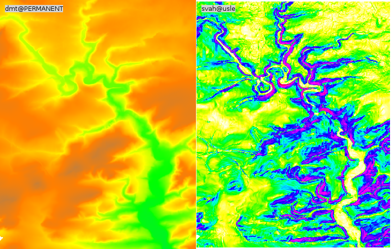

Průměrná dlouhodobá ztráta půdy
===============================

Vstupní data
------------

* vrstva povodí IV. řádu
* DMT v rozlišení 10 x 10 m
* HPJ - hlavní půdní jednotky z kódu BPEJ
* KPP - komplexní průzkum půd
* základní báze geografických dat - ZABAGED
* ortofotomapa
   
Postup
------

Nejrpve vytvoříme z DMT rastrovou mapu znázorňující sklonové poměry ve
stupních (*slope*), který později použijeme pro výpočt topografického
faktoru LS. Pro výpočet sklonových poměrů použijeme
:grasscmd:`r.slope.aspect`, viz :skoleni:`topografické analýzy
<grass-gis-zacatecnik/raster/analyzy-povrchu.html>`. Nejprve je třeba
nastavit :skoleni:`výpočetní region
<grass-gis-zacatecnik/intro/region.html>` na základě vstupního DMT.

.. code-block:: bash
                
   g.region raster=dmt
   r.slope.aspect elevation=dmt slope=svah                           

      DMT a míra svahu
