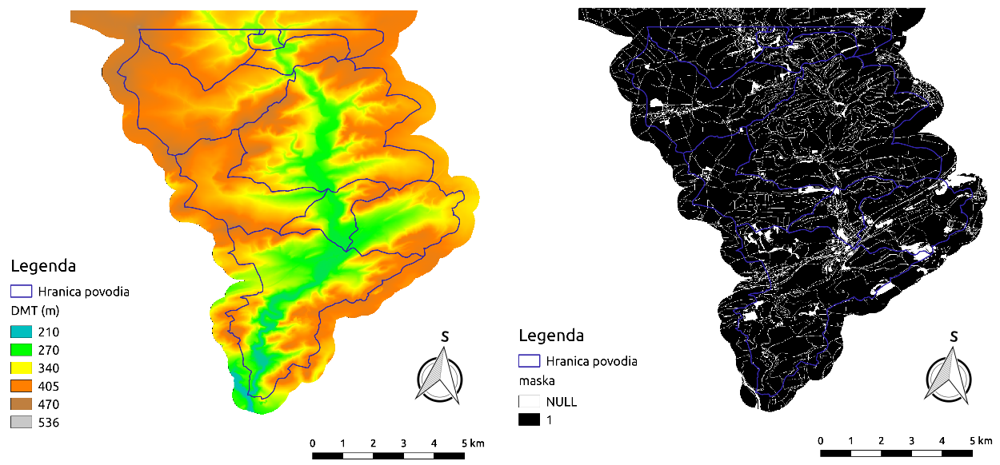

2. Průměrná dlouhodobá ztráta půdy
==================================

Teoretické základy
------------------

Průměrná roční ztráta půdy způsobené odtokom z pozemku určitého sklonu
a způsobu využívaní možno predikovat pomocí matematického modelu
:wikipedia:`USLE <Univerzální rovnice ztráty půdy>`, tzv. univerzální
rovnice ztráty půdy:

.. _vzorec-G:

.. math::
   
   G = R \times K \times L \times S \times C \times P

Základní symboly
----------------

 * G - průmerná dlouhodobá ztráta půdy (:math:`t.ha^{-1} . rok^{-1}`)
 * R - faktor erozní účinnosti deště (:math:`MJ.ha^{-1} .cm.h^{-1}`)
 * K - faktor erodoze půdy (:math:`t.h.MJ^{-1} .cm^{-1} .rok^{-1}`) 
 * L - faktor délky svahu (:math:`-`)
 * S - faktor sklonu svahu (:math:`-`)
 * C - faktor ochranného vlivu vegetačního krytu (:math:`-`) 
 * P - faktor účinnosti protierozních opatření (:math:`-`) 
          
Vstupní data
------------

 * :map:`hpj.shp` - vektorová vrstva hlavních půdních jednotek z kódů BPEJ
 * :map:`kpp.shp` - vektorová vrstva komplexního průzkumu půd
 * :map:`landuse.shp` - vektorová vrstva využití území
 * :map:`povodi.shp` - vektorová vrstva povodí IV. řádu s návrhovými
   srážkami :math:`H_s` (doba opakovaní 2, 5, 10, 20, 50 a 100 let)
 * :dbtable:`hpj_k` - číselník s kódem `K` pro hlavní půdní jednotky, :num:`#ciselniky` vlevo
 * :dbtable:`kpp_k` - číselník s kódem `K` pro vrstvu komplexního
   průzkumu půd, :num:`#ciselniky` vpravo
 * :dbtable:`lu_c` - číselník s kódem `C` pro vrstvu využití území,
   :num:`#ciselniky` vpravo
 * :map:`dmt` - digitální model terénu v rozlišení 10 x 10 m,
   :num:`#dmt-maska` vlevo
 * :map:`maska.pack` - oblast území bez liniových a plošných prvků
   prerušujících odtok, :num:`#dmt-maska` vpravo
             
Navrhovaný postup
-----------------

:ref:`1.<krok1>` 
sjednocení hlavních půdních jednotek a komplexního průzkumu půd

:ref:`2.<krok2>` 
připojení hodnot faktora `K` k elementárním plochám

:ref:`3.<krok3>` 
průnik vrstvy s faktorom `K` s vrstvou využití území

:ref:`4.<krok4>` 
připojení hodnot faktoru `C`

:ref:`5.<krok5>` 
výpočet parametru `KC` 

:ref:`6.<krok6>` 
vytvoření rastrové mapy sklonu a mapy akumulací toku v každé buňce

:ref:`7.<krok7>` 
výpočet parametru `LS`

:ref:`8.<krok8>` výpočet `G` a vytvoření rastru s hodnotami
představující průměrnou dlouhodobou ztrátu půdy

:ref:`9.<krok9>` 
výpočet průměrných hodnot `G` pro povodí

:ref:`10.<krok10>` 
vytvoření rastrových vrstev `LS` a `G` s maskou

:ref:`11.<krok11>` 
výpočet průměrných hodnot `G` pro povodí s maskou 

.. _schema-usle:

.. figure:: images/schema_usle.png
   :class: large

   Grafické schéma postupu. 

Znázornění vstupních vektorových dat spolu s atributovými tabulkami je
totožné se :ref:`vstupními vektorovými daty pro metodu SCS CN
<scs-cn-vstupni-data>`. Digitální model reliéfu a oblast řešeného
území bez liniových a plošných prvků přerušující odtok (maska) jsou na
:num:`#dmt-maska`. Tabulky s faktory `K` a `C` jsou uvedeny na
:num:`#ciselniky`.

.. _dmt-maska:

   Vrstva digitálního modelu reliéfu a oblast řešeného území bez prvků 
   přerušujících odtok.

.. _ciselniky:

.. figure:: images/ciselniky_usle.png
   :class: middle

   Číselníky s hodnotami *K* a *C*. 

Postup zpracování v GRASS GIS
-----------------------------

Z digitálního modelu terénu (DMT) vytvoříme rastrovou mapu
znázorňující sklonové poměry v stupních (*slope*). Ten bude potřebný
později na výpočet :ref:`topografického faktoru LS <ls-faktor>`. V
prvním kroku nastavíme :skoleni:`výpočetní region
<grass-gis-zacatecnik/intro/region.html>` na základě vstupního DMT a
následně použijeme modul :grasscmd:`r.slope.aspect`, viz. školení
GRASS GIS pro začátečníky :skoleni:`topografické analýzy
<grass-gis-zacatecnik/rastrova_data/analyzy-povrchu.html>`.

.. code-block:: bash
                
   g.region raster=dmt
   r.slope.aspect elevation=dmt slope=svah

.. figure:: images/1b.png
   :class: middle

   Hypsografické stupně (DMT) v metrech a sklonové poměry v stupňích.

Dále vytvoříme vyhlazený DMT (:option:`filled`), rastrovou mapu směru
odtoku do sousední buňky s největším sklonem (:option:`direction`) a
rastrovou mapu znázorňující akumulaci toku v každé buňce
(:option:`accumulation`).

.. note:: Na vytvoření vyhlazeného DMT možno alternativně použít také
          Addons modul :grasscmdaddons:`r.hydrodem`, pro výpočet směru
          odtoku modul :grasscmd:`r.fill.dir` a pro akumulaci odtoku
          :grasscmd:`r.watershed`.

   .. todo:: Tady by chtělo hlubší analýzu, v čem se moduly liší, to
             je otázka na kolegy z k143.
   
Před výpočtem si nastavíme masku podle zájmového území pomocí
modulu :grasscmd:`r.mask`.

.. code-block:: bash

   r.mask raster=dmt
   r.terraflow elevation=dmt filled=dmt_fill direction=dir swatershed=sink accumulation=accu tci=tci

   Směr v stupních a akumulací odtoku v :math:`m^2` vytvořené modulem
   :grasscmd:`r.terraflow`.

.. _ls-faktor:
   
LS faktor
^^^^^^^^^

LS faktor (topografický faktor) možno vypočítat podle vztahu:

.. math::
   
   LS = (accu \times \frac{10.0}{22.13})^{0.6} \times (\frac{sin(slope \times \frac{pi}{180})}{0.09})^{1.3}
   
Pro tyto účely využijeme nástroj :grasscmd:`r.mapcalc` jako hlavní
nástroj :skoleni:`mapové algebry
<grass-gis-zacatecnik/rastrova_data/rastrova-algebra.html>` v systému
GRASS.

V zápisu pro tento nástroj bude rovnice vypadat následovně:

.. code-block:: bash

   r.mapcalc expr="ls = pow(accu * (10.0 / 22.13), 0.6) * pow(sin(svah * (3.1415926/180)) / 0.09, 1.3)"

Nastavíme vhodnou tabulku barev:

.. code-block:: bash

   r.colors map=ls color=colors.txt

::
      
    0.00 128:64:64
    0.01 255:128:64
    0.05 0:255:0
    0.10 0:128:128
    0.20 0:128:255
    
.. figure:: images/3b.png
   :class: small

   Topografický faktor LS zahrnující vliv délky a sklonu svahu.
   
K a C faktor
^^^^^^^^^^^^

Do aktuálního mapsetu importujeme vektorovou vrstvu :map:`hpj_kpp_land`
(viz. :ref:`návod <hydrsk>` na její vytvoření).

.. todo:: Tady by měl být link na scs-cn (?)
          
.. tip:: V případě, že mapa :map:`hpj_kpp_land` je umístěna v jiném
         mapsetu, je možno ji do aktualního mapsetu překopírovat
         pomocí :grasscmd:`g.mapset`, tak, že najprve změníme mapset,
         přidáme mapu a potom sa vrátíme do aktuálního mapsetu. V
         správci vrstev zvolíme pravým tlačítkem myši *Make a copy in
         the current mapset*.

.. todo:: Ten tip zní zmatečně, kopírování je přes :grasscmd:`g.copy`,
          přepínat se do mapsetu mapy není třeba, stačí ho přidat do
          vyhledávací cesty.
                   
Do její atributové tabulky přidáme dva nové sloupce :dbcolumn:`K` a
:dbcolumn:`C`. To vykonáme pomocí :skoleni:`správce atributových dat
<grass-gis-zacatecnik/vektorova_data/atributy.html>` anebo modulu
:grasscmd:`v.db.addcolumn`.

.. code-block:: bash
                
   v.db.addcolumn map=hpj_kpp_land columns="K double"
   v.db.addcolumn map=hpj_kpp_land columns="C double" 

Hodnotu K faktoru pro jednotlivé elementární plochy přiřadíme pomocou
tabulky :dbtable:`HPJ_K.xls`. Pro plochy bez hodnoty K faktoru
doplníme údaje na základě půdních typů a subtypů podle komplexního
průzkumu půd (tabulka :dbtable:`KPP_K.xls`). Hodnota C faktoru
zemědělsky využívaných oblastí zjistíme z průměrných hodnot pro
jednotlivé plodiny z tabulky :dbtable:`LU_C.xls`. Na spojení tabulek
použijeme modul :grasscmd:`v.db.join`

Převodové tabulky je potřebné najprve naimportovat do prostředí GRASS
GIS. Použijeme modul :grasscmd:`db.in.ogr`:

.. code-block:: bash
                
   db.in.ogr in=KPP_K.xls out=kpp_k
   db.in.ogr in=HPJ_K.xls out=hpj_k
   db.in.ogr in=LU_C.xls out=lu_c
 
Potom přistoupíme k připojení tabulky :dbtable:`hpj_k` k atributům
vektorové vrstvy :map:`hpj_kpp_land`, přitom klíčem bude atribut
:dbcolumn:`HPJ_key`.

.. code-block:: bash 
            
   v.db.join map=hpj_kpp_land column=a_HPJ_key other_table=hpj_k other_column=HPJ 

Chýbějící informace hodnoty faktoru ``K`` doplníme z tabulky
:dbtable:`kpp_k` SQL dotazom prostřednictvím modulu
:grasscmd:`db.execute`.

.. code-block:: bash
   
   db.execute sql="UPDATE hpj_kpp_land SET K = (
   SELECT b.K FROM hpj_kpp_land AS a JOIN kpp_k as b ON a.a_b_KPP = b.KPP)
   WHERE K IS NULL"

.. todo:: Nestačil by tady odkaz na text v scs-cn?
             
V dalším kroku doplníme hodnoty ``C`` faktoru z importované tabulky
:dbtable:`lu_c`.

.. code-block:: bash
                
   v.db.join map=hpj_kpp_land column=b_LandUse other_table=lu_c other_column=LU 

.. todo:: Co je b_LandUse?
             
Údaje v atributové tabulky si zkontrolujeme, či jsou vyplněné
správně. Použijeme SQL dotaz :grasscmd:`db.select`, přitom vybere jen
první 3 záznamy.

.. code-block:: bash

   db.select sql="select cat,K,C from hpj_kpp_land where cat <= 5"

Výsledek může vypadat například i takto:

.. code-block:: bash

   cat|K|C
   1|0.13|0.19
   2|0.13|0.19
   3|0.13|0.19
   ...

Dále do atributové tabulky přidáme nový atribut :dbcolumn:`KC`, do
kterého uložíme součin faktorů ``K * C``. To můžeme vykonat pomocí
:skoleni:`správce atributových dat
<grass-gis-zacatecnik/vektorova_data/atributy.html>` anebo modulem
:grasscmd:`v.db.addcolumn` s kombinací s :grasscmd:`v.db.update`.

.. code-block:: bash

   v.db.addcolumn map=hpj_kpp_land columns="KC double"
   v.db.update map=hpj_kpp_land column=KC value="K * C"

Ukázkový výsledek pro první tři záznamy opět zkontrolujeme.

.. code-block:: bash

   db.select sql="select cat,K,C,KC from hpj_kpp_land where cat <= 3"

.. code-block:: bash

   cat|K|C|KC
   1|0.13|0.19|0.0247
   2|0.13|0.19|0.0247
   3|0.13|0.19|0.0247
   ...

V dalším kroku vektorovou mapu převedeme na rastrovou reprezentací
modulem :grasscmd:`v.to.rast`. Pro zachovaní informací použijeme
prostorové rozlišení *1 m* (:grasscmd:`g.region`,
viz. :skoleni:`výpočetní region
<grass-gis-zacatecnik/intro/region.html>`).

Pomocí modulu :grasscmd:`r.resamp.stats` potom provedeme převzorkovaní
na prostorové rozlišení DMT *10 m* a to na základě průměru hodnot
vypočítaného z hodnot okolních buněk. Tímto postupom zabráníme ztrátě
informácí, ke kterému by došlo při přímém převodu na rastr s
rozlišením *10 m*. Při rasterizaci se totiž hodnota buňky rastru
odvozuje na základě polygonu, který prochází středem buňky anebo na
základě polygonu, který zabírá najvětší část plochy buňky.

.. code-block:: bash
   
   g.region raster=dmt res=1 
   v.to.rast input=hpj_kpp_land output=hpj_kpp_land_kc use=attr attribute_column=KC

   g.region raster=dmt
   r.resamp.stats input=hpj_kpp_land_kc output=hpj_kpp_land_kc10 

Na obrázku :num:`#porovkn` je znázorněná část zájmového území, kde
možno vidět rastrovou vrstvu :map:`hpj_kpp_land_kc` před (vlevo dole)
a po použití modulu :grasscmd:`r.resamp.stats`.

.. _porovkn:

.. figure:: images/10a.png
   
   Část zájmového území s faktorem *KC* před a po převzorkovaní.
                      
Kvůli vizualizaci nastavíme vhodnou :skoleni:`tabulku barev
<grass-gis-zacatecnik/rastrova_data/tabulka-barev.html>` a kvůli
přehlednosti mapu přejmenujeme na :map:`kc` modulem
:grasscmd:`g.rename`. Výsledok je na :num:`#kc`.

.. code-block:: bash
                
   r.colors map=hpj_kpp_land_kc10 color=wave
   g.rename raster=hpj_kpp_land_kc10,kc

.. _kc:

.. figure:: images/11.png
   :class: small

   Faktor *KC* zahrnující vliv eroze půdy a vliv ochranného vlivu
   vegetačního pokrytu.

R a P faktor
^^^^^^^^^^^^

Hodnoty těchto parametrů nebudeme odvozovat jako ty předchádzející. V
tomto případě jednoduše použijeme průmernou hodnotu ``R`` a ``P``
faktoru pro Českou republiku, t.j ``R = 40`` a ``P = 1``.

Výpočet průmerné dlouhodobé ztráty půdy
^^^^^^^^^^^^^^^^^^^^^^^^^^^^^^^^^^^^^^^

Ztrátu půdy `G` vypočítame modulem :grasscmd:`r.mapcalc`
(:num:`#rmapcalc`), přičemž vycházíme ze vztahu, který byl uvedený v
:ref:`teoretické časti školení <vzorec-G>`.

.. _rmapcalc:

.. figure:: images/15.png
   :class: small

Pro výslednou vrstvu zvolíme vhodnou barevnou škálu, přidáme legendu,
měřítko a mapu zobrazíme (:num:`#map-g`)

.. code-block:: bash
                
   r.mapcalc expr="g = 40 ∗ ls ∗ kc ∗ 1"
   r.colors -n -e map=g color=corine

.. _map-g:

.. figure:: images/12.png
   :class: small

   Vrstva s hodnotami představujícími průměrnou dlouhodobou ztrátu
   půdy G v jednotkách :math:`t.ha^{-1} . rok^{-1}`.

.. note:: Na :num:`#map-g` je maximální hodnota v legendě *1*. Je to
    pouze z důvodu, aby byl výsledek přehledný a korespondoval s
    barvami v mapě. V skutečnosti parametr ``G`` nabývá hodnotu až
    *230*, při takovémto rozsahu by byla stupnice v legendě
    jednobarevná (v našem případě červená).  Změnit rozsah intervalu v
    legendě bylo možné nastavením parametru *range*, konkrétněji
    příkazem :code:`d.legend raster=g range=0,1`.

Průměrná hodnota ztráty pro povodí
^^^^^^^^^^^^^^^^^^^^^^^^^^^^^^^^^^

Na určení průměrné hodnoty a sumy ztráty prp každé částečné povodí
využijeme modul :grasscmd:`v.rast.stats`. Klíčovou vrstvou je
vektorová mapa povodí :map:`A07_Povodi_IV`, kde nastavíme prefix
:item:`g_` pre nově vytvořený sloupec. Z toho potom modulem
:grasscmd:`v.db.univar` zobrazíme statistiky průměrných hodnot ztráty
půdy.

.. code-block:: bash
                
   v.rast.stats map=A07_Povodi_IV raster=g column_prefix=g method=average
   v.db.univar map=A07_Povodi_IV column=g_average

.. note:: Vektorová vrstva povodí musí být v aktuálním mapsetu. Pokud
          například pracujeme v jiném mapsetě, stačí když ji přidáme z
          mapsetu :mapset:`PERMANENT` a následně v menu pravým
          kliknutím na mapě zvolíme :item:`Make a copy in the current
          mapset`.

Pro účely vizualizace vektorovou vrstvu převedeme na rastr, pomocí
modulu :grasscmd:`r.colors` nastavíme vhodnou tabulku barev a výsledek
prezentujeme, viz. :num:`#g-average`.

.. code-block:: bash
   
   v.to.rast input=A07_Povodi_IV output=pov_avg_G use=attr attribute_column=g_average
   r.colors -e map=pov_avg_G color=bgyr

.. _g-average:

.. figure:: images/13.png

   Povodí s průměrnými hodnotami ztráty půdy

.. note:: Z důvodu přehlednosti je opet interval v legendě
          upravený. Maximální hodnota průmerné ztráty půdy na povodí
          je až *0.74* (v jednotkách :math:`t.ha^{-1} . rok^{-1}`)
    
Zahrnutí prvků prerušujících odtok
^^^^^^^^^^^^^^^^^^^^^^^^^^^^^^^^^^

.. todo:: Vzít *dmt*, vypočítat *svah* (bez prvků prerušujících
          odtok), potom přidat masku, vytvorit *accu* - to je ok.
          Třeba to provést JINAK!!! hlavně s normálnou vrstvou prvků
          přerušujících odtok!

Pro výpočet uvedený výše vychází ztráta půdy v některých místech
enormně vysoká. To je způsobené tím, že ve výpočtech nejsou zahrnuté
liniové a plošné prvky přerušující povrchový odtok. Těmito prvky jsou
především budovy, příkopy dálnic a silnic, železniční tratě anebo
ploty lemijící pozemky.

Abysme zjistili přesnější hodnoty, je nutné tyto prvky do výpočtu
zahrnout. Pro tento účel použijeme masku liniových a plošných prvků
přerušujících odtok :map:`maska.patch` a vypočítame nové hodnoty LS
faktoru a ztráty půdy. Vstupem bude :map:`dmt` bez prvků přerušujících
odtok (:num:`#dmt-m`).

.. code-block:: bash
   
   r.unpack -o input=MASK.pack output=maska
   r.mask raster=maska
   r.terraflow elevation=dmt filled=dmt_fill_m direction=dir_m swatershed=sink_maccumulation=accu_m tci=tci_m

.. _dmt-m:

.. figure:: images/14a.png
   :class: small

   Vrstva digitálního modelu terénu vstupujícího do výpočtu bez prvků
   přerušujících odtok.

Dále dopočítame faktor *LS* a následně *G*.

.. code-block:: bash

   r.mapcalc expr="ls_m = pow(accu_m * (10.0 / 22.13), 0.6) * pow(sin(svah * (3.1415926/180)) / 0.09, 1.3)"
   r.mapcalc expr="g_m = 40 ∗ ls_m ∗ kc ∗ 1"
   
   r.colors map=ls_m color=wave
   r.colors -n -e map=g_m color=corine

V posledním kroku vymažeme masku, výsledky zobrazíme a porovnáme
(:num:`#ls-porov` a :num:`#g-porov`).
             
.. _ls-porov:

     
   Porovnání hodnot faktoru LS bez ohledu na prvky přerušující odtok
   (vlevo) a s prvky přerušujícími odtok (vpravo).

.. _g-porov:

.. figure:: images/g_porov.png
   :scale: 57%

   Porovnaní výsledků USLE bez ohledu na prvky přerušující odtok
   (vlevo) a s prvky přerušujícími odtok (vpravo).

Průměrná hodnota ztráty prp povodí s prvky přerušujícími odtok
^^^^^^^^^^^^^^^^^^^^^^^^^^^^^^^^^^^^^^^^^^^^^^^^^^^^^^^^^^^^^^
   
Opět využijeme modul :grasscmd:`v.rast.stats`. Vektorové mapě povodí
:map:`A07_Povodi_IV` nastavíme prefix :item:`g_m` pro nově vytvořený
sloupec a potom modulem :grasscmd:`v.db.univar` zobrazíme statistiky
průměrných hodnot ztráty půdy. Výsledek v rastrové podobě je na
:num:`#g-m-average`.

.. code-block:: bash
                
   v.rast.stats map=A07_Povodi_IV raster=g_m column_prefix=g_m method=average
   v.db.univar map=A07_Povodi_IV column=g_m_average
   
   v.to.rast input=A07_Povodi_IV output=pov_avg_G_m use=attr attribute_column=g_m_average
   r.colors -e map=pov_avg_G_m color=bgyr

.. _g-m-average:

.. figure:: images/16.png

   Povodí s průměrnými hodnotami ztráty půdy s uvážením prvků,
   které přerušují odtok.

Na závěr vypočítáme rozdíly (modul :grasscmd:`r.mapcalc`) výsledných
vrstev bez a s uvážením prvků, které přerušují odtok pro faktor *LS*,
hodnoty představující průměrnou dlouhodobou ztrátu půdy *G* a povodí s
průměrnými hodnotami ztráty půdy *G_pov*. Nazveme je :map:`delta_ls`,
:map:`delta_g` a :map:`delta_pov_avg` a nastavíme barevnou stupnici
:item:`differences`. Viz. :num:`#diff`.

.. code-block:: bash

   r.mapcalc expression=delta_ls = ls - ls_m
   r.mapcalc expression=delta_g = g - g_m
   r.mapcalc expression=delta_pov_avg = pov_avg_G - pov_avg_G_m

   r.colors map=delta_ls color=differences
   r.colors map=delta_g color=differences
   r.colors map=delta_pov_avg color=differences

.. _diff:

   Znázornění rozdílů rastrových vrstev LS, G a G_pov, které
   vznikly bez uvážení a s uvážením prvků, které přerušují odtok.
 
Poznámky
--------

GRASS nabízí na výpočet USLE dva užitečné moduly :grasscmd:`r.uslek` a
:grasscmd:`r.usler`.
