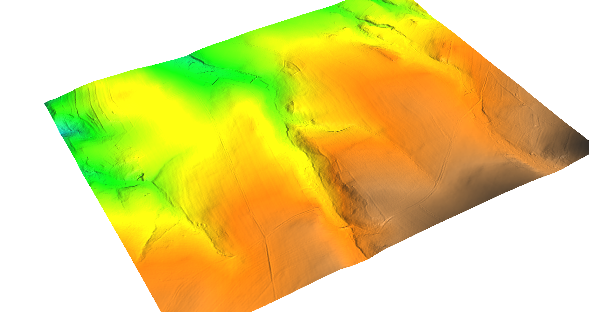
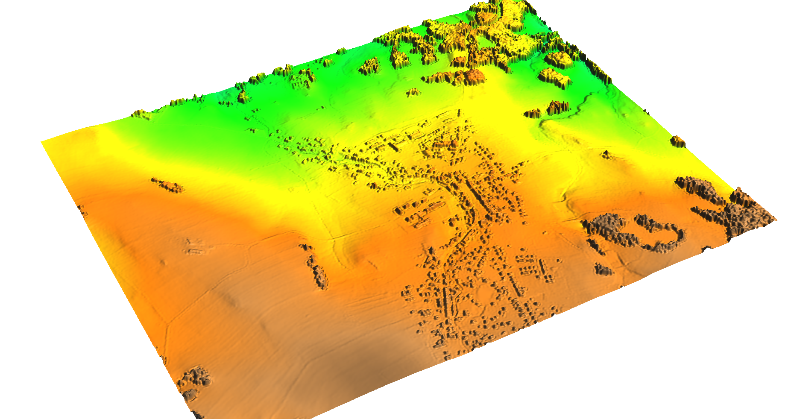

Zpracování DMR a DMP (ČÚZK)
===========================

Tato kapitola shromažuje informace, jak pracovat s daty **digitálního
modelu reliéfu a povrchu** poskytovaných `Českým úřadem zeměměřičským
a katastrálním <http://www.cuzk.cz/>`__.

Tyto produkty poskytuje ČÚZK ve dvou formátech:

1. textovém XYZ
2. binárním LAS, resp. komprimovaném LAZ

.. note:: Tato data nejsou poskytována v režimu otevřených dat, ČÚZK
          nicméně zveřejnil vzorová data volně ke stažení `zde
          <http://geoportal.cuzk.cz/UKAZKOVA_DATA/VYSKOPIS.zip>`__. Tento
          úkázkový dataset obsahuje data pouze v textovém formátu XYZ.

Postup importu dat v textovém či binárním formátu je popsán v
:doc:`předcházející kapitole <import>`.

Digitální model reliéfu
-----------------------

:wikipedia:`Digitální model reliéfu <Digitální model terénu>`, někdy
označovaný jako Digitální model terénu (DMT/DMR) poskytuje ČÚZK ve
dvou formátech:

1. textovém XYZ
2. binárním LAS, resp. komprimovaném LAZ

`Digitální
model reliéfu České republiky
<http://geoportal.cuzk.cz/%28S%28kle1ef454jwgniffefmzxmed%29%29/Default.aspx?mode=TextMeta&side=vyskopis&metadataID=CZ-CUZK-DMR5G-V&head_tab=sekce-02-gp&menu=302>`__

   Ukázka interpolovaného digitálního modelu reliéfu

Digitální model povrchu
-----------------------

:wikipedia:`digitálního modelu povrchu <Digitální model povrchu>`
(DMP)

`Digitální model povrchu České republiky
<http://geoportal.cuzk.cz/%28S%28kle1ef454jwgniffefmzxmed%29%29/Default.aspx?lng=CZ&mode=TextMeta&side=vyskopis&metadataID=CZ-CUZK-DMP1G-V&mapid=8&menu=303>`__

   Ukázka interpolovaného digitálního modelu povrchu

