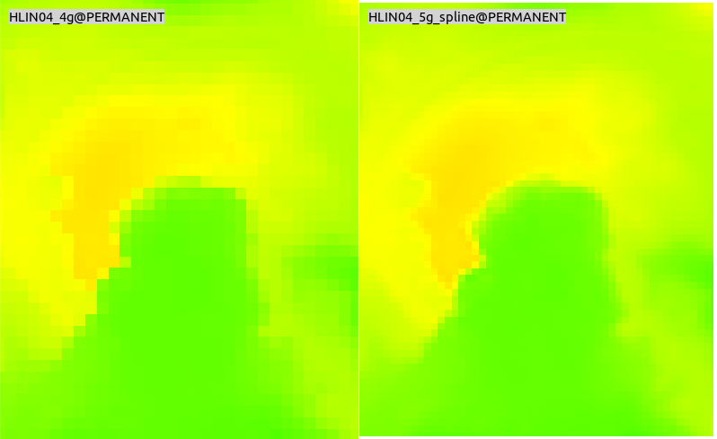

Tvorba DMR a DMP
================

Tato kapitola shromažďuje informace, jak pracovat s daty **digitálního
modelu reliéfu a povrchu** poskytovaných `Českým úřadem zeměměřičským
a katastrálním <http://www.cuzk.cz/>`__ v systému GRASS GIS.

Tyto produkty poskytuje ČÚZK ve dvou formátech:

1. textovém XYZ
2. binárním LAS, resp. komprimované formě LAZ

Souřadnice X,Y jsou referencovány v souřadnicovém systému S-JTSK
(:epsg:`5514`), souřadnice H (nadmořská výška) ve výškovém referenčním
systému Balt po vyrovnání (Bpv).

.. note:: Tato data nejsou poskytována v režimu otevřených dat, ČÚZK
          nicméně zveřejnil vzorová data volně ke stažení `zde
          <http://geoportal.cuzk.cz/UKAZKOVA_DATA/VYSKOPIS.zip>`__. Ukázkový
          dataset obsahuje data pouze v textovém formátu XYZ.

Postup importu lidarových dat je popsán v :doc:`předcházející kapitole
<import>`.

Digitální model reliéfu
-----------------------
   
Data pro :wikipedia:`digitální model reliéfu <Digitální model
terénu>`, tj. digitální reprezentaci modelu reliéfu *bez* umělých a
přírodních objektů (např. vegetace nebo budovy) poskytuje ČÚZK ve dvou
verzích:

.. _dmr4g:

* **DMR4G** - diskrétní body v pravidelné síti (5 x 5 m) bodů o
  souřadnicích X,Y,H s úplnou střední chybou výšky 0,3 m v odkrytém
  terénu a 1 m v zalesněném terénu. Další informace `zde
  <http://geoportal.cuzk.cz/(S(kle1ef454jwgniffefmzxmed))/Default.aspx?lng=CZ&mode=TextMeta&side=vyskopis&metadataID=CZ-CUZK-DMR4G-V&mapid=8&menu=301>`__.
* **DMR5G** - diskrétní body v nepravidelné trojúhelníkové síti (TIN) bodů
  o souřadnicích X,Y,H s úplnou střední chybou výšky 0,18 m v odkrytém
  terénu a 0,3 m v zalesněném terénu. Další informace `zde
  <http://geoportal.cuzk.cz/(S(kle1ef454jwgniffefmzxmed))/Default.aspx?lng=CZ&mode=TextMeta&side=vyskopis&metadataID=CZ-CUZK-DMR5G-V&mapid=8&menu=302>`__.

Digitální model povrchu
-----------------------

Data pro :wikipedia:`digitální model povrchu <Digitální model
povrchu>` (DMP), tj. digitální reprezentaci modelu reliéfu *včetně*
umělých a přírodních objektů poskytuje ČÚZK v současnosti v jedné
verzi, a to jako:

* **DMP1G** - diskrétní body v nepravidelné sítě výškových bodů
  (TIN) s úplnou střední chybou výšky 0,4 m pro přesně vymezené
  objekty (budovy) a 0,7 m pro objekty přesně neohraničené (lesy a
  další prvky rostlinného pokryvu). Další informace `zde
  <http://geoportal.cuzk.cz/(S(kle1ef454jwgniffefmzxmed))/Default.aspx?lng=CZ&mode=TextMeta&side=vyskopis&metadataID=CZ-CUZK-DMP1G-V&mapid=8&menu=303>`__.

Následující kapitoly popisují typické postupy tvorby rastrové či TIN
reprezentace DMR/DMP. 

Tvorba DMR/DMP reprezentace
---------------------------

Digitální model reliéfu či povrchu lze v systému GRASS vytvořit
několika způsoby. První uvedený postup je vhodný především pro
DMR4G. Další tři postupy jsou aplikovatelné jak na DMR5G tak DMP1G.

**1. Vytvoření rastrové reprezentace převzetím hodnot vstupních bodových dat**

Import vstupních dat do rastrové mapy s prostorových rozlišením
odvozeným ze vstupu. Jednoduchý postup vhodný především pro vstupní
bodová data v pravidelné mřížce. Příklad v kapitole
:ref:`create-dmr4g`.

**2. Vytvoření rastrové reprezentace s vyplněním "děr"**

Import vstupních dat do rastrové mapy s prostorových rozlišením
odvozeným ze vstupu. Interpolace hodnot pouze v místech, kde chybí
vstupní data. Příklad v kapitole :ref:`create-dmr5g-holes`.

**3. Spline interpolace z importovaných vektorových bodových dat**

Import vstupních dat do vektorové bodové mapy, interpolace výsledného
povrchu pomocí modulu :grasscmd:`v.surf.rst`. Časově náročné. Vhodné
pro vytvoření DMT s vysokým prostorovým rozlišením. Příklad v kapitole
:ref:`create-dmr5g-spline`.

**4. Vytvoření TIN reprezentace**

Vytvoření TIN (:wikipedia-en:`Triangulated irregular network`)
reprezentace na základě vstupních bodových dat. Většina navazujících
nástrojů pro analýzu topografického povrchu v systému GRASS podporuje
pouze rastrovou reprezentaci digitálního modelu reliéfu či
povrchu. Vhodné při exportu TIN a navazující operace již mimo systém
GRASS GIS. Příklad v kapitole :ref:`create-dmr5g-tin`.

.. _create-dmr4g:
   
Vytvoření DMR převzetím hodnot pravidelné mřížky bodových dat DMR4G
^^^^^^^^^^^^^^^^^^^^^^^^^^^^^^^^^^^^^^^^^^^^^^^^^^^^^^^^^^^^^^^^^^^

V prvním kroku zjistíme hraniční souřadnice importovaných dat, viz
kapitola :ref:`import dat <lidar-import-scan>`.

.. code-block:: bash

   r.in.xyz -sg input=HLIN04_4g.xyz separator=space

Na základě toho nastavíme výpočetní region a to tak, aby střed buňky
odpovídal vstupní pravidelné mřížce bodů. Prostorové rozlišení
nastavíme na 5m, což odpovídá vzdálenosti bodů DMR4G. 

.. code-block:: bash
   
   g.region n=-1088005 s=-1090000 e=-625005 w=-627500 b=461.5 t=554.31
   g.region n=n+2.5 s=s-2.5 w=w-2.5 e=e+2.5 res=5

Následně na to data do nastaveného výpočetního regionu naimportujeme.

.. code-block:: bash

   r.in.xyz input=HLIN04_4g.xyz separator=space output=HLIN04_4g

.. note:: Podobný postup by bylo možné aplikovat na binární vstupní
   data ve formátu LAS/LAZ a modul :grasscmd:`r.in.lidar`, 
   viz kapitola :ref:`import dat <lidar-las-raster-steps>`.
          
.. figure:: images/dmr4g.png
               
   Ukázka výsledného produktu digitálního modelu reliéfu vytvořeno na
   bázi DMR4G převzetím hodnot vstupních bodů. Na obrázku jsou pro
   ilustraci vykreslena vstupní pravidelná síť bodů DMR4G a výstupní
   mřížka rastrové mapy.

.. tip:: Zájmové území by nemělo obsahovat místa bez dat. To můžeme
   zkontrolovat pomocí modulu :grasscmd:`r.univar`.

   .. code-block:: bash

      r.univar HLIN04_4g

   ::
      
      ...
      total null cells: 0
      ...

           
   Vizualizace terénu na bázi DMR4G ve 3D pohledu.
      
.. _create-dmr5g-holes:
   
Vytvoření DMR kombinací převzetí hodnot DMR5G a interpolací chybějících hodnot
^^^^^^^^^^^^^^^^^^^^^^^^^^^^^^^^^^^^^^^^^^^^^^^^^^^^^^^^^^^^^^^^^^^^^^^^^^^^^^

.. _create-dmr5g-spline:

Začneme obdobně jako v :ref:`předchozí kapitole <create-dmr4g>`
importem vstupních dat do rastrové reprezentace podle toho, zda jsou
vstupní data dostupná v :ref:`textovém <lidar-xyz-raster>` nebo
:ref:`binárním <lidar-las-raster>` formátu. Příklad níže ukazuje
postup pro textová data.

.. code-block:: bash

   r.in.xyz -sg input=HLIN04_5g.xyz separator=space
   g.region n=-1088000.076 s=-1090000.059 e=-624999.829 w=-627499.828 b=461.312 t=554.334

.. _dmr5g_res:
   
V našem případě nastavíme prostorové rozlišení na 3 metry (vycházíme z
průměrné hustoty vstupních bodů, viz :ref:`poznámky k importu
vektorových dat <v-outlier>`). Předtím je samozřejmě nutné importovat
data do vektorové reprezentace, postup je uveden v kapitole
:ref:`create-dmr5g-spline`.

.. code-block::
   v.outlier -e input=HLIN04_5g

::
   
   Estimated point density: 0.1102
   Estimated mean distance between points: 3.012

.. code-block::
   
   g.region res=3 -a

Poté data naimportujeme:

.. code-block:: bash
                
   r.in.xyz input=HLIN04_5g.xyz separator=space output=HLIN04_5g

Rastrová mapa bude vzhledem k povaze dat DMR5G obsahovat místa bez dat
(no-data). V našem případě jde téměř o polovinu buněk(!) Tato místa se
bude snažit v dalším kroku vyplnit na základně interpolovaných hodnot.

.. code-block:: bash

   r.univar map=HLIN04_5g

::
   
   total null and non-null cells: 557112
   total null cells: 249326

   Importovaná dlaždice DMR5G do rastrové reprezentace.

Pro vyplnění chybějících hodnot DMR použijeme modul
:grasscmd:`r.fillnulls`. Modul podporuje tři různé metody interpolace:
*rst* (:wikipedia:`spline`, tj. metoda použitá v kapitole
:ref:`create-dmr5g-spline`), *bilinear* (:wikipedia:`bilinear`),
*bicubic* (:wikipedia:`bicubic <Bikubická interpolace>`). Pro DMR je
vhodná metoda spline (*rst*). Nicnémě vzhledem k její časové
náročnosti (desítky minut na uvedené dlaždici) zvolíme v tomto případě
akceptovatelnou bikubickou interpolaci (*bicubic*).

.. code-block:: bash

   r.fillnulls input=HLIN04_5g output=HLIN04_5g_filled method=bicubic

.. figure:: images/dmr5g-filled.png

   Importovaná dlaždice DMR5G po interpolaci chybějících
   hodnot. Barevná tabulka nastavena na *elevation*.

.. figure:: images/dmr5g-3d.png
   :class: middle
           
   Vizualizace terénu na bázi DMR5G ve 3D pohledu.
            
Velmi dobrou alternativou k výše uvedenému modulu je
:grasscmd:`r.fill.stats`. Ten je určen k rychlému doplnění chybějících
hodnot na základě statistiky vstupních dat. Výchozí metoda (*wmean*) v
podstatě odpovídá interpolační metodě :wikipedia:`IDW`, *mean* poté
aplikaci "low-pass filru". Dále jsou dostupné metody *median*,
*mode*. Modul je ideální pro zpracovaní velkého objemu dat ve velmi
vysokém rozlišení. Na rozdíl od :grasscmd:`r.fillnulls` interpoluje
chybějící hodnoty pouze v daném okolí definovaném parametrem
:option:`cells` (výchozí je okolí 8 buněk). Tento postup je vhodný v
případě, že místa s chybějícími hodnotami tvoří menší celky. Což není
náš případ, kdy počet chybějících hodnot dosahuje téměř 50%.

.. _create-dmr5g-spline:

Vytvoření DMR metodou spline na základě DMR5G
^^^^^^^^^^^^^^^^^^^^^^^^^^^^^^^^^^^^^^^^^^^^^

Lidarová data importujeme do vektorové reprezentace, postup pro
:ref:`textový <lidar-import-xyz-vektor>` a :ref:`binární
<lidar-import-las-vektor>` formát v kapitole :doc:`import`. Příklad
níže ukazuje import dat v textovém formátu.

.. code-block:: bash
                
   v.in.ascii input=HLIN04_5g.xyz output=HLIN04_5g separator=space z=3 -tbz

V našem případě zvolíme prostorové rozlišení 3 metry (odvozené z
průměrné hustoty vstupních bodů, viz :ref:`předchozí kapitola
<dmr5g_res>`).
   
.. code-block:: bash

   g.region vector=HLIN04_5g res=3 -a
   
Poté spustíme proces interpolace:

.. code-block:: bash
                
   v.surf.rst input=HLIN04_5g elevation=HLIN04_5g

.. important:: Modul :grasscmd:`v.surf.rst` patří mezi extrémně
   výpočetně náročné nástroje. Na testovacím PC trvala interpolace pro
   výše zmíněná data 30 min.

   Od verze GRASS 7.4 podporuje modul paralelizaci výpočtu, což může
   vést k signifikantnímu zrychlení výpočtu. V našem případě rozložení
   výpočtu na 3 jadra CPU (parametr :option:`nprocs=3`) vedlo ke
   snížení výpočetního času na XX min.

   .. code-block:: bash

      v.surf.rst input=HLIN04_5g elevation=HLIN04_5g nprocs=3
   
.. figure:: images/dmr5g.png
   :class: middle
           
   Ukázka výsledného produktu digitálního modelu reliéfu vytvořeno na
   bázi DMR5G metodou spline s rozlišením 3m.

   Porovnání vytvořených DMR převzetím hodnot DMR4G při rozlišení 5m a
   interpolací spline v rozlišení 3 metry.

.. todo:: aktualizovat screenshot

.. figure:: images/dsm-cuzk.png

   Ukázka výsledného produktu digitálního modelu povrchu vytvořeného
   spline interpolací v prostorovém rozlišení 3 metry.

.. todo:: porovnat modely
          
.. _create-dmr5g-tin:
   
Vytvoření DMR v podobě TIN reprezentace
^^^^^^^^^^^^^^^^^^^^^^^^^^^^^^^^^^^^^^^

.. todo:: TBD
   
Dávkové zpracování dlaždic DMR/DMP a vytvoření výsledné mozaiky
---------------------------------------------------------------

ČÚZK poskytuje typicky data ve formě dlaždic, v případě testovacího
datasetu se jedná o:

* HLIN04,
* HLIN05,
* HLIN14,
* HLIN15.

Zpracování dlaždic můžeme urychlit paralelizací výpočtu, k tomu
použijeme nástroje frameworku *PyGRASS*, viz kapitola
:doc:`../pygrass/index`. Moduly systému GRASS umožňuje spouštět třída
:class:`Module`, viz příklad v kapitole :doc:`Úvod do skriptování
<../skripty/ndvi-python>`. Paralelizaci výpočtu je možné poměrně
jednoduše implementovat pomocí třídy :class:`ParallelModuleQueue`,
viz `dokumentace
<https://grass.osgeo.org/grass72/manuals/libpython/pygrass.modules.interface.html#pygrass.modules.interface.module.ParallelModuleQueue>`__. Příklad
použití si ukážeme na jednoduché operaci importu dat pomocí modulu
:ref:`v.in.ascii <lidar-import-xyz-vektor>`:

.. literalinclude:: ../_static/skripty/create-dmt.py
   :language: python
   :lines: 60-64,67-70
   :linenos:
   :emphasize-lines: 1-2, 7, 8, 9

Komentáře:

* Na řádcích :lcode:`1-2` vytvoříme objekt modulu
  :grasscmd:`v.in.ascii` obsahující společné parametry.
* Na řádku :lcode:`7` vytvoříme pro každý importovaný soubor kopii
  objektu pro import.
* Této kopii nastavíme na souboru závislé parametry - cestu k
  importovanému souboru (:option:`input`) a název výstupní vektorové
  mapy (:option:`output`). Spustíme instanci takto upraveného objektu
  a zařadíme do fronty (``queue`` jako instance třídy
  :class:`ParallelModuleQueue`), viz řádek :lcode:`8`.

  .. literalinclude:: ../_static/skripty/create-dmt.py
     :language: python
     :lines: 127
* Poté necháme všechny paralelně běžící procesy doběhnout, viz řádek
  :lcode:`9`.

Podobně lze paralelně volat i interpolační modul
:grasscmd:`v.surf.rst` pouze s tím rozdílem, že je třeba pro každý
proces nastavit příslušný region na základě vstupních dat
(dlaždice). Tuto operaci nám zásadně usnadní třída
:class:`MultiModule`, která umožňuje registrovat navazující moduly
jako jeden proces ve frontě. V prvním kroku zaregistrujeme modul
:grasscmd:`g.region`, pomocí kterého nastavíme výpočetní region
dlaždice (:lcode:`11`) a poté přidáme do procesu interpolační modul
:grasscmd:`v.surf.rst` (:lcode:`12`).

.. literalinclude:: ../_static/skripty/create-dmt.py
   :language: python
   :lines: 86-100
   :linenos:
   :emphasize-lines: 1-2, 11-14

Komentáře:

* Ve skriptu nastavujeme výpočetní region dlaždice o něco větší tak,
  aby u výstupních dlaždic DMT vznikly pásy překryvu a bylo možno
  vytvořit výslednou mozaiku DMT bez ostrých přechodů na hranicích
  dlaždic, viz ``offset`` jako desetinásobek zadaného rozlišení na
  řádce :lcode:`1-2`.

.. warning:: Třída :class:`MultiModule` je v současnosti dostupná
             pouze ve vývojové verzi systému GRASS 7.3, viz
             `dokumentace
             <https://grass.osgeo.org/grass73/manuals/libpython/pygrass.modules.interface.html#pygrass.modules.interface.module.MultiModule>`__.
                       
.. todo:: Dopsat scénář řešení v nižších verzích bez třídy
   MultiModule.

Výsledná mozaika DMT jednotlivých dlaždic může být vytvořena modulem
:grasscmd:`r.series` a vhodnou statistickou metodou, viz
:lcode:`109`. Výsledný skript může vypadat následovně:
          
.. literalinclude:: ../_static/skripty/create-dmt.py
   :language: python
   :linenos:

.. note:: Skript umožňuje paralelizovat jak běh modulů pro import a
          interpolaci (parametr :option:`nprocs`), tak modulu
          :grasscmd:`v.surf.rst` jako takového (:option:`rst_nprocs`).

Ukázka volání (v tomto případě bude vytíženo při interpolaci 12 jader
CPU, výpočet trval přes hodinu a 20 minut):

.. code-block:: bash

   create-dmt.py input=VYSKOPIS elevation=HLIN_5g pattern=*5g* resolution=1 nprocs=4 rst_nprocs=3
   
Výsledná verze skriptu ke stažení `zde
<../_static/skripty/create-dmt.py>`_.

   Ukázka vizualizace výsledného DMT složeného jako mozaika ze čtyř
   dlaždic vstupních bodových dat s rozlišením 1m ve 3D potaženého
   ortofotem (ČÚZK WMS), viz kapitola :ref:`vizualizace-3d`.

