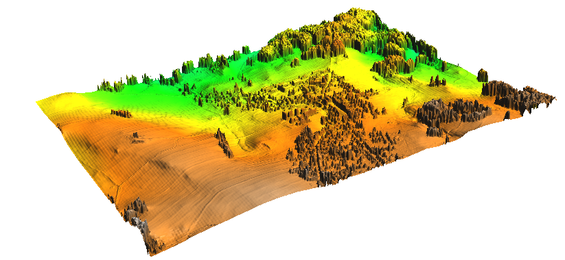

Tvorba DMR a DMP
================

Tato kapitola shromažuje informace, jak pracovat s daty **digitálního
modelu reliéfu a povrchu** poskytovaných `Českým úřadem zeměměřičským
a katastrálním <http://www.cuzk.cz/>`__.

Tyto produkty poskytuje ČÚZK ve dvou formátech:

1. textovém XYZ
2. binárním LAS, resp. komprimovaném LAZ

.. note:: Tato data nejsou poskytována v režimu otevřených dat, ČÚZK
          nicméně zveřejnil vzorová data volně ke stažení `zde
          <http://geoportal.cuzk.cz/UKAZKOVA_DATA/VYSKOPIS.zip>`__. Tento
          úkázkový dataset obsahuje data pouze v textovém formátu XYZ.

Postup importu dat v textovém či binárním formátu je popsán v
:doc:`předcházející kapitole <import>`.

Pro tvorbu digitalního modelu reliefu či povrchu lze v systému GRASS
využít několik postupů:

1. import vstupních dat do vektorové mapy (viz navod pro :ref:`textová
   <lidar-import-xyz-vektor>` a :ref:`binární
   <lidar-import-las-vektor>` data), nastavení výpočetního regionu
   (:grasscmd:`g.region`) a interpolace výsledného povrchu pomocí
   modulu :grasscmd:`v.surf.rst` (metoda XXX).

.. todo:: doplnit dalsi postupy (rastr)
             
Digitální model reliéfu
-----------------------

Data pro :wikipedia:`digitální model reliéfu <Digitální model
terénu>`, tj. digitální reprezentaci modelu reliefu *bez* umělých a
přírodních objektů (např. vegetace nebo budovy) poskytuje ČÚZK ve dvou
verzích:

* **DMR4G** - diskrétních bodů v pravidelné síti (5 x 5 m) bodů o
  souřadnicích X,Y,H s úplnou střední chybou výšky 0,3 m v odkrytém
  terénu a 1 m v zalesněném terénu. Další informace `zde
  <http://geoportal.cuzk.cz/(S(kle1ef454jwgniffefmzxmed))/Default.aspx?lng=CZ&mode=TextMeta&side=vyskopis&metadataID=CZ-CUZK-DMR4G-V&mapid=8&menu=301>`__.
* **DMR5G** - diskrétní body v nepravidelné trojúhelníkové síti (TIN) bodů
  o souřadnicích X,Y,H s úplnou střední chybou výšky 0,18 m v odkrytém
  terénu a 0,3 m v zalesněném terénu. Další informace `zde
  <http://geoportal.cuzk.cz/(S(kle1ef454jwgniffefmzxmed))/Default.aspx?lng=CZ&mode=TextMeta&side=vyskopis&metadataID=CZ-CUZK-DMR5G-V&mapid=8&menu=302>`__.

Souřadnice X,Y jsou referencovány v souřadnicovém systému S-JTSK
(:epsg:`5514`), souřadnice H (nadmořská výška) ve výškovém referenčním
systému Balt po vyrovnání (Bpv).

Příklad importu dat DMR5G a vytvoření výsledného produktu DMT pomocí
:grasscmd:`v.surf.rst`. Nejprve nastavíme výpočetní region na základě vstupní bodové vektorové mapy, prostorové rozlišení zarovnáme (přepínač :option:`-a`) na 1 metr.
          
.. code-block:: bash

   g.region vector=HLIN04_5g res=1 -a

.. note:: Pokud používáte GRASS verze nižší než 7.2.1 tak naimportujte
   vstupní data včetně topologie (tj. vynechte přepínač :option:`-b` v
   případě importních modulů :ref:`v.in.ascii
   <lidar-import-xyz-vektor>` a :ref:`v.in.lidar
   <lidar-import-las-vektor>`). V opačném případě nebude výše uvedený
   příkaz pro nastavení výpočetního regionu fungovat.

   
Poté spustíme proces interpolace:

.. code-block:: bash
                
   v.surf.rst input=HLIN04_5g elevation=HLIN04_5g

.. tip:: Modul :grasscmd:`v.surf.rst` poskytuje dobré výsledky,
         bohužel je ale velmi pomalý. Na testovacím PC trvala
         interpolace pro výše zmíněná data XXX min!

         Od verze GRASS 7.3 (aktuální vývojová větev) podporuje modul
         paralelizaci výpočtu, což může vést k signifikatnímu
         zrychlení výpočtu. V našem případě rozložení výpočtu na 8
         jader CPU (parametr :option:`nprocs=8`) vedlo ke snížení
         výpočetního času na XXX min.

         .. code-block:: bash

            v.surf.rst input=HLIN04_5g elevation=HLIN04_5g ncprocs=8
   
.. figure:: images/dtm-cuzk.png

   Ukázka výsledného produktu digitálního modelu reliéfu.

Digitální model povrchu
-----------------------

Data pro :wikipedia:`digitální modelu povrchu <Digitální model
povrchu>` (DMP), tj. digitální reprezentaci modelu reliefu *včetně*
umělých a přírodních objektů (např. vegetace nebo budovy) poskytuje
ČÚZK v současnosti v jedné verzi a to jako:

* **DMP4G** - diskrétních bodů v nepravidelné sítě výškových bodů
  (TIN) s úplnou střední chybou výšky 0,4 m pro přesně vymezené
  objekty (budovy) a 0,7 m pro objekty přesně neohraničené (lesy a
  další prvky rostlinného pokryvu). Další informace `zde
  <http://geoportal.cuzk.cz/(S(kle1ef454jwgniffefmzxmed))/Default.aspx?lng=CZ&mode=TextMeta&side=vyskopis&metadataID=CZ-CUZK-DMP1G-V&mapid=8&menu=303>`__.

Souřadnice X,Y jsou podobně jako v případě DMR4/5G referencovány v
souřadnicovém systému S-JTSK (:epsg:`5514`), souřadnice H (nadmořská
výška) ve výškovém referenčním systému Balt po vyrovnání (Bpv).

Produkt DMP vytvoříme obdobně jako v případě DMR:

.. code-block:: bash

   v.in.ascii input=HLIN04_1g.xyz output=HLIN04_1g separator=space z=3 -tbz
   g.region vector=HLIN04_1g res=1 -a
   v.surf.rst input=HLIN04_1g elevation=HLIN04_1g nprocs=8

.. note:: Pokud zpracovánate DMR a DMP současně pro stejné území, je
          vhodné zachovat stejný výpočetní region. Ten můžete nastavit
          na základě více vektorových map současně, v tomto případě
          DMR5G a DMP1G:

          .. code-block:: bash

             g.region vector=HLIN04_1g,HLIN04_5g res=1 -a
          

   Ukázka výsledného produktu digitálního modelu povrchu.

Dávkové zpracování dlaždic DMR/DMP
----------------------------------

.. todo:: doplnit
