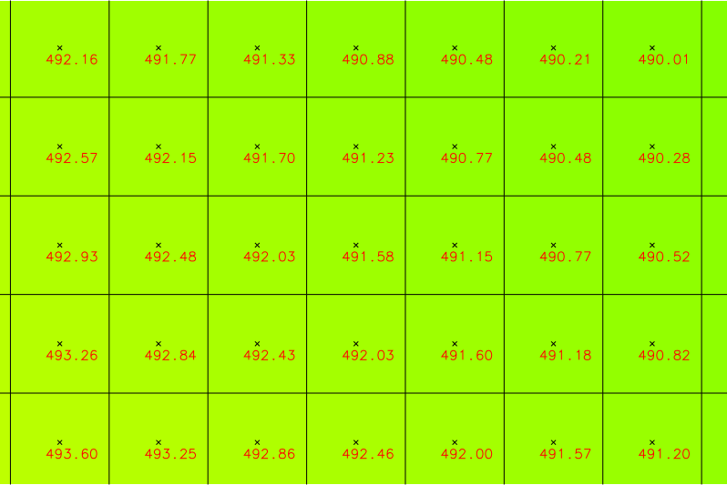

Tvorba DMR a DMP
================

Tato kapitola shromažuje informace, jak pracovat s daty **digitálního
modelu reliéfu a povrchu** poskytovaných `Českým úřadem zeměměřičským
a katastrálním <http://www.cuzk.cz/>`__.

Tyto produkty poskytuje ČÚZK ve dvou formátech:

1. textovém XYZ
2. binárním LAS, resp. komprimovaném LAZ

.. note:: Tato data nejsou poskytována v režimu otevřených dat, ČÚZK
          nicméně zveřejnil vzorová data volně ke stažení `zde
          <http://geoportal.cuzk.cz/UKAZKOVA_DATA/VYSKOPIS.zip>`__. Tento
          úkázkový dataset obsahuje data pouze v textovém formátu XYZ.

Postup importu dat v textovém či binárním formátu je popsán v
:doc:`předcházející kapitole <import>`.

Pro tvorbu digitalního modelu reliefu či povrchu lze v systému GRASS
využít několik postupů:

**1. Vytvoření rastru původních hodnot bodových dat** 

Import vstupních dat do rastrové mapy s prostorových rozlišením
odvozeným ze vstupních dat. Postup vhodný především pro pravidelnou
mřížku vstupních dat.

**2. Spline interpolace z bodových dat**

Import vstupních dat do vektorové bodové mapy, interpolace výsledného
povrchu pomocí modulu :grasscmd:`v.surf.rst`. Vhodné pro vytvoření DMT
s vysokým prostorovým rozlišením.

.. todo:: doplnit dalsi postupy (rastr)
             
Digitální model reliéfu
-----------------------

Data pro :wikipedia:`digitální model reliéfu <Digitální model
terénu>`, tj. digitální reprezentaci modelu reliefu *bez* umělých a
přírodních objektů (např. vegetace nebo budovy) poskytuje ČÚZK ve dvou
verzích:

* **DMR4G** - diskrétních bodů v pravidelné síti (5 x 5 m) bodů o
  souřadnicích X,Y,H s úplnou střední chybou výšky 0,3 m v odkrytém
  terénu a 1 m v zalesněném terénu. Další informace `zde
  <http://geoportal.cuzk.cz/(S(kle1ef454jwgniffefmzxmed))/Default.aspx?lng=CZ&mode=TextMeta&side=vyskopis&metadataID=CZ-CUZK-DMR4G-V&mapid=8&menu=301>`__.
* **DMR5G** - diskrétní body v nepravidelné trojúhelníkové síti (TIN) bodů
  o souřadnicích X,Y,H s úplnou střední chybou výšky 0,18 m v odkrytém
  terénu a 0,3 m v zalesněném terénu. Další informace `zde
  <http://geoportal.cuzk.cz/(S(kle1ef454jwgniffefmzxmed))/Default.aspx?lng=CZ&mode=TextMeta&side=vyskopis&metadataID=CZ-CUZK-DMR5G-V&mapid=8&menu=302>`__.

Souřadnice X,Y jsou referencovány v souřadnicovém systému S-JTSK
(:epsg:`5514`), souřadnice H (nadmořská výška) ve výškovém referenčním
systému Balt po vyrovnání (Bpv).

Následující dva příklady vytvoření rastrové reprezentace DMT prezentují dva rozdílné přístupy:

* vytvoření DMT *převzetím* hodnot pravidelné mřížky bodových dat
  DMR4G, prostorové rozlišení je odvozeno ze vstupních dat (tj. 5m)

* vytvoření vysoce podrobného DMT metodou *spline* na základě DMR5G

Vytvoření DMT *převzetím* hodnot pravidelné mřížky bodových dat DMR4G
^^^^^^^^^^^^^^^^^^^^^^^^^^^^^^^^^^^^^^^^^^^^^^^^^^^^^^^^^^^^^^^^^^^^^

V prvním kroku zjistíme hraniční souřadnice importovaných dat.

.. code-block:: bash

   r.in.xyz -sg input=HLIN04_4g.xyz separator=space

Na základě toho nastavíme výpočetní region a to tak, aby střed buňky
odpovídal vstupní pravidelné mřížce bodů. Prostorové rozlišení
nastavíme na 5m, což odpovídá vzdálenosti bodů DMR4G.

.. code-block:: bash
   
   g.region n=-1088005 s=-1090000 e=-625005 w=-627500 b=461.5 t=554.31
   g.region n=n+2.5 s=s-2.5 w=w-2.5 e=e+2.5 res=5

Následně na to, data do nastaveného výpočetního regionu naimportujeme.

.. code-block:: bash

   r.in.xyz input=HLIN04_4g.xyz separator=space output=HLIN04_4g

               
   Ukázka výsledného produktu digitálního modelu reliéfu vytvořeno na
   bázi DMR4G převzetím hodnot vstupních bodů. Na obrázku jsou pro
   ilustraci vykreslena vstupní pravidelná síť bodů DMR4G a výstupní
   mřížka rastrové mapy.

Vytvoření vysoce podrobného DMT metodou spline na základě DMR5G
^^^^^^^^^^^^^^^^^^^^^^^^^^^^^^^^^^^^^^^^^^^^^^^^^^^^^^^^^^^^^^^

Nastavíme výpočetní region na základě vstupní bodové vektorové mapy,
prostorové rozlišení zarovnáme (přepínač :option:`-a`) na 1 metr.
          
.. code-block:: bash

   g.region vector=HLIN04_5g res=1 -a

.. note:: Pokud používáte GRASS verze nižší než 7.2.1 tak naimportujte
   vstupní data včetně topologie (tj. vynechte přepínač :option:`-b` v
   případě importních modulů :ref:`v.in.ascii
   <lidar-import-xyz-vektor>` a :ref:`v.in.lidar
   <lidar-import-las-vektor>`). V opačném případě nebude výše uvedený
   příkaz pro nastavení výpočetního regionu fungovat.

   
Poté spustíme proces interpolace:

.. code-block:: bash
                
   v.surf.rst input=HLIN04_5g elevation=HLIN04_5g

.. tip:: Modul :grasscmd:`v.surf.rst` poskytuje dobré výsledky,
         bohužel je ale velmi pomalý. Na testovacím PC trvala
         interpolace pro výše zmíněná data 3hod 14min!

         Od verze GRASS 7.3 (aktuální vývojová větev) podporuje modul
         paralelizaci výpočtu, což může vést k signifikatnímu
         zrychlení výpočtu. V našem případě rozložení výpočtu na 8
         jader CPU (parametr :option:`nprocs=8`) vedlo ke snížení
         výpočetního času na 30 min.

         .. code-block:: bash

            v.surf.rst input=HLIN04_5g elevation=HLIN04_5g nprocs=8
   
.. figure:: images/dmr5g.png

   Ukázka výsledného produktu digitálního modelu reliéfu vytvořeno na
   bázi DMR5G metodou spline s rozlišením 1m.

.. figure:: images/dmr4g-vs-5g.png

   Porovnání vytvořených DMR převzetím hodnot DMR4G při rozlišení 5m a
   interpolací spline v rozlišení 1m.
   
Digitální model povrchu
-----------------------

Data pro :wikipedia:`digitální modelu povrchu <Digitální model
povrchu>` (DMP), tj. digitální reprezentaci modelu reliefu *včetně*
umělých a přírodních objektů (např. vegetace nebo budovy) poskytuje
ČÚZK v současnosti v jedné verzi a to jako:

* **DMP1G** - diskrétních bodů v nepravidelné sítě výškových bodů
  (TIN) s úplnou střední chybou výšky 0,4 m pro přesně vymezené
  objekty (budovy) a 0,7 m pro objekty přesně neohraničené (lesy a
  další prvky rostlinného pokryvu). Další informace `zde
  <http://geoportal.cuzk.cz/(S(kle1ef454jwgniffefmzxmed))/Default.aspx?lng=CZ&mode=TextMeta&side=vyskopis&metadataID=CZ-CUZK-DMP1G-V&mapid=8&menu=303>`__.

Souřadnice X,Y jsou podobně jako v případě DMR4/5G referencovány v
souřadnicovém systému S-JTSK (:epsg:`5514`), souřadnice H (nadmořská
výška) ve výškovém referenčním systému Balt po vyrovnání (Bpv).

Produkt DMP vytvoříme obdobně jako v případě DMR:

.. code-block:: bash

   v.in.ascii input=HLIN04_1g.xyz output=HLIN04_1g separator=space z=3 -tbz
   g.region vector=HLIN04_1g res=1 -a
   v.surf.rst input=HLIN04_1g elevation=HLIN04_1g nprocs=8

.. note:: Pokud zpracovánate DMR a DMP současně pro stejné území, je
          vhodné zachovat stejný výpočetní region. Ten můžete nastavit
          na základě více vektorových map současně, v tomto případě
          DMR5G a DMP1G:

          .. code-block:: bash

             g.region vector=HLIN04_1g,HLIN04_5g res=1 -a
          
.. figure:: images/dsm-cuzk.png

   Ukázka výsledného produktu digitálního modelu povrchu.

Dávkové zpracování dlaždic DMR/DMP
----------------------------------

ČÚZK poskytuje typicky data ve formě dlaždic, v případě testovacího
datasetu se jedna o:

* HLIN04,
* HLIN05,
* HLIN14,
* HLIN15.

Zpracování dlaždic můžeme urychlit paralelizací výpočtu, k tomu
použijeme nástoje frameworku PyGRASS, viz kapitola
:doc:`../pygrass/index`. Moduly systému GRASS umožňuje spuštět třída
:class:`Module`, viz příklad v kapitole :doc:`Úvod do skriptování
<../skripty/ndvi-python>`. Paralelizaci výpočtu je možné poměrně
jednoduše implementovat pomocí třídy :class:`ParallelModuleQueue`,
viz `dokumentace
<https://grass.osgeo.org/grass72/manuals/libpython/pygrass.modules.interface.html#pygrass.modules.interface.module.ParallelModuleQueue>`__. Příklad
použití si ukážeme na jednoduché operaci importu dat pomocí modulu
:ref:`v.in.ascii <lidar-import-xyz-vektor>`:

.. literalinclude:: ../_static/skripty/create-dmt.py
   :language: python
   :lines: 60-64,67-69
   :linenos:
   :emphasize-lines: 1-2, 7, 8, 9

Komentáře:

* Na řádcích :lcode:`1-2` vytvoříme objekt modulu
  :grasscmd:`v.in.ascii` obsahující společné parametry.
* Na řádku :lcode:`7` vytvoříme pro každý importovaný soubor kopii
  objektu pro import.
* Této kopii nastavíme na souboru závislé parametry - cestu k
  importovanému souboru (:option:`input` a název výstupní vektorové
  mapy (:option:`output`). Spustíme instanci takto upraveného objektu
  a zařadíme do fronty (``queue`` jako instance třídy
  :class:`ParallelModuleQueue`), viz řádek :lcode:`8`.

  .. literalinclude:: ../_static/skripty/create-dmt.py
     :language: python
     :lines: 127
* Poté necháme všechny paralelně běžící procesy proběhnout, viz řádek
  :lcode:`9`.

Podobně lze paralelně volat i interpolační modul
:grasscmd:`v.surf.rst` pouze s tím rozdílem je že třeba pro každý
proces nastavit příslušný region na základě vstupních dat
(dlaždice). Tuto operaci nám zásadně usnadní třída
:class:`MultiModule`, která umožňuje registrovat moduly jako jeden
proces ve frontě. V prvním kroku zaregistrujeme modul
:grasscmd:`g.region` pomocí kterého nastavíme výpočetní region
dlaždice (:lcode:`11`) a poté přidáme do procesu interpolační modul
:grasscmd:`v.surf.rst` (:lcode:`12`).

.. literalinclude:: ../_static/skripty/create-dmt.py
   :language: python
   :lines: 86-100
   :linenos:
   :emphasize-lines: 1-2, 11-14

Komentáře:

* Ve skriptu nastavujeme výpočetní region dlaždice o něco větší tak,
  aby u výstupních dlaždic DMT vznikly pásy překryvu a bylo možno
  vytvořit výslednou mozaiku DMT bez ostrých přechodů na hranicích
  dlaždic, viz ``offset`` jako desetinásobek zadaného rozlišení na
  řádce :lcode:`1-2`.

.. todo:: Vysvětlit ``sync``

.. warning:: Třída :class:`MultiModule` je v současnosti dostupná
             pouze ve vývojové verzi systému GRASS 7.3, viz
             `dokumentace
             <https://grass.osgeo.org/grass73/manuals/libpython/pygrass.modules.interface.html#pygrass.modules.interface.module.MultiModule>`__.
                       
.. todo:: Dopsat scénář řešení v nižších verzích bez třídy
   MultiModule.

Výsledná mozaika DMT jednotlivých dlaždic může být vytvořena modulem
:grasscmd:`r.series` a vhodnou statistickou metodou, viz
:lcode:`109`. Výsledný skript může vypadat následovně:
          
.. literalinclude:: ../_static/skripty/create-dmt.py
   :language: python
   :linenos:

.. note:: Skript umožňuje paralelizovat jak běh modulů pro import a
          interpolaci (parametr :option:`nprocs`), tak modulu
          :grasscmd:`v.surf.rst` jako takového (:option:`rst_nprocs`).

Ukázka volání (v tomto případě bude vytíženo při interpolaci 12 jader
CPU, výpočet trval přes hodinu a 20 minut):

.. code-block:: bash

   create-dmt.py input=VYSKOPIS elevation=HLIN_5g pattern=*5g* resolution=1 nprocs=4 rst_nprocs=3
   
Výsledná verze skriptu ke stažení `zde
<../_static/skripty/create-dmt.py>`_.

.. figure:: images/dmr5g_ortofoto_3d.png

   Ukázka vizualizace výsledného DMT ve 3D s ortofotem (ČÚZK WMS).

