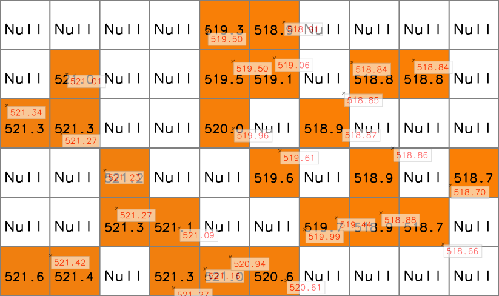

Import dat
==========

Před importem dat je potřeba vytvořit příslušnou lokaci, viz kapitola
:skoleni:`struktura dat
<grass-gis-zacatecnik/intro/struktura-dat.html>` a :skoleni:`tvorba
lokace <grass-gis-zacatecnik/data/tvorba-lokace.html>`. V případě
textového formátu, který neobsahuje informaci o souřadnicovém systému,
vytvoříme typicky lokaci :skoleni:`na základě EPSG kódu
<grass-gis-zacatecnik/data/tvorba-lokace.html#priklad-vytvoreni-lokace-pro-data-v-souradnicovem-systemu-s-jtsk>`. U
binarního formátu LAS/LAZ je možné, vzhledem k tomu, že tento formát
obvykle obsahuje informaci o souřadnicovém systému, vytvořit lokaci
:skoleni:`na základě vstupího souboru
<grass-gis-zacatecnik/data/tvorba-lokace.html#lokace-srtm>`.

Obecně řečeno lze vstupní Lidarová data importovat do systému GRASS
jako vektorová a rastrová data.

Textový formát XYZ
------------------

Data v textovém formátu XYZ umožňuje modul
:grasscmd:`r.in.xyz`. Vstupní soubor obsahuje souřadnice x,y,z pro
každý bod na jednom řádku. Souřadnice jsou odděleny většinou bílým
znakem jako je mezera nebo tabulátor. Modul vytvoří na základě
agregace načtených bodů do rastrových buněk dle zvolené statistické
metody (parametr :option:`method`, výchozí je průměrná hodnota -
*mean*) novou rastrovou mapu.

Příklad importu si ukážeme na soubor *HLIN04_5g.xyz* z kapitoly
:doc:`dmr-dmp-cuzk`.

::
   
   -625002.344 -1089749.632 502.825
   -625000.53 -1089735.192 502.585
   -625006.071 -1089779.418 504.849
   ...
   
.. note:: V tomto případě jsou data v součadnicovém systému S-JTSK
          (:epsg:`5514`).

Modul :grasscmd:`r.in.xyz` vzhledem k tomu, že provádí agregaci
načtených dat, se na rozdíl od ostatních importních modulů řídí
aktuálním výpočetním regionem. Proto je třeba před importem nastavit
výpočetní region na základě vstupních dat. K tomu nám poslouží
přepínače :option:`-sg`.

.. _lidar-import-scan:

.. code-block:: bash

   r.in.xyz -sg input=HLIN04_5g.xyz separator=space output=HLIN04_5g --o
                
   n=-1088000.076 s=-1090000.059 e=-624999.829 w=-627499.828 b=461.312 t=554.334

Výsledek nám poslouží pro nastavení rozsahu výpočetního regionu, na
nás bude zvolit vhodné prostorové rozlišení. V našem případě zvolíme 1
metr.

.. code-block:: bash

   g.region n=-1088000.076 s=-1090000.059 e=-624999.829 w=-627499.828 b=461.312 t=554.334 res=1 -p

.. note:: Přepínač :option:`-p` můžeme vytiskout pro kontorolu výsledek.

   ::

      north:      -1088000.076
      south:      -1090000.059
      west:       -627499.828
      east:       -624999.829
      nsres:      0.9999915
      ewres:      0.9999996

   Module :grasscmd:`g.region` ve výchozím nastavení provádí zarovnání
   na rozsah, proto není prostorové rozlišení přesně rovno zadané
   hodnotě. Zarovnání regionu na rozlišení můžeme vynutit pomocí
   přepínače :option:`-a`.

   .. code-block:: bash

      g.region n=-1088000.076 s=-1090000.059 e=-624999.829 w=-627499.828 b=461.312 t=554.334 res=1 -pa

   ::
      
      north:      -1088000
      south:      -1090001
      west:       -627500
      east:       -624999
      nsres:      1
      ewres:      1

   Další možností je nastavit region tak, aby vstupní body po okrajích
   padly do centra rastrových buněk. V tomto případě rozšíříme rozsah
   regionu o polovinu nastaveného prostorového rozlišení, v našem
   případě tedy 0,5 metru.

   .. code-block:: bash

      g.region n=-1088000.076 s=-1090000.059 e=-624999.829 w=-627499.828 b=461.312 t=554.334
      g.region n=n+0.5 s=s-0.5 w=w-0.5 e=e+0.5 res=1 -p

   ::

      north:      -1087999.576
      south:      -1090000.559
      west:       -627500.328
      east:       -624999.329
      nsres:      0.9999915
      ewres:      0.9999996

Poté již provedeme import (tj. vynecháme přepínače :option:`-sg`):

.. code-block:: bash
                
   r.in.xyz input=HLIN04_5g.xyz separator=space output=HLIN04_5g

Pokud chceme vstupní data importovat jako vektorovou mapu, použijeme
modul :grasscmd:`v.in.ascii`.

.. note:: Import lze urychlit přepínačem :option:`-t` (nevytvářet
          atributovou tabulku) a :option:`-b` (nesestavovat
          topologii).

          Ve výchozím nastavení modul importuje body jako 2D. Pomocí
          přepínače :option:`-z` si vynutíme výstup do 3D vektorové
          mapy. Index sloupce se z-tovou souřadnici definujeme pomocí
          parametru :option:`z`.

.. code-block:: bash

   v.in.ascii in=HLIN04_5g.xyz out=HLIN04_5g separator=space z=3 -tbz

   Ukázka importu Lidarových dat do rastrové a vektorové mapy.
   
Binární formát LAS/LAZ
----------------------

Data v binárím formátu LAS či komprimované LAZ lze do systému GRASS
naimportovat jako rastrovou mapu a to pomocí modulu
:grasscmd:`r.in.lidar` anebo jako mapu vektorovou pomocí
:grasscmd:`v.in.lidar`.

Modul :grasscmd:`r.in.lidar` funguje obdobně jako :grasscmd:`r.in.xyz`
s tím, že nejrpve zjistíme rozsah dat a podle toho nastavíme výpočetní
region. V tomto regionu dojde k agregaci vstupních bodu na základě
zvolené statistické metody (parametr :option:`method`, výchozí metoda
je průměrná hodnota *mean*).

.. code-block: bash

   r.in.lidar input=pr_TANV37_5g.laz -sg

.. note:: Je možné, že vstupní soubor nebude obsahovat informace o
   souřadnicovém systému. V tomto případě příkaz skončí chybou:

   ::

      ERROR: Projection of dataset does not appear to match current location.

      GRASS LOCATION PROJ_INFO is:
      name: WGS 84 / UTM zone 33N
      datum: wgs84
      ellps: wgs84
      proj: utm
      zone: 33
      no_defs: defined

      Import dataset PROJ_INFO is:
      Dataset proj = 0 (unreferenced/unknown)
      
      In case of no significant differences in the projection definitions, use the -o flag...
      Consider generating a new location with 'location' parameter from input data set.

   V tomto případě, přídejte přepínač :option:`-o`, který kontrolu
   souřadnicového systému přeskočí. V našem případě ještě použijeme
   přepínač :option:`--quiet`, tak abychom potlačili všechny zprávy
   modulu.

   .. code-block:: bash

      r.in.lidar input=pr_TANV37_5g.laz -sgo --quiet

Výsledek, v našem případě

::
   
   n=5627727.26 s=5625597.55 e=534548.84 w=531815.05 b=925.35 t=1292.54

použijeme pro nastavení výpočetního regionu včetně rozlišení (parametr :option:`res`).

.. code-block:: bash

   g.region n=5627727.26 s=5625597.55 e=534548.84 w=531815.05 b=925.35 t=1292.54 res=1

Poté již provedeme import:

.. code-block:: bash

   r.in.lidar input=pr_TANV37_5g.laz output=pr_TANV37_5g -o

.. tip:: Modul :grasscmd:`r.in.lidar` umožňuje výpočetní region
         nastavit automaticky na základě vstupních dat. K tomu slouží
         přepínač :option:`-e`. V tomto ohledu se hodí použít ještě
         přepínač :option:`-n`, který aktualní výpočetní region
         nastaví na základě vstupních dat. Prostorové rozlišení
         regionu nastavíme parametrem :option:`resolution`.
   
.. code-block:: bash

   r.in.lidar input=pr_TANV37_5g.laz output=pr_TANV37_5g resolution=1 -one

.. note:: Výsledný výpočetní region bude v tomto případě schodný s příkazem (preference rozlišení):

   .. code-block:: bash

      g.region n=5627727.26 s=5625597.55 e=534548.84 w=531815.05 b=925.35 t=1292.54 res=1 -a

   ::
      
      north:      5627728
      south:      5625597
      west:       531815
      east:       534549
      nsres:      1
      ewres:      1

Pro vytvoření vektorové mapy na základě vstupních dat slouží modul
:grasscmd:`v.in.lidar`.

.. code-block:: bash

   v.in.lidar input=pr_TANV37_5g.laz output=pr_TANV37_5g

.. tip:: Podobně jako v případě importu textových dat lze proces
   urychlit tím, že nebudeme vytvářet atributová data (pokud je
   nepotřebujeme, což je typicky u již klasifikovaných dat
   určených pro tvorbu digitálního modelu terénu, viz kapitola
   :doc:`cuzk-dmr-dmp`) a přeskočíme tvorbu topologie, která u
   bodových dat stejně nedává smysl. V našem případě ještě
   použijeme přepínač :option:`-o`, který přeskočí kontrolu
   souřadnicového systému.

   .. code-block:: bash

      v.in.lidar input=pr_TANV37_5g.laz output=pr_TANV37_5g  -otb
