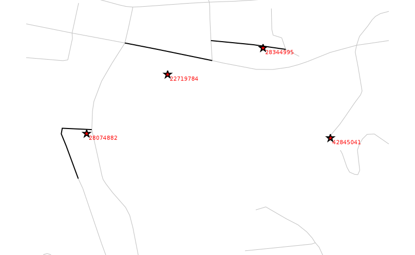

Přístup k vektorovým datům
==========================

K vektorovým datům lze přistupovat ve dvou režimech:

* *bez topologie* (ala jednoduché geoprvky, viz OGC standard `Simple
  Features <http://www.opengeospatial.org/standards/sfa>`_), tento
  přístup zajišťuje třída :pygrass-vector:`Vector`
* *včetně topologie*, viz třída :pygrass-vector:`VectorTopo`

Další informace v `dokumentaci PyGRASS
<http://grass.osgeo.org/grass70/manuals/libpython/pygrass_vector.html>`_.

Průchod vektorovými prvky bez topologie
---------------------------------------

Skript níže *vypisuje souřadnice definičních bodů* z mapy
:map:`obce_bod` mapsetu :mapset:`ruian` spolu s jejich názvy.

#. Nejprve na řádku :lcode:`5` vytvoříme instaci třídy
   :pygrass-vector:`Vector` odkazující na zvolenou vektorovou mapu,
   kterou na následujícím řádku otevřeme v režimu čtení.
#. Jednotlivé prvky procházíme sekvenčně v cyklu ``for`` na řádku
   :lcode:`8`.
#. Na konci skriptu nezapomeneme vektorovou mapu korektně uzavřít
   :lcode:`11`.
             
.. literalinclude:: ../_static/skripty/obce_body.py
   :language: python
   :linenos:
   :emphasize-lines: 5-6, 8, 11

Skript ke stažení `zde <../_static/skripty/obce_body.py>`__.

.. important:: Tímto způsobem (bez topologie) lze procházet v mapě
          pouze základní geometrická primitiva jako jsou *body*, *linie*,
          *hraniční linie* a *centroidy*, viz kapitola
          :skoleni:`Topologický model
          <grass-gis-zacatecnik/intro/vektor.html#topologicky-model>` ze školení pro
          začátečníky. Přístup ke složeným typům jako jsou *plochy* již
          vyžaduje topologii.

Výpis skriptu může vypadat následovně:

::
   
   ...
   Božejov                  : -700917 -1129944
   Cejle                    : -677975 -1132017
   Drahonice                : -781273 -1137206
   ...
          
.. note:: Pokud skript v GUI končí chybou

   ::

       Traceback (most recent call last):
         File "/home/martin/skripty/obce_body.py", line 11, in <module>
           print (u"{:<25}: {:.0f}{:.0f}".format(prvek.attrs['nazev'], prvek.x, prvek.y))
         UnicodeEncodeError: 'ascii' codec can't encode characters in
          position 3-4: ordinal not in range(128)

   tak přidejte na začátek skriptu

   .. code-block:: python

      import sys
      import codecs
      sys.stdout = codecs.getwriter('utf8')(sys.stdout)

Přístup k topologii
-------------------

Přístup k topologii vektorových prvků zajišťuje třída
:pygrass-vector:`VectorTopo`. Více informací o topologickém modelu
systému GRASS najdete ve :skoleni:`školení pro začátečníky
<grass-gis-zacatecnik/intro/vektor.html#topologicky-model>`.

V následující ukázce vypíšeme *pro každý okres počet jeho sousedních
okresů*.

#. Na řádku :lcode:`5` vytvoříme instaci třídy
   :pygrass-vector:`VectorTopo` odkazující na zvolenou vektorovou mapu,
   kterou na následujícím řádku otevřeme v režimu topologického čtení.
#. Jednotlivé prvky (tj. okresy) procházíme sekvenčně v cyklu ``for``
   na řádku :lcode:`8`. Pro průchod složených topologických primitiv,
   jako jsou v tomto případě plochy, musíme použít funknci ``viter()``.
#. Pro každou plochu okresu projdeme její hraniční linie :lcode:`10` a
   zjistíme jaká plocha je od této linie nalevo a napravo :lcode:`11`
   (``-1`` představuje žádný prvek).
      
.. literalinclude:: ../_static/skripty/okresy.py
   :language: python
   :linenos:
   :emphasize-lines: 5-6, 8, 10, 11

.. warning:: Mezi verzemi GRASS 7.1 a GRASS 7.0 se API PyGRASS
             částečně změnilo. Místo funkce ``get_left_right()``
             (:lcode:`11`) použijte v GRASS 7.1 ``read_area_ids()``.

Skript ke stažení `zde <../_static/skripty/okresy.py>`_.

Výpis skriptu může vypadat následovně:

::

   ...
   Blansko             : 5
   Brno-město          : 1
   Vyškov              : 6
   ...

.. warning:: Tento skript je funkční pouze ve verzi GRASS 7.0.1 a
             vyšší.
                   
Nalezení nejbližších prvků, zápis nových prvků
----------------------------------------------

K nalezení nejbližších prvků je vyžadován přístup k topologii. V
následujícím příkladu budeme *hledat nejbližší ulici k dané
záchrance*. Dále zkontrolujeme, zda je záchrance přiřazen korektní kód
ulice (dle :wikipedia:`RÚIAN`).

Záchranky jsou společně s nejbližšími ulicemi zapsány do nové
vektorové mapy :map:`zachranka_ulice` (řádky
:lcode:`10, 15,24,26`). Atributová tabulka pro výstupní vektorovou mapu
je definována na řádcích :lcode:`11-14`.

.. literalinclude:: ../_static/skripty/zachranka_ulice.py
   :language: python
   :linenos:
   :emphasize-lines: 10-15, 24, 26, 29

Skript ke stažení `zde <../_static/skripty/zachranka_ulice.py>`_.
                     
.. warning:: Velmi důležitý řádek je :lcode:`29`, kde dochází k zápisu
             atributů do atributové tabulky. Pokud nezavoláte funkci
             ``commit()``, tak do výstupní vektorové mapy **nezapíší**
             žádné atributy!

Skript současně vypisuje na výstup kód záchranky, 0 nebo 1 podle toho,
zda se nalezená nejbližší ulice shoduje s údajem z RÚIANu a nakonec
adresu této ulice. Výpis může vypadat následovně:

::

     40432211 0 Chrpová
     40432408 1 Strašnická
     40433048 0 Práčská

   Zvýraznění úseků ulic nejbližších dané záchrance.
             
