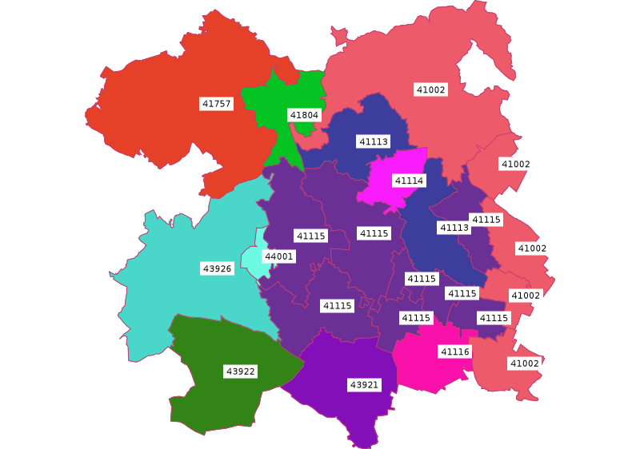

Implementace skriptu pro GRASS
==============================

Skript bude v první fázi vypisovat pro dané PSČ seznam obcí a jejich
sousedy dle PSČ. 

Příprava dat
------------

Vektorová mapa :map:`obce_polygon` z mapsetu :mapset:`ruian`
neobsahuje v atributové tabulce informace o PSČ. Tuto informaci budeme
muset nejprve doplnit. PSČ obcí ke stažení `zde
<http://training.gismentors.eu/geodata/db_pcobc.zip>`_ jako DBF
tabulka.

V aktuálním mapsetu si vytvoříme kopii původní mapy
(:grasscmd:`g.copy`) a k její atributové tabulce připojíme tabulku
s PSČ.

.. code-block:: bash

   g.copy vector=obce_polygon@ruian,obce

Vstupní tabulku s PSČ nejprve pomocí :grasscmd:`db.in.ogr`
naimportujeme:

.. code-block:: bash

   db.in.ogr input=zv_pcobc.dbf encoding=cp852

.. note:: Modul předpokládá kódování znaků UTF-8. Vzhledem k tomu, že
   jsou vstupní data v kódování CP852, je nutné jej definovat
   parametrem :option:`encoding`.

   .. important::
   
          Ve verzích GRASS 7.0.2 a nižší modul :grasscmd:`db.in.ogr`
          parametr :option:`encoding` nemá. V tomto případě definujeme
          kódování pomocí proměnné prostředí
          :envvar:`SHAPE_ENCODING`.

          .. code-block:: bash

             SHAPE_ENCODING=cp852 db.in.ogr input=zv_pcobc.dbf

Tabulka bohužel neobsahuje kód obce, podle kterého bysme mohli data
pohodlně pomocí modulu :grasscmd:`v.db.join` připojit k atributové
tabulce obcí, viz. výpis modulu :grasscmd:`db.select`.

.. code-block:: bash

   db.select sql="select * from zv_pcobc_dbf limit 1"

   NAZCOBCE|PSC|NAZPOST|KODOKRESU|NAZOKRESU|NAZOBCE|KOD
   Abertamy|36235|Abertamy|3403|Karlovy Vary|Abertamy|

Vytvoříme pomocnou tabulku pomocí :grasscmd:`db.execute`, která bude
obsahovat dva sloupce: kód obce a PSČ.

.. code-block:: bash
                
   db.execute sql="create table obce_psc as select o.kod,z.psc from obce as o \
    join zv_pcobc_dbf as z on o.okreskod = z.KODOKRESU and o.nazev = z.NAZOBCE"

.. note:: Tento postup je nutný, neboť databáze SQLite (která je pro
          systém GRASS vychozí při ukládání atributových dat, viz
          :skoleni:`školení pro začátečníky
          <grass-gis-zacatecnik/intro/vektor.html#atributova-data>`), nepodporuje
          :sqlcmd:`JOIN` v příkazu :sqlcmd:`UPDATE`. Pokud používate
          namísto toho např. PostgreSQL, tak se operace zjednoduší.

Takto vytvořenou tabulku již lze k atributové tabulce vektorové mapy
obcí pomocí :grasscmd:`v.db.join` připojit.

.. code-block:: bash

   v.db.join map=obce column=kod other_table=obce_psc other_column=kod

Výsledek si můžeme zkontrolovat pomocí modulu :grasscmd:`v.db.select`.

.. code-block:: bash

   v.db.select map=obce column=kod,nazev,psc

::
      
   ...
   532401|Jarpice|27371
   532428|Jemníky|27401
   548103|Kámen|39413
   ...

Implementace testovací verze skriptu
------------------------------------

Podrobnější informace v kapitole :doc:`../pygrass/vektory`.

.. literalinclude:: ../_static/skripty/obce_psc_v1.py
   :language: python
   :linenos:

Skript ke stažení `zde <../_static/skripty/obce_psc_v1.py>`_.

Výstup může vypadat následovně:

::

   Seznam obci s PSC 41115:
   41115: Děčany
   41115: Podsedice
   41115: Jenčice
   41115: Lkáň
   41115: Chodovlice
   41115: Dlažkovice
   41115: Sedlec
   41115: Třebívlice
   Seznam sousednich obce:
   44001: Želkovice
   41002: Velemín
   41113: Třebenice
   41804: Lukov
   41002: Úpohlavy
   41002: Slatina
   41114: Vlastislav
   43921: Koštice
   43922: Chožov
   43926: Libčeves
   41002: Vchynice
   41002: Čížkovice
   41116: Klapý
   41113: Třebenice
   41757: Hrobčice

Druhá verze skriptu
-------------------

Druhá verze skriptu se bude lišit od první tím, že namísto textového
výpisu, vytvoří novou vektorovou mapu se spojeným polygonem obcí s
definovaným PSČ a zároveň bude obsahovat sousední obce.

.. literalinclude:: ../_static/skripty/obce_psc_v2.py
   :language: python
   :linenos:

Skript ke stažení `zde <../_static/skripty/obce_psc_v2.py>`_.
      

        
   Vizualizace výsledku pro PSČ 41115.

Poznámka
^^^^^^^^

Úloha by se dala samozřejmě řešit poměrně jednoduše namísto PyGRASS
kombinací standardních modulů systému GRASS :grasscmd:`v.extract` a
:grasscmd:`v.select`.

.. literalinclude:: ../_static/skripty/obce_psc_v3.py
   :language: python
   :linenos:
   
Skript ke stažení `zde <../_static/skripty/obce_psc_v3.py>`_.
