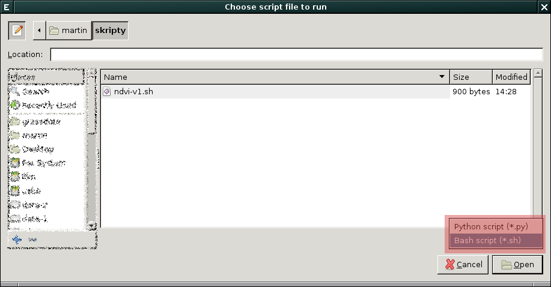

POSIX
=====

Základní verze skriptu
----------------------

.. literalinclude:: ../_static/skripty/ndvi-v1.sh
   :language: bash
   :linenos:

Soubor ke stažení `zde <../_static/skripty/ndvi-v1.sh>`_.

   
   Při spuštění skriptu z GUI je nutno změnit výchozí typ souboru na
   ``.sh``.

Pokročilejší verze skriptu
--------------------------

.. literalinclude:: ../_static/skripty/ndvi-v2.sh
   :language: bash
   :linenos:

Výsledná verze skriptu ke stažení `zde
<../_static/skripty/ndvi-v2.sh>`_.
