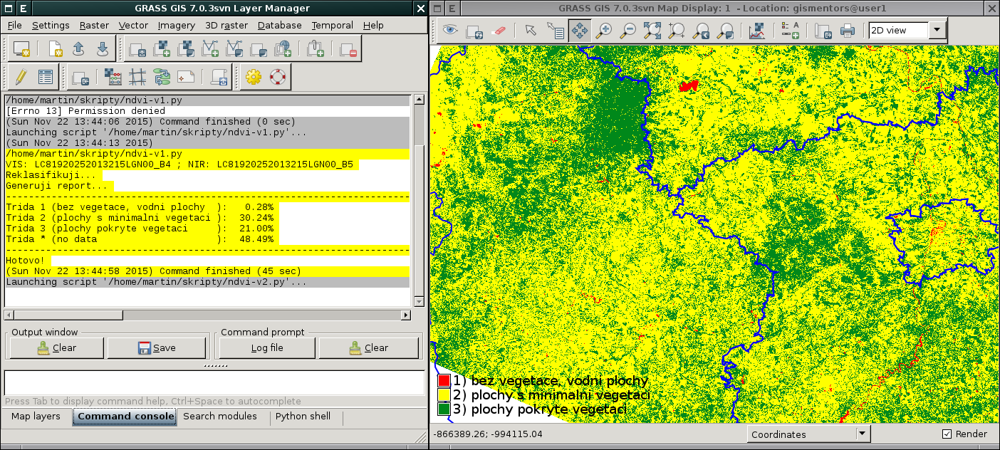

Python
======

Základní verze skriptu
----------------------

Začneme verzí skriptu *bez vstupní parametrů*, názvy vstupních a
výstupních rastrových map jsou uvedeny na řádcích :lcode:`7-12`.

Na řádku :lcode:`3` importuje z knihovny :doc:`../pygrass/index` třídu
:pygrass-modules:`Module`, která nám umožní z prostředí jazyka Python spouštět
moduly systému GRASS jako je např. :grasscmd:`g.mapsets` (viz řádek :lcode:`7`) a
další.

.. note:: Spouštět moduly systému GRASS z jazyka Python umožňuje také
          knihovna :grasscmd:`GRASS Python Scripting Library
          <libpython/script_intro>`. V našech případech budeme ale použít pro
          tento účel PyGRASS a jeho třídu :pygrass-modules:`Module`.
          
.. literalinclude:: ../_static/skripty/ndvi-v1.py
   :language: python
   :linenos:
   :emphasize-lines: 3, 7-12, 15, 18, 22-24, 35-36, 44-45, 53-54, 58

Skript je ke stažení `zde <../_static/skripty/ndvi-v1.py>`__.

   Příklad spuštění skriptu v GUI a vizualizace výsledku v mapovém okně.

.. _pygrass-module:
      
Poznámky k volání modulů
^^^^^^^^^^^^^^^^^^^^^^^^                     

Moduly systému GRASS se volají ve skriptech se stejnými parametry jako z příkazové
řádky. Například pro volání na řádku :lcode:`15`:

.. literalinclude:: ../_static/skripty/ndvi-v1.py
   :language: python
   :lines: 15

by korespondující zápis pro příkazovou řádku vypadal následovně:

.. code-block:: bash

   g.mapsets mapset=landsat operation=add --quiet
           
Jednotlivé parametry modulu se zadávaní jako argumenty třídy
:pygrass-modules:`Module`. Vyjímkou jsou globální přepínače (tj. ty,
které jsou uvozeny dvěma pomlčkami) jako je :option:`--quiet`,
:option:`--overwrite` a další. Ty se zadávají jako argument s hodnotou
``True``. V tomto případě tedy ``quiet=True``. Běžné přepínače
(uvozeny jednou pomlčkou) se předávají jako hodnota argumentu
:option:`flags`.

.. note:: **Zkracování názvů parametrů**

   Při volání modulů z příkazové řádky lze názvy parametrů libovolně
   zkracovat, pouze s tou podmínkou, aby byly jednoznačné. V níže
   uvedeném případě bude následnující volání v pořádku i když méně
   čitelné.

   .. code-block:: bash

      g.mapsets landsat o=add --q

   Podobné zkracování názvů parametrů **není** při použití třídy
   :pygrass-modules:`Module` z knihovny :doc:`../pygrass/index` možné.

.. note:: **Shortcuts**

   PyGRASS umožňuje emulovat způsob volání modulů podobně jako :doc:`ndvi-posix`
   přes tzv. "shortcuts". Příklad volání modulu :grasscmd:`g.mapsets`
   (řádek :lcode:`15`):

   .. code-block:: python

      from grass.pygrass.modules.shortcuts import general as g

      g.mapsets(mapset=mapset, operation='add', quiet=True)

Vstup
~~~~~

Některé moduly přijímají vstup ze souboru, např. :grasscmd:`r.recode`
s parametrem :option:`rules` (řádky :lcode:`30-36`). Místo fyzického
vytvoření vstupního souboru na disku lze použít *standardní vstup*,
konktrétně argument ``stdin_`` s hodnotou řetězce, který má být na
vstupu. V tomto případě musí parameter modulu :option:`rules` nabývat
hodnoty ``-``.

.. literalinclude:: ../_static/skripty/ndvi-v1.py
   :language: python
   :lines: 30-36

Zpracování výstupu
~~~~~~~~~~~~~~~~~~

U modulů, které svůj výstup zapisují na *standardní výstup*, lze
jejich výstup zachytit přes argument ``stdout_=PIPE``. Obsah výstupu
je potom uložen jako řetězec v atributu třídy :pygrass-modules:`Module`
``outputs.stdout``, viz řádek :lcode:`4,58,61-62`.

.. literalinclude:: ../_static/skripty/ndvi-v1.py
   :language: python
   :lines:  4, 58, 61-62

Pokročilejší verze skriptu
--------------------------

Pokročilejší verze skriptu je rozšířena o:

* uživatelské rozhraní, řádky :lcode:`3-19`
* vstupní parametry (:option:`mapset`, :option:`output_postfix` a
  :option:`classes`), viz řádky :lcode:`6-19`
* uživatelské rozhraní je zpracováno funkcí ``parse()`` (řádek
  :lcode:`102`), která je součástí balíčku ``grass.script`` (řádek
  :lcode:`24`)
* hodnoty parametrů jsou na řádku :lcode:`102` uloženy do proměnné
  ``options``, přepínače do proměnné ``flags``, ty jsou dále použity
  na řádcích :lcode:`30-31,57`
* celý kód je vložen do funkce ``main()`` (řádek :lcode:`29`)
    
.. literalinclude:: ../_static/skripty/ndvi-v2.py
   :language: python
   :linenos:
   :emphasize-lines: 3-19, 24, 29, 30-31, 57, 102

Výsledná verze skriptu ke stažení `zde
<../_static/skripty/ndvi-v2.py>`_.

.. _wxgui-ndvi-v2-0:

.. figure:: images/wxgui-ndvi-v2-0.png

   Příklad spuštění pokročilé verze skriptu v GUI, výběr vstupních
   parametru v dialogu nástroje.

.. figure:: images/wxgui-ndvi-v2-1.png

   Výsledek je vypsán do záložky :item:`Command output` v dialogu
   nástroje.

Poznámky k uživatelskému rozhraní
^^^^^^^^^^^^^^^^^^^^^^^^^^^^^^^^^

Příklad parametru :option:`output_postfix`

.. literalinclude:: ndvi-v2.py
   :language: python
   :lines: 10-15

který definuje jeho

* název (``key``)
* popisek (``description``)
* výchozí hodnotu (``answer``)
* a typ parametru (``type``)

U dalších parametrů jsou použity tzv. `standardizované volby
<http://grass.osgeo.org/programming7/parser__standard__options_8c.html>`__,
např. ``G_OPT_M_MAPSET`` definuje parametr pro volbu mapsetu. V našem
případě nastavíme parametr skriptu jako povinný (``required: yes``) a
doplníme výchozí volbu (mapset :mapset:`landsat`), viz
:numref:`wxgui-ndvi-v2-0`.

.. literalinclude:: ndvi-v2.py
   :language: python
   :lines: 6-9

Ve výsledku se skript chová jako standardní modul systému GRASS,
přepínačem :option:`--help` obdržíme informace o jeho syntaxi.

.. code-block:: bash

   ndvi-v2.py --help

::
      
    Description:
     Creates reclassified NDVI.

    Usage:
     ndvi-v2.py mapset=name [output_postfix=string] [classes=name] [--help]
       [--verbose] [--quiet] [--ui]

    Flags:
     --h   Print usage summary
     --v   Verbose module output
     --q   Quiet module output
     --ui  Force launching GUI dialog

    Parameters:
              mapset   Name of mapset (default: current search path)
                        '.' for current mapset
                       default: landsat
      output_postfix   Postfix for output maps
                       default: ndvi
             classes   Name of input file
        
           
Poznámky k vypisování informačních zpráv
^^^^^^^^^^^^^^^^^^^^^^^^^^^^^^^^^^^^^^^^

Nahradili jsme funkci ``print()`` pro vypisování zpráv o průběhu
funkcí ``message()`` z balíčku ``grass.script``. 

.. literalinclude:: ../_static/skripty/ndvi-v1.py
   :language: python
   :lines: 27

přepsáno na
      
.. literalinclude:: ../_static/skripty/ndvi-v2.py
   :language: python
   :lines: 53

Díky tomu budou fungovat globální přepínače :option:`--quiet` a
:option:`--verbose` pro tichý, resp. upovídaný mód.  Např. při použítí
volby :option:`--quiet` se vypíše pouze výsledný report, ostatní
zprávy o průběhu výpočtu budou skryty.

.. code-block:: bash

   ndvi-v2.py mapset=landsat --q

::
      
    --------------------------------------------------------------------------------
    Trida 1 (bez vegetace, vodni plochy  ):   0.28%
    Trida 2 (plochy s minimalni vegetaci ):  30.24%
    Trida 3 (plochy pokryte vegetaci     ):  21.00%
    Trida * (no data                     ):  48.49%
    --------------------------------------------------------------------------------

Poznámky k hledání vstupních rastrových dat
^^^^^^^^^^^^^^^^^^^^^^^^^^^^^^^^^^^^^^^^^^^

Pro nalezení rastrových map končících na *B4* a *B5* použijeme funkci
:pygrass-gis:`glist <Mapset.glist>` třídy :pygrass-gis:`Mapset`. Třída
:pygrass-gis:`Mapset` je součástí balíčku ``pygrass.gis``.

.. literalinclude:: ndvi-v2.py
   :language: python
   :lines: 27, 36-40

.. note:: Blokem ``try/except`` zachytíme chybu v případě, že rastrové mapy
          nebudou nalezeny. Potom zavoláme funkci ``fatal()`` z
          knihovny ``grass.script``, která skript ukončí.
      
Poznámky ke spuštění modulu
^^^^^^^^^^^^^^^^^^^^^^^^^^^

Pokud skript spustíme bez parametrů mělo by vyskočit grafické okno
podobné ostatním modulům systému GRASS.

.. figure:: images/wxgui-ndvi-v2-0.png
        
   Vygenerovaný grafický dialog skriptu.

.. note:: **Spuštění skriptu s parametrem classes**

   Mějme soubor `classes.txt` s odlišným rozdělením tříd:

   .. literalinclude:: ../_static/skripty/classes.txt

   Soubor ke stažení `zde <../_static/skripty/classes.txt>`_.
   
   Spuštění skriptu bude vypadat následovně

   .. code-block:: bash
                
      ndvi-v2.py map=landsat classes=classes.txt

   s výsledkem:

   ::
      
        --------------------------------------------------------------------------------
        Trida 1 (bez vegetace, vodni plochy  ):   0.68%
        Trida 2 (plochy s minimalni vegetaci ):  38.43%
        Trida 3 (plochy pokryte vegetaci     ):  12.39%
        Trida * (no data                     ):  48.49%
       --------------------------------------------------------------------------------
   
