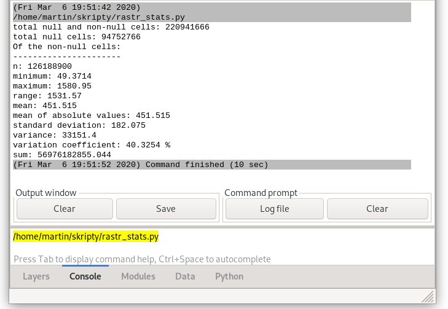

Spuštění skriptu
================

Mějme jednoduchý skript, který vypíše výměru města
:wikipedia:`Pardubice` v hektarech. K tomu použijeme vektorovou mapu
:map:`obce_polygon` z mapsetu :mapset:`ruian`.

.. literalinclude:: ../_static/skripty/obce_vymera-v1.py
   :language: python

Tento soubor (ke stažení `zde
<../_static/skripty/obce_vymera-v1.py>`_) uložte kamkoliv na
disk. Bližší popis kódu nechme na kapitolu :doc:`ndvi-python` a
:doc:`PyGRASS <../pygrass/index>`.

Spuštění z GUI
--------------

Nejjednodušší cestou je spustit skript z grafického uživatelského
rozhraní a to z menu správce vrstev :menuselection:`File -->
Launch script` anebo z nástrojové lišty.

.. figure:: images/lmgr-launch-script.png

   Spuštění skriptu z nástrojové lišty správce vrstev.

Po výběru skriptu si GRASS zkontroluje, zda je skript *spustitelný* a
zda je tzv. v *spouštěcí cestě*. V připadě, že tomu tak není, tak se
objeví příslušné dialogy, které potvrdíme.

.. figure:: images/launch-permission.png
   :class: small

   Dialog pro nastavení spustitelnosti.

.. figure:: images/launch-path.png
   :class: small

   Dialog pro přidání adresáře se skriptem do spouštěcí cesty.

Skript se poté spustí, výpis je přesměrován do okna správce vrstev.

.. figure:: images/launch-output.png

   Výsledek spuštění skriptu v okně správce vrstev.

Skript můžete také spustit zadáním úplné cesty v přikazové řádce
správce vrstev.

   Spuštění skriptu z příkazové řádky správce vrstev.

..
     .. note:: Přidání skriptu do spouštěcí cesty má tu výhodu, že lze
               skript znovu spustit z příkazové řádky správce vrstev jako
               kterýkoliv modul systému GRASS.
            
Spuštění z příkazové řádky
--------------------------

Nejprve nastavíme právo spustitelnosti pomocí příkazu :program:`chmod`
(jde o Unixový nástroj, pod Windows použijeme správce souborů) a poté
skript spustíme.

.. notecmd:: Návod nastavení spustitelnosti a spuštění skriptu

   .. code-block:: bash

      chmod +x obce_vymera-v1.py
      ./obce_vymera-v1.py

   Předpokládejme, že adresář se skriptem není ve spouštěcí cestě,
   spustíme jej tedy přes ``./``.

.. note:: Pro přidání adresáře do spouštěcí cesty můžete použít
          :grasscmd:`proměnnou prostředí <variables>`
          :envvar:`GRASS_ADDON_PATH`. Pokud je tato proměnná
          definována před spuštěním systému GRASS, tak se její obsah
          automaticky vloží do spouštěcí cesty.

          Proměnné prostředí systému GRASS jsou uloženy v souboru
          ``bashrc`` (v případě Windows jde o soubor ``env.bat``) v
          konfiguračním adresáři systému GRASS. Ten je umístěn pod
          Linuxem v ``$HOME/.grass7``, v případě Windows
          ``$APPDATA\GRASS7``.

          Např.

          ::

             export GRASS_ADDON_PATH=/opt/bin:$HOME/grassbin

          bude mít za následek, že se při spuštění systému GRASS přidají do
          spouštěcí cesty dva adresáře: ``/opt/bin`` a ``grassbin``
          z domovského adresáře aktivního uživatele.

          V případě OS Windows by proměnná mohla vypadat následovně:

          ::
                
             set GRASS_ADDON_PATH=C:\opt\bin;%HOME%\grassbin
          
          Potom lze skript spustit jako jakýkoliv příkaz systému GRASS
          či operačního systému.

          .. code-block:: bash

             obce_vymera-v1.py

Spuštění jako batch job
-----------------------

Pokud je definována proměnná prostředí :envvar:`GRASS_BATCH_JOB`, tak
GRASS spustí soubor uvedený jako hodnota této proměnné. Po doběhnutí
skriptu se GRASS sám ukončí.

.. code-block:: bash
                
   export GRASS_BATCH_JOB=/home/martin/skripty/obce_vymera-v1.py 
   grass70 /opt/grassdata/gismentors/user1

.. note:: GRASS v tomto případě spouštíme s mapsetem :mapset:`user1` v
   lokaci `gismentors` umístěné v adresáři ``/opt/grassdata``. Pokud
   bysme tento parametr vynechali, tak GRASS spustí skript v posledně
   navštíveném mapsetu.

Výstup může vypadat následovně:
::

   Cleaning up temporary files...
   Starting GRASS GIS...
   Executing '/home/martin/grassbin/obce_vymera-v1.py' ...
   Pardubice: 8263.98 ha
   Execution of '/home/martin/grassbin/obce_vymera-v1.py' finished.
   Cleaning up temporary files...

Proměnnou prostředí deaktivujeme pomocí příkazu :program:`unset`.

.. code-block:: bash

   unset GRASS_BATCH_JOB

Poté se GRASS bude chovat po startu již standardně.
