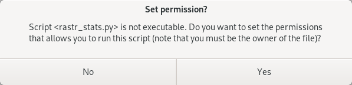

Spuštění skriptu
================

Začneme jednoduchým skriptem, který vypíše výměru města
:wikipedia:`Pardubice` v hektarech. K tomu použijeme vektorovou mapu
:map:`obce` z mapsetu :mapset:`ruian`.

.. literalinclude:: ../_static/skripty/obce_vymera-v1.py
   :language: python

Tento soubor (ke stažení `zde
<../_static/skripty/obce_vymera-v1.py>`_) uložte kamkoliv na
disk. Bližší popis kódu nechme na kapitolu :doc:`ndvi-python` a
:doc:`PyGRASS <../pygrass/index>`.

Spuštění z GUI
--------------

Nejjednodušší cestou je spustit skript z grafického uživatelského
rozhraní, a to z menu správce vrstev :menuselection:`File --> Launch
script` anebo z nástrojové lišty |grass-script-load|.

Po výběru skriptu si GRASS zkontroluje, zda je skript *spustitelný* a
zda je tzv. v *spouštěcí cestě*. V připadě, že tomu tak není, tak se
objeví příslušné dialogy, které potvrdíme (:item:`Yes`).

   Dialog pro nastavení spustitelnosti.

.. figure:: images/launch-path.png
   :class: small

   Dialog pro přidání adresáře se skriptem do spouštěcí cesty.

.. note:: Přidání skriptu do spouštěcí cesty má tu výhodu, že lze
   skript znovu spustit z příkazové řádky správce vrstev jako
   kterýkoliv modul systému GRASS.
   
Skript se poté spustí, výpis je přesměrován do okna správce vrstev.

.. figure:: images/launch-output.png

   Výsledek spuštění skriptu v okně správce vrstev.

.. tip::

   Cesta ke skriptu je součástí historie příkazové řádky. Z ní můžeme
   vyvolat skript opakovaně.

   .. figure:: images/lmgr-launch-cmd.png

      Spuštění skriptu z příkazové řádky správce vrstev.

..
   Spuštění z příkazové řádky
   --------------------------

   Nejprve nastavíme právo spustitelnosti pomocí příkazu :program:`chmod`
   (jde o Unixový nástroj, pod Windows použijeme správce souborů) a poté
   skript spustíme.

   .. notecmd:: Návod nastavení spustitelnosti a spuštění skriptu

   .. code-block:: bash

      chmod +x obce_vymera-v1.py
      ./obce_vymera-v1.py

   Předpokládejme, že adresář se skriptem není ve spouštěcí cestě,
   spustíme jej tedy přes ``./``.

   .. note:: Pro přidání adresáře do spouštěcí cesty můžete použít
          :grasscmd:`proměnnou prostředí <variables>`
          :envvar:`GRASS_ADDON_PATH`. Pokud je tato proměnná
          definována před spuštěním systému GRASS, tak se její obsah
          automaticky vloží do spouštěcí cesty.

          Proměnné prostředí systému GRASS jsou uloženy v souboru
          ``bashrc`` (v případě Windows jde o soubor ``env.bat``) v
          konfiguračním adresáři systému GRASS. Ten je umístěn pod
          Linuxem v ``$HOME/.grass7``, v případě Windows
          ``$APPDATA\GRASS7``.

          Např.

          ::

             export GRASS_ADDON_PATH=/opt/bin:$HOME/grassbin

          bude mít za následek, že se při spuštění systému GRASS přidají do
          spouštěcí cesty dva adresáře: ``/opt/bin`` a ``grassbin``
          z domovského adresáře aktivního uživatele.

          V případě OS Windows by proměnná mohla vypadat následovně:

          ::
                
             set GRASS_ADDON_PATH=C:\opt\bin;%HOME%\grassbin
          
          Potom lze skript spustit jako jakýkoliv příkaz systému GRASS
          či operačního systému.

          .. code-block:: bash

             obce_vymera-v1.py

Spuštění jako batch job
-----------------------

Pokud je definována proměnná prostředí :envvar:`GRASS_BATCH_JOB`, tak
GRASS spustí soubor uvedený jako hodnota této proměnné. Po doběhnutí
skriptu se GRASS sám ukončí.

Příklad pro Linux:

.. code-block:: bash
                
   export GRASS_BATCH_JOB=/home/martin/skripty/obce_vymera-v1.py 
   grass /opt/grassdata/gismentors/user1

Příklad pro MS Windows (spuštěno z *OSGeo4W Shell*):

.. code-block:: bash
                
   set GRASS_BATCH_JOB=C:\users\martin\skripty\obce_vymera-v1.py 
   grass C:\users\martin\grassdata\gismentors\user1

.. todo:: otestovat
          
.. note:: GRASS v tomto případě spouštíme s mapsetem :mapset:`user1` v
   lokaci `gismentors`. Pokud bysme tento parametr vynechali, tak
   GRASS spustí skript v posledně navštíveném mapsetu.

Výstup může vypadat následovně:
::

   Starting GRASS GIS...
   Cleaning up temporary files...
   Executing </home/martin/skripty/obce_vymera-v1.py> ...
   Pardubice: 8263.98 ha
   Execution of </home/martin/skripty/obce_vymera-v1.py> finished.
   Cleaning up default sqlite database ...
   Cleaning up temporary files...

Proměnnou prostředí deaktivujeme pomocí příkazu :program:`unset` (pro
Linux).

.. code-block:: bash

   unset GRASS_BATCH_JOB

Pod MS Windows pomůže trik s prázdnout hodnotou:

.. code-block:: bash

   set GRASS_BATCH_JOB=

.. todo:: test
          
Poté se GRASS bude chovat po startu již standardně.

Od verze GRASS GIS 7.6 lze použít místo proměnné prostředí
:envvar:`GRASS_BATCH_JOB` elegatnější cestu přes přepínač ``--exec``.

Varianta pro Linux:

.. code-block:: bash

   grass --exec /home/martin/skripty/obce_vymera-v1.py /opt/grassdata/gismentors/user1

Varianta pro MS Windows (v *OSGeo4W Shell*):

.. code-block:: cmd

   grass --exec C:\users\martin\skripty\obce_vymera-v1.py C:\users\martin\grassdata\gismentors\user1

.. todo:: test

Spuštění explicitně
-------------------

Ve všech výše zmíněných příkladech vždy systém GRASS spouštíme
explicitně. To není nutné, stačí ve skriptu nastavit cestu k instalaci
systému GRASS (proměnná prostředí :envvar:`GISBASE`) a datům
(tj. lokaci a mapset) - pomocí funkce ``init()``.

.. code-block:: python

   #!/usr/bin/env python3
   
   import os
   import sys

   os.environ['GISBASE'] = '/usr/lib/grass78'
   
   sys.path.insert(0, os.path.join(os.environ['GISBASE'], 'etc', 'python'))
   import grass.script.setup as gsetup
   from grass.pygrass.vector import VectorTopo

   gsetup.init(os.environ['GISBASE'], '/opt/grassdata', 'gismentors', 'user1')
   
   ...

Pod MS Windows nahraďte defici ``gisbase`` a cestu k lokaci:

.. code-block:: python

   gisbase = os.environ['GISBASE'] = r'C:\OSGeo4W64\apps\grass\grass78'
   ...
   gsetup.init(os.environ['GISBASE'], r'C:\users\martin\grassdata', 'gismentors', 'user1')

.. todo:: test

.. todo:: pridat pycharm
