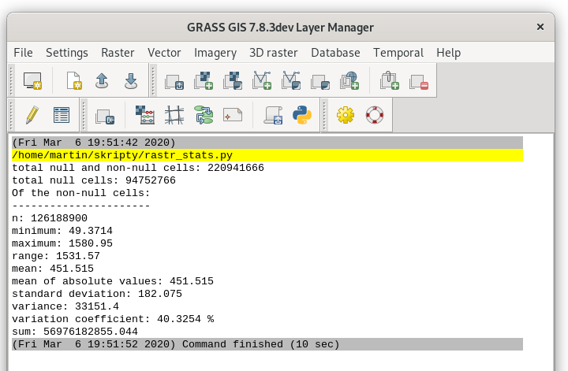

Spuštění skriptu
================

..
   Začneme jednoduchým skriptem, který vypíše výměru města
   :wikipedia:`Pardubice` v hektarech. K tomu použijeme vektorovou mapu
   :map:`obce` z mapsetu :mapset:`ruian`.

   .. literalinclude:: ../_static/skripty/obce_vymera-v1.py
      :language: python

   Tento soubor (ke stažení `zde
   <../_static/skripty/obce_vymera-v1.py>`_) uložte kamkoliv na
   disk.

Začneme jednoduchým skriptem, který vypíše statistiku rastrové mapy. V
našem případě digitálního modelu terénu (:map:`dmt`).

.. literalinclude:: ../_static/skripty/rastr_stats.py
   :language: python
                               
Soubor (ke stažení `zde <../_static/skripty/rastr_stats.py>`_) uložte
na disk.
   
Bližší popis kódu nechme na kapitolu :doc:`ndvi-python` a
:doc:`PyGRASS <../pygrass/index>`.

Spuštění z GUI
--------------

Nejjednodušší cestou jak vytvořit a spustit skript, je použít nástroje
grafického uživatelského rozhraní systému GRASS. Otevřeme integrovaný
textový editor dostupný z menu :menuselection:`File --> Simple Python
editor` anebo z nástrojové lišty |grass-python|.

   Nativní Python editor systému GRASS. Skript spustíme pomocí
   tlačítka |grass-execute|.

Již hotový skript lze spustit přímo z menu správce vrstev
:menuselection:`File --> Launch script` anebo z nástrojové lišty
|grass-script-load|.

Po výběru skriptu si GRASS zkontroluje, zda je skript *spustitelný* a
zda je tzv. v *spouštěcí cestě*. V připadě, že tomu tak není, tak se
objeví příslušné dialogy, které potvrdíme (:item:`Yes`).

.. figure:: images/launch-permission.png
   :class: small

   Dialog pro nastavení spustitelnosti.

.. figure:: images/launch-path.png
   :class: small

   Dialog pro přidání adresáře se skriptem do spouštěcí cesty.

.. note:: Přidání skriptu do spouštěcí cesty má tu výhodu, že lze
   skript znovu spustit z příkazové řádky správce vrstev jako
   kterýkoliv modul systému GRASS.
   
Skript se poté spustí, výpis je přesměrován do okna správce vrstev.

   Výsledek spuštění skriptu v okně správce vrstev.

.. tip::

   Cesta ke skriptu je součástí historie příkazové řádky. Z ní můžeme
   vyvolat skript opakovaně.

   .. figure:: images/lmgr-launch-cmd.png

      Spuštění skriptu z příkazové řádky správce vrstev.

..
   Spuštění z příkazové řádky
   --------------------------

   Nejprve nastavíme právo spustitelnosti pomocí příkazu :program:`chmod`
   (jde o Unixový nástroj, pod Windows použijeme správce souborů) a poté
   skript spustíme.

   .. notecmd:: Návod nastavení spustitelnosti a spuštění skriptu

   .. code-block:: bash

      chmod +x rastr_stats.py
      ./rastr_stats.py

   Předpokládejme, že adresář se skriptem není ve spouštěcí cestě,
   spustíme jej tedy přes ``./``.

   .. note:: Pro přidání adresáře do spouštěcí cesty můžete použít
          :grasscmd:`proměnnou prostředí <variables>`
          :envvar:`GRASS_ADDON_PATH`. Pokud je tato proměnná
          definována před spuštěním systému GRASS, tak se její obsah
          automaticky vloží do spouštěcí cesty.

          Proměnné prostředí systému GRASS jsou uloženy v souboru
          ``bashrc`` (v případě Windows jde o soubor ``env.bat``) v
          konfiguračním adresáři systému GRASS. Ten je umístěn pod
          Linuxem v ``$HOME/.grass7``, v případě Windows
          ``$APPDATA\GRASS7``.

          Např.

          ::

             export GRASS_ADDON_PATH=/opt/bin:$HOME/grassbin

          bude mít za následek, že se při spuštění systému GRASS přidají do
          spouštěcí cesty dva adresáře: ``/opt/bin`` a ``grassbin``
          z domovského adresáře aktivního uživatele.

          V případě OS Windows by proměnná mohla vypadat následovně:

          ::
                
             set GRASS_ADDON_PATH=C:\opt\bin;%HOME%\grassbin
          
          Potom lze skript spustit jako jakýkoliv příkaz systému GRASS
          či operačního systému.

          .. code-block:: bash

             rastr_stats.py

Spuštění jako batch job
-----------------------

Pokud je definována proměnná prostředí :envvar:`GRASS_BATCH_JOB`, tak
GRASS spustí soubor uvedený jako hodnota této proměnné. Po doběhnutí
skriptu se GRASS sám ukončí.

Příklad pro Linux:

.. code-block:: bash
                
   export GRASS_BATCH_JOB=/home/martin/skripty/rastr_stats.py 
   grass78 /opt/grassdata/gismentors/user1

Příklad pro MS Windows (spuštěno z *OSGeo4W Shell*):

.. code-block:: bash
                
   set GRASS_BATCH_JOB=C:\users\martin\skripty\rastr_stats.py 
   grass78 C:\users\martin\grassdata\gismentors\user1

.. important:: Tento způsob nemusí být pod MS Windows funkční v
   případě, že je nainstalován v OS systémový Python (např. díky Esri
   ArcGIS). V tomto případě doporučujeme postup popsaný :ref:`níže
   <exec>`.
          
.. note:: GRASS v tomto případě spouštíme s mapsetem :mapset:`user1` v
   lokaci `gismentors`. Pokud bysme tento parametr vynechali, tak
   GRASS spustí skript v posledně navštíveném mapsetu.

Výstup může vypadat následovně:

::

    Starting GRASS GIS...
    Cleaning up temporary files...
    Executing </home/martin/skripty/rastr_stats.py> ...
     100%
    total null and non-null cells: 220941666
    total null cells: 94752766

    Of the non-null cells:
    ----------------------
    n: 126188900
    minimum: 49.3714
    maximum: 1580.95
    range: 1531.57
    mean: 451.515
    mean of absolute values: 451.515
    standard deviation: 182.075
    variance: 33151.4
    variation coefficient: 40.3254 %
    sum: 56976182855.044
    Execution of </home/martin/skripty/rastr_stats.py> finished.
    Cleaning up default sqlite database ...
    Cleaning up temporary files...

Proměnnou prostředí deaktivujeme pomocí příkazu :program:`unset` (pro
Linux).

.. code-block:: bash

   unset GRASS_BATCH_JOB

Pod MS Windows pomůže trik s prázdnout hodnotou:

.. code-block:: bash

   set GRASS_BATCH_JOB=

Poté se GRASS bude chovat po startu již standardně.

.. _exec:

Od verze GRASS GIS 7.6 lze použít místo proměnné prostředí
:envvar:`GRASS_BATCH_JOB` elegatnější cestu přes přepínač ``--exec``.

Varianta pro Linux:

.. code-block:: bash

   grass78 /opt/grassdata/gismentors/user1 --exec /home/martin/skripty/rastr_stats.py

Varianta pro MS Windows (v *OSGeo4W Shell*):

.. code-block:: cmd

   py3_env
   grass78 C:\users\martin\grassdata\gismentors\user1 --exec python3 C:\users\martin\skripty\rastr_stats.py

.. figure:: images/windows-exec.png

   Spuštění skriptu z příkazové řádky OSGeo4W.
   
Spuštění explicitně
-------------------

Ve všech výše zmíněných příkladech vždy systém GRASS spouštíme
explicitně. To není nutné, stačí ve skriptu nastavit cestu k instalaci
systému GRASS (proměnná prostředí :envvar:`GISBASE`) a datům
(tj. lokaci a mapset) - pomocí funkce ``init()``.

.. code-block:: python

   #!/usr/bin/env python3
   
   import os
   import sys

   os.environ['GISBASE'] = '/usr/lib/grass78'
   
   sys.path.insert(0, os.path.join(os.environ['GISBASE'], 'etc', 'python'))
   import grass.script.setup as gsetup
 
   gsetup.init(os.environ['GISBASE'], '/opt/grassdata', 'gismentors', 'user1')
   
   ...

Po této úpravě lze skript spustit přímo bez nutnosti spouštět GRASS
GIS jako takový.

.. code-block:: bash

   python3 /home/martin/skripty/rastr_stats.py

Pod MS Windows nahraďte defici ``gisbase`` a cestu k lokaci:

.. code-block:: python

   os.environ['GISBASE'] = r'C:\OSGeo4W64\apps\grass\grass78'
   ...
   gsetup.init(os.environ['GISBASE'], r'C:\users\martin\grassdata', 'gismentors', 'user1')

Skript je nutné spustit z *OSGeo4W Shell* (před spustěním skriptu je
nutné zavolat ``py3_env``, který nastaví prostředí pro Python 3):

.. code-block:: bash

   py3_env
   python3 C:\users\martin\skripty\rastr_stats.py

.. figure:: images/windows-exec.png

   Spuštění skriptu z příkazové řádky OSGeo4W.

Spuštění v textovém editoru (PyCharm, MS Windows)
-------------------------------------------------

Následuje návod pro textový editor :program:`PyCharm`. Postup
nastavení editoru pro prostředí OSGeo4W v operačním systému MS Windows
je součástí školení :skoleni:`GeoPython pro začátečníky
<geopython-zacatecnik/ruzne/editor.html>`.

.. figure:: images/windows-pycharm.png
   :class: large

   Spuštění skriptu z textového editoru PyCharm.

.. tip:: Do skriptu, který nastavuje prostředí, můžete přidat definici
   cest pro instalaci GRASS GIS. Po této úpravě již nemusíte ve
   vašich skriptech pro GRASS GIS uvádět následujícící řádky:

   .. code-block:: python

      os.environ['GISBASE'] = r'C:\OSGeo4W64\apps\grass\grass78'
      sys.path.insert(0, os.path.join(os.environ['GISBASE'], 'etc', 'python'))

   Otevřete soubor :file:`C:\\OSGeo4W64\\bin\\python-qgis.bat` (nebo
   :file:`python-qgis-ltr.bat`) a přidejte na jeho konec dvě následující řádky:

   .. code-block:: bat
      
      set GISBASE=%OSGEO4W_ROOT%\apps\grass\grass78
      set PYTHONPATH=%GISBASE%\etc\python;%PYTHONPATH%

   Ideálně uložte toto nastavení mimo soubor
   :file:`python-qgis.bat`. Vyhnete se tak tomu, že při další
   aktualizaci QGISu o tyto úpravy přijdete.

Spuštění pomocí BAT souboru pod MS Windows
------------------------------------------

Skript lze spustit i přímo pomocí řídícího BAT souboru, který nastaví
prostředí nutné pro běh systému GRASS. Minimalistický příklad níže.

.. code-block:: bat

   @echo off

   set OSGEO4W_ROOT=C:\OSGeo4W64

   call %OSGEO4W_ROOT%\bin\o4w_env.bat
   call %OSGEO4W_ROOT%\bin\py3_env.bat
   
   set GISBASE=%OSGEO4W_ROOT%\apps\grass\grass78
   set PYTHONPATH=%GISBASE%\etc\python;%PYTHONPATH%

   python rastr_stats.py

   pause

Ze samotného Python skriptu vypadnou přebytečné dvě řádky:

.. code-block:: python

   os.environ['GISBASE'] = r'C:\OSGeo4W64\apps\grass\grass78'
   sys.path.insert(0, os.path.join(os.environ['GISBASE'], 'etc', 'python'))
