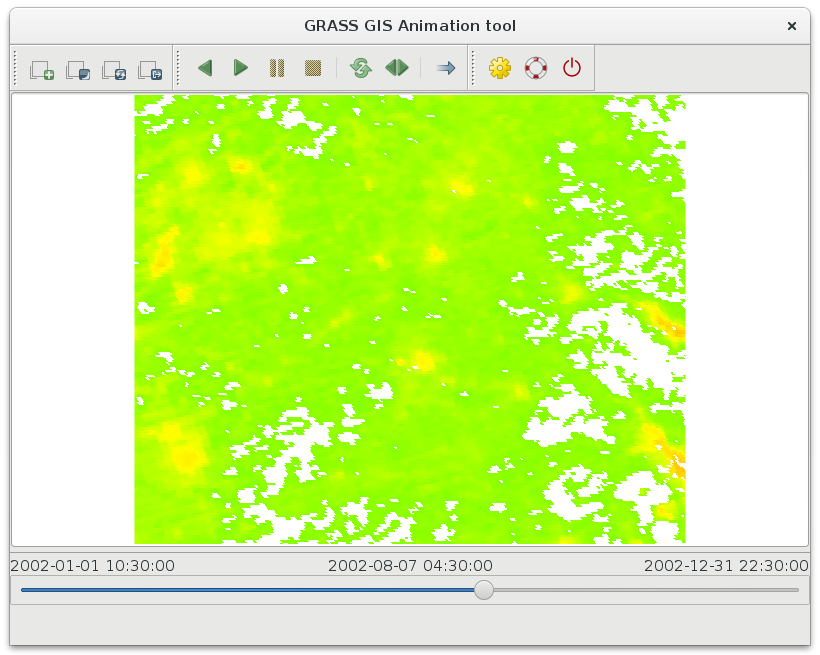

*******************************
Úvod do časoprostorových analýz
*******************************

Více informací najdete v :grasscmd:`dokumentaci
<temporalintro>`. Nástroje určené pro časoprostorové analýzy začínají
na :grasscmd:`prefix t.* <temporal>`.

.. note:: Podpora pro časoprostorové analýzy je dostupná pouze ve
   verzi **GRASS 7 a vyšší**.

Časoprostorový dataset
======================

Časoprostorový dataset lze vytvořit na základě série 2D/3D rastrových
a vektorových map. Podle vstupních dat rozlišujeme tři základní typy
datasetů:

* **strds** - časoprostorový dataset pro 2D rastrová data, obsluhují
  moduly s prefixem ``t.rast``
* **str3ds** - časoprostorový dataset pro 3D rastrová data, obsluhují
  moduly s prefixem ``t.rast3d``
* **stvds** - časoprostorový dataset pro 2D/3D vektorová data, obsluhují
  moduly s prefixem ``t.vect``

Vytvoření datasetu
------------------

Dataset vytvoříme v několika krocích, nejrpve vytvoříme prázdný
dataset pomocí modulu :grasscmd:`t.create`.

.. code-block:: bash
                
   t.create output=modis title="MODIS 2002" desc="Ukazkovy casoprostorovy dataset MODIS"

Do kterého posléze modulem :grasscmd:`t.register` nahrajeme vstupní
data, v našem případě rastrové data z projektu :wikipedia:`MODIS`.

.. code-block:: bash
               
   t.register input=modis file=maps.txt

Základní metadata
-----------------

Základní informace o časoprostorovém datasetu poskytuje modul
:grasscmd:`t.info`.

.. code-block:: bash

   t.info modis
   
Informace o časové topoligii získáme voláním modulu
:grasscmd:`t.topology`.

.. code-block:: bash

   t.topology modis

Příklad získání podrovbných informací z daného časového rozsahu:

.. code-block:: bash

   t.topology -m modis where="start_time >= '2002-07-15' and start_time < '2002-07-17'"

Časoprostorové dotazování
=========================

Dotazování rastrových dat umožňuje modul :grasscmd:`t.rast.list`
včetně případných podmínek.

Příklad pro vypsání dat z měsíce března:

.. code-block:: bash
                
   t.rast.list input=modis order=start_time where="start_time > '2002-03-01' and start_time < '2002-04-01'"

Základní statistiku rastrových map poskutuje modul :grasscmd:`t.rast.univar`.

.. code-block:: bash

   t.rast.univar input=modis where="start_time > '2002-03-01' and start_time < '2002-04-01'"

Agregace
--------

Určení statististiky teplot pro jednotlivé měsíce pomocí modulu :grasscmd:`t.rast.aggregate`:

.. code-block:: bash
                
   t.rast.aggregate input=modis out=modis_m basename=ag gra="1 months"

Vytvoří se dvanáct rastrových map v měsíční periodě, viz

.. code-block:: bash

   t.rast.list modis_m order=start_time

Statistiku pro všechny měsíce získáme pomocí :grasscmd:`t.rast.univar`

.. code-block:: bash
                
   t.rast.univar modis_m

Příklad statistiky pro červenec a srpen:

.. code-block:: bash
                
   t.rast.univar modis_m where="start_time > '2002-07-01' and start_time < '2002-09-01'"

Výběr dat z časoprostorového datasetu
-------------------------------------

Vytvořit na základě výběru nový časoprostorový dataset umožňuje příkaz
:grasscmd:`t.rast.extract`.

.. code-block:: bash
          
   t.rast.extract input=modis where="start_time > '2002-03-01' and start_time < '2002-06-01'" output=modis_spring
   t.rast.extract input=modis where="start_time > '2002-06-01' and start_time < '2002-09-01'" output=modis_summer
   t.rast.extract input=modis where="start_time > '2002-09-01' and start_time < '2002-12-01'" output=modis_autumn
   t.rast.extract input=modis where="start_time > '2002-12-01' or start_time < '2002-03-01'" output=modis_winter

V následujících příkazech budeme sledovat trend změny teploty v
jednotlivých ročních obdobích. K tomu použijeme modul :grasscmd:`t.rast.series`.

.. code-block:: bash
                
   t.rast.series input=modis_spring output=modis_spring_avg method=average
   t.rast.series input=modis_summer output=modis_summer_avg method=average
   t.rast.series input=modis_autumn output=modis_autumn_avg method=average
   t.rast.series input=modis_winter output=modis_winter_avg method=average

Vzniknou čtyři rastrové mapy zobrazující průměrné roční teploty v
ročních obdobích. Průměrnou teplotu zjistíme pomocí modulu
:grasscmd:`r.univar`, příklad pro jaro:

.. code-block:: bash
                          
   r.univar modis_spring_avg

Vizualizace časoprostrových dat
===============================

Vizualizace časové řady pomocí nástroje :grasscmd:`g.gui.timeline`.

.. code-block:: bash

   g.gui.timeline inputs=modis_spring,modis_summer,modis_autumn,modis_winter

.. figure:: images/g-gui-timeline.png

   Vizualizace čtyř časoprostorových datasetů na základě ročního období

Vizualizovat data časoprostorových datasetů umožňuje animační nástroj
:grasscmd:`g.gui.animation`.

.. code-block:: bash
             
   g.gui.animation strds=modis

               
   wxGUI Animation Tool
                
Mezi další užitečné nástroje patří :grasscmd:`g.gui.mapswipe`

.. code-block:: bash
                
   t.rast.list modis_m where="start_time < '2002-03-01'"

   g.gui.mapswipe first=ag_0 second=ag_1

.. figure:: images/g-gui-mapswipe.png

   Vizualizace agregovaných LTS dat pro první dva měsíce roku 2002
