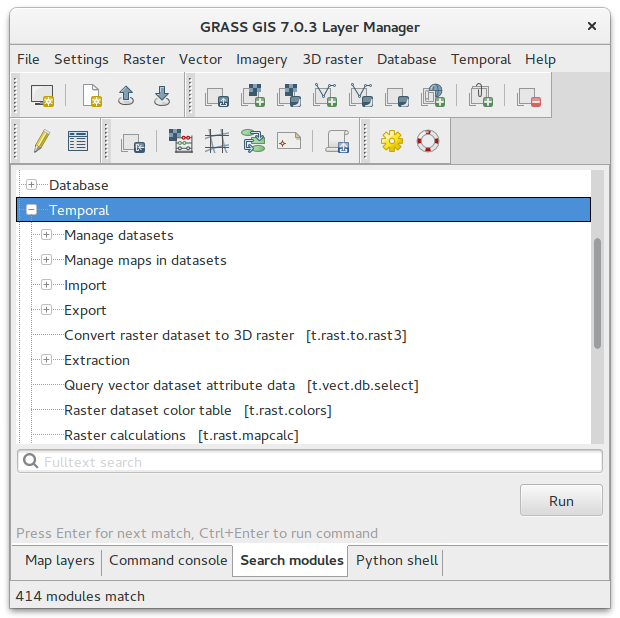

**********************
Časoprostorové analýzy
**********************

Nástroje systému GRASS určené pro časoprostorové analýzy začínají na
:grasscmd:`prefix t.* <temporal>`. Podrobné informace najdete v
:grasscmd:`dokumentaci <temporalintro>`.

.. note:: Podpora pro časoprostorové analýzy je dostupná pouze ve
   verzi *GRASS 7.0 a vyšší*.

   Nástroje systému GRASS časoprostorových analýz.

**Časoprostorový dataset** lze vytvořit na základě série 2D/3D rastrových
a vektorových map. Podle vstupních dat rozlišujeme tři základní typy
datasetů:

* *strds* - časoprostorový dataset pro 2D rastrová data, obsluhují ho
  moduly s prefixem ``t.rast``
* *str3ds* - časoprostorový dataset pro 3D rastrová data, obsluhují ho
  moduly s prefixem ``t.rast3d``
* *stvds* - časoprostorový dataset pro 2D/3D vektorová data, obsluhují ho
  moduly s prefixem ``t.vect``

.. rubric:: Témata
   :class: secnotoc
                    
.. toctree::
   :maxdepth: 2

   modis
   landsat
