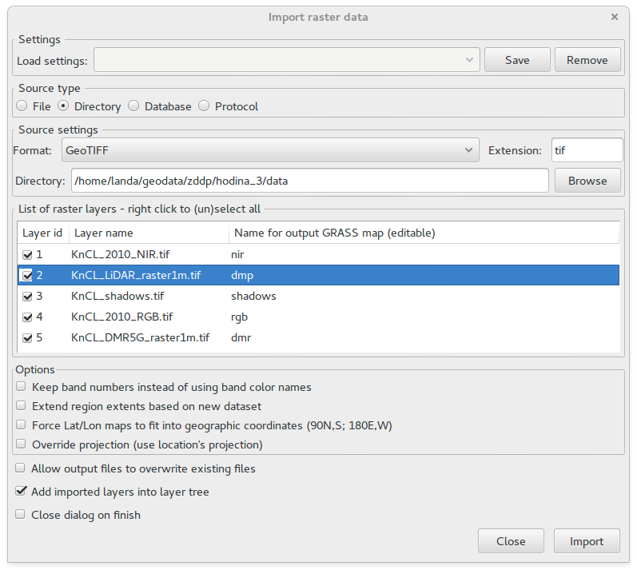
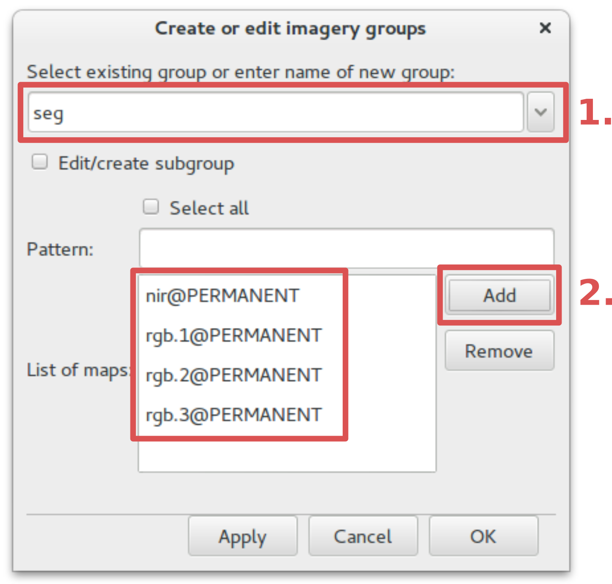
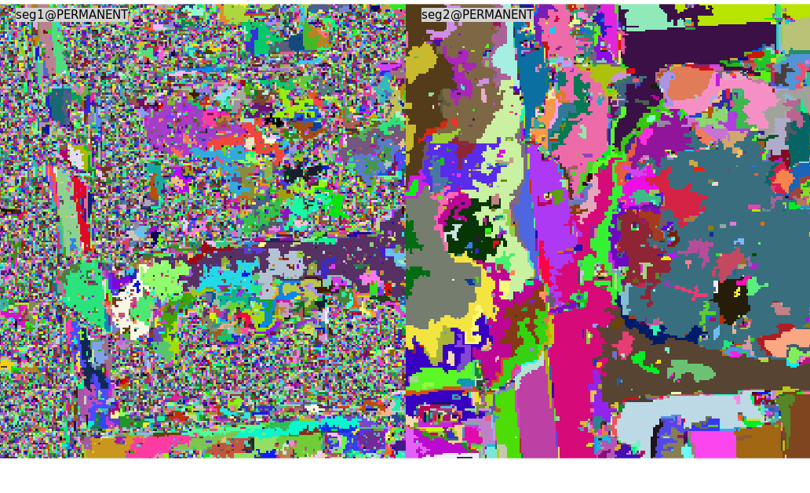
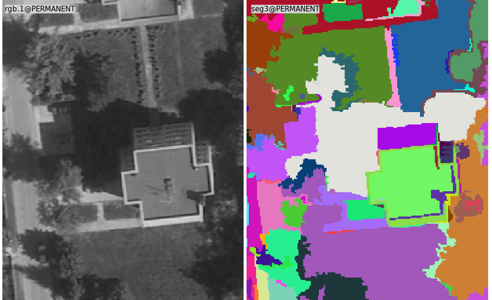
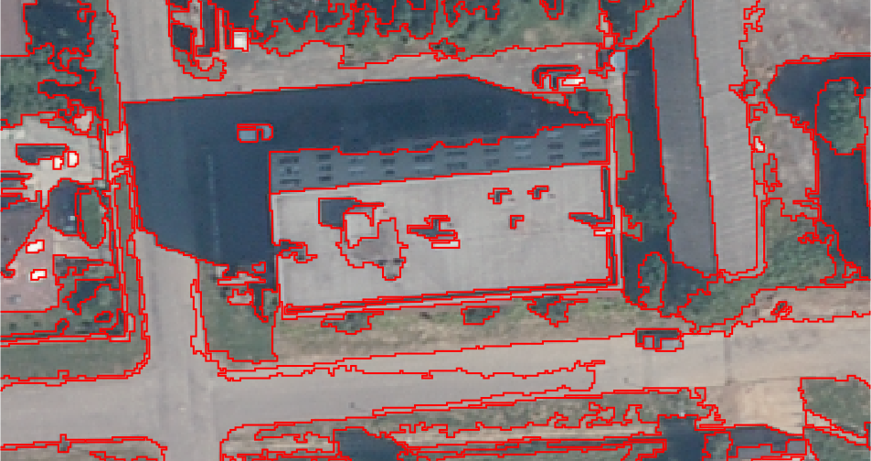
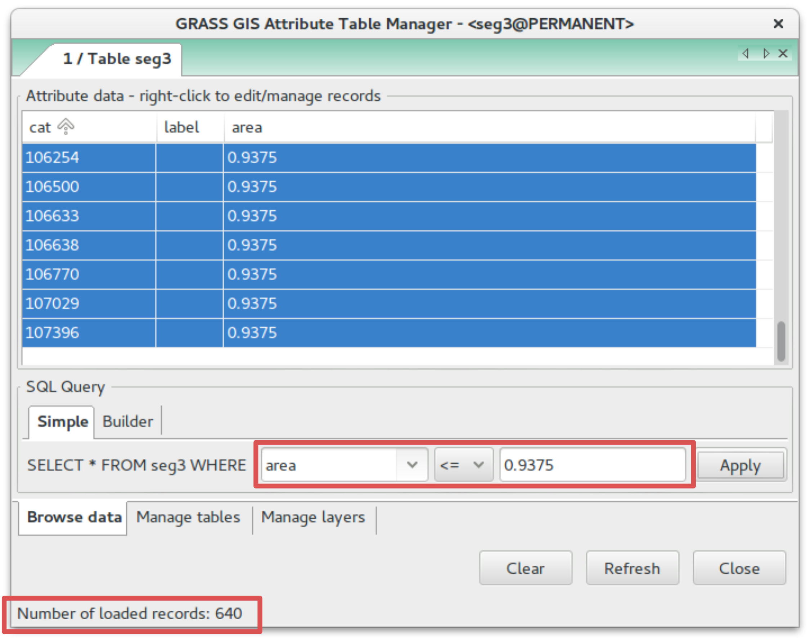
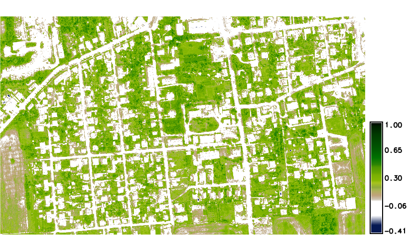
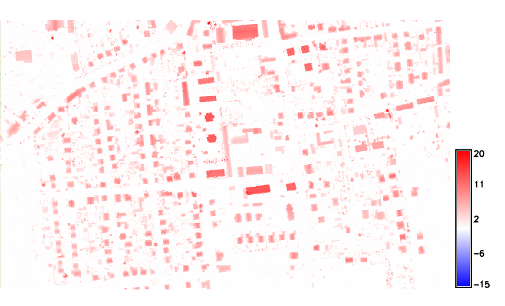
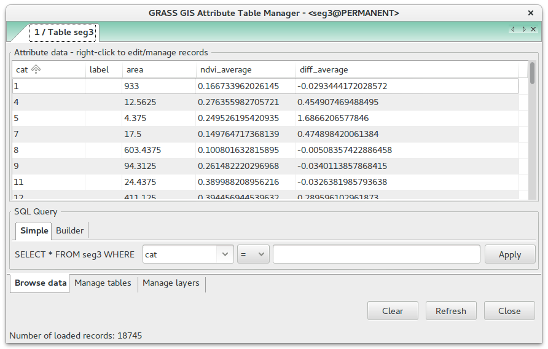
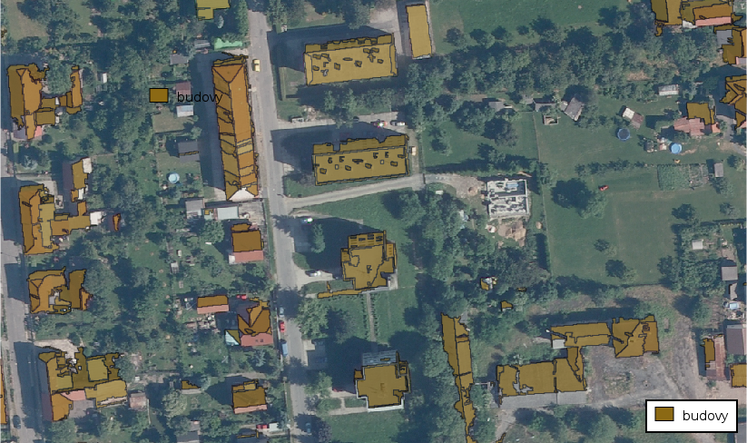

Segmentace obrazu
=================

Segmentace obrazu je metoda, která slouží k automatickému rozdělení
vlastního obrazu na oblasti se společnými vlastnostmi, které obvykle
mají nějaký smysluplný význam. Výsledky segmentace jsou využitelné
například při analýze obrazů získaných při dálkovém průzkumu Země
(citace z :wikipedia:`české wikipedie <Segmentace obrazu>`).

Vstupní data
------------

* letecké snímky viditelného (RGB) a blízkého
  infračerveného spektra (NIR)
* digitální model reliéfu (DMR) a povrchu (DMP)
* stíny (shadows)
    
Import dat
^^^^^^^^^^

Po spuštění systému GRASS vytvoříme novou lokaci buď na
:skoleni:`základě vstupních dat
<grass-gis-zacatecnik/data/tvorba-lokace.html#lokace-srtm>` anebo
:skoleni:`pomocí EPSG kódu
<grass-gis-zacatecnik/data/tvorba-lokace.html#lokace-sjtsk>` (v našem
případě jde o S-JTSK :epsg:`5514`).

Vstupní data naimportujeme do mapsetu PERMANENT, viz
:skoleni:`poznámky k importu rastrových dat
<grass-gis-zacatecnik/data/import.html#rastrova-data>` ve školení pro
začátečníky.

   Ukázka importu vstupních dat.

.. note:: RGB snímek se po importu rozpadne na tři rastrové mapy (viz.
   :map:`rgb.1`, :map:`rgb.2` a :map:`rgb.3`), současně
   jsou tyto vrstvy registrovány v obrazové skupině :map:`rgb`,
   viz příkaz :grassCmd:`i.group`. Jednotlivé obrazové kanály
   lze složit do barevné kompozice příkazem :grassCmd:`d.rgb`,
   viz :skoleni:`vizualizace dat
   <grass-gis-zacatecnik/intro/zobrazeni-geodat.html#rastrova-data>`.

   .. figure:: images/segment-rgb.png
      :class: large
           
      Ukázka vizualizace vstupních dat, složení barevné syntézy v
      pravých (skutečných) barvách.

Segmentace obrazu
-----------------

Do segmentace obrazu bude vstupovat kromě pásem viditelného spektra
(:map:`rgb.1`, :map:`rgb.2` a :map:`rgb.3`) také pásmo blízkého
infračerveného spektra (:map:`nir`). Vytvoříme obrazovou skupinu,
která bude tyto vrstvy obsahovat. Nástroj pro správu obrazových skupin
je dostupný z menu :menuselection:`Imagery --> Develop images and
groups --> Create/edit group` anebo jako příkaz :grassCmd:`i.group`.

           
   Vytvoření obrazové skupiny pro segmentaci dat. Zadání názvu
   (:fignote:`1`) a přidání rastrových map do skupiny (:fignote:`2`).

.. important:: Před dalším výpočtem je nutné nastavit korektní
   :skoleni:`výpočetní region
   <grass-gis-zacatecnik/intro/region.html>`. Vzhledem k tomu, že mají
   vstupní vrstvy RGB a NIR stejné prostorové umístění a rozlišení,
   zvolíme jednu z nich, např. :map:`nir`.

   .. figure:: images/segment-region.png
      :class: small
           
Nástroj pro segmentaci obrazu :grassCmd:`i.segment`
je dostupný v menu :menuselection:`Imagery --> Clasify image -->
Object segmentation`.

Segmentaci obrazu budeme provádět v několika krocích. Výsledek prvního
běhu s práhem (:option:`threshold`) 0.01 použijeme pro další krok, kde
navýšíme práh na hodnotu 0.05. Výsledky první segmetace využijeme v
druhém běhu pomocí parametru :option:`seeds`. Objekty se společnými
spekrálními a geometrickými vlastnosti se spojí, jejich počet se
zmenší, viz :num:`segment-1-2`.

.. code-block:: bash
   
   # první běh (~ 4 350 000 objektů)
   i.segment group=seg output=seg1 threshold=0.01
   # druhý běh (~ 440 000 objektů)            
   i.segment group=seg output=seg2 threshold=0.05 seeds=seg1

.. _segment-1-2:

   Porovnání objektů vzniklých po prvním a druhém běhu.
          
Ve třetím kroku zvýšíme práh na hodnotu 0.09 a zároveň nastavíme
minimální počet pixelů, které formují objekt na 15. Výsledek
segmentace je znázorněn :num:`segment-3`.

.. _segment-3:

   Ukázka výsledku segmentace obrazu (třetí běh) a kanálu leteckého
   snímku.
          
.. code-block:: bash
   
   # třetí běh (~ 25 000 objektů)            
   i.segment group=seg output=seg3 threshold=0.09 minsize=15 seeds=seg2

Výsledek segmentace převedeme do vektorové reprezentace pomocí modulu
:grassCmd:`r.to.vect` (:menuselection:`Raster --> Map type conversions
--> Raster to vector`). Jako kategorie objektů použijeme rastrové
hodnoty, viz přepínač :option:`-v`.

.. code-block:: bash

   r.to.vect -v input=seg3 output=seg3 type=area

   Ukázka vizualizace hranic objektů na podkladové vrstvě barevné
   kompozice v pravých barvách.

Do atributové tabulky můžeme přidat nový atribut výměry
objektů. Objekty by měly mít výměru větší než 0,9375m :sup:`2`
(vstupní data mají prostorové rozlišení 0,25m, minimální velikost
objektu byla nastavena na 15 pixelů). Tuto operaci můžete provést ze
:skoleni:`správce atributových dat
<grass-gis-zacatecnik/vektorova_data/atributy.html#editace-atributovych-dat>`
anebo pomocí kombinace příkazů :grassCmd:`v.db.addcolumn` a
:grassCmd:`v.to.db`:

.. code-block:: bash

   v.db.addcolumn map=seg3 columns="area double"
   v.to.db map=seg3 option=area columns=area

   Výběr objektů s minimální výměrou.
            
Filtrace objektů
----------------         

Jako podkladové vrstvy pro filtraci objektů využijeme vrstvu
normalizovaného diferečního vegetačního indexu (NDVI) vypočteného z vrstev
červeného (:map:`rgb.1`) a blízkého infračerveného (:map:`nir`) pásma
viz. :doc:`návod na jeho výpočet <../skripty/ndvi>`. Produkt NDVI
můžeme vytvořit univerzálním nástrojem :skoleni:`mapové albegry
<grass-gis-zacatecnik/rastrova_data/rastrova-algebra.html>`
:grassCmd:`r.mapcalc` anebo přímo pomocí nástroje :grassCmd:`i.vi`.

.. code-block:: bash

   i.vi red=rgb.1 output=ndvi viname=ndvi nir=nir

   Vrstva normalizovaného diferenčního vegetačního indexu.

Dále pomocí nástroje :skoleni:`mapové albegry
<grass-gis-zacatecnik/rastrova_data/rastrova-algebra.html>`
:grassCmd:`r.mapcalc` (:menuselection:`Raster --> Raster map
calculator`) vypočteme rastrovou mapu rozdílu výšek digitalního modelu
povrchu a terénu:

.. code-block:: bash

   r.mapcalc exp="diff = dmp - dmr"
          

   Rastrová mapa rozdílu výšek digitálního modelu povrchu a terénu
   (tabulka barev: differences).

Tyto dvě rastrové mapy použijeme pro výpočet zonální statistiky
objektů pomocí modulu :grassCmd:`v.rast.stats` (:menuselection:`Vector
--> Update attributes --> Update area atributes from raster`). Ze
statistických ukazatelů vybereme průměrnou hodnotu
(:option:`method=average`).

.. code-block:: bash

   v.rast.stats map=seg3 raster=ndvi column_prefix=ndvi method=average
   v.rast.stats map=seg3 raster=diff column_prefix=diff method=average

   Objekty s atributy průměrné hodnoty NDVI a rozdílu výšek.
               
Na základě těchto atributů můžeme provést jednoduchou klasifikaci objektů. Např.

* budovy   

::

   diff_average > 2.5 AND ndvi_average < 0

Výběr objektů splňujících dané atributové podmínky můžeme provést pomocí
:skoleni:`správce atributových dat
<grass-gis-zacatecnik//intro/atributove-dotazy.html>` anebo přímo
modulem :grassCmd:`v.extract`.

.. code-block:: bash

   v.extract input=seg3 where="diff_average > 2.0 AND ndvi_average < 0" output=budovy

   Vizualizace výsledku filtrace objektů budov na základě NDVI a rozdílu výšek.
               
Podobně můžeme provést filtraci objektů reprezentující stromy a pod.
